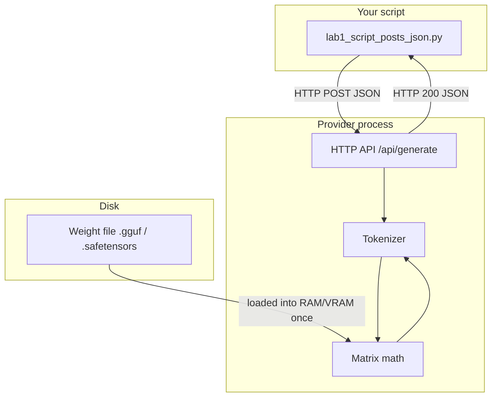

# 00: Script, Provider, Weights

After this chapter you can point at three boxes and say what each one does. A later chapter can wrap the POST in a function. This chapter does not.

## Data
Three things exist:

1. A Python script you run. It builds a JSON object and sends an HTTP POST.
2. A provider process. Ollama, vLLM, LM Studio, llama.cpp server, or a cloud API. It is a normal HTTP server. It listens on a port.
3. A model weight file (`.gguf` or `.safetensors`). It is a file of numbers. It does not open a port. It does not read HTTP.

Your script never opens the weight file. The weight file never sees your script.

## Information
The only path is:

script → HTTP POST (JSON) → provider API → tokenizer → matrix math on the loaded weights → tokens → HTTP response (JSON) → script

If the provider is not running, the script fails with a connection error. If the weight file is missing, the provider fails and returns an HTTP error. Those are two different failures.

## Knowledge
1. Start the provider (Ollama is already running at `192.168.1.29:11434` on this workspace).
2. Build a JSON body with the keys that provider documents.
3. POST it to the generate or chat route.
4. Read the JSON that comes back.
5. Print one field (`response` on Ollama `/api/generate`, or `choices[0].message.content` on OpenAI-style `/v1/chat/completions`).

Lab 1 does steps 3–5. Lab 2 prints every key in both directions so the contract is visible.

## Wisdom
Stop when one POST returns text. Do not add a client class, a stream parser, retries, or a loop yet. Those are later chapters. If you add them now, you will not know which box broke.

## The When and Why
- **When:** the first time a program needs a model. Before tools, before a loop, before the word "agent".
- **Why:** every later piece (dispatcher, ReAct, handoff JSON) is this same POST with more keys. If this POST is fuzzy, those chapters feel like magic.

## How it works



Walkthrough of one request:

1. The script encodes `{"model": "...", "prompt": "...", "stream": false}` as bytes.
2. It opens a TCP connection to the provider host and port.
3. The provider maps the prompt string to token IDs, runs them through the loaded weights, and maps new token IDs back to text.
4. The provider puts that text in a JSON object and writes it back on the same connection.
5. The script decodes the JSON and prints the text field.

## Data contract

Ollama native generate (what the labs use):

**Request** `POST /api/generate`

```json
{
  "model": "qwen3.6:35b-a3b-65k",
  "prompt": "string",
  "stream": false,
  "options": { "temperature": 0.0 }
}
```

**Response**

```json
{
  "model": "qwen3.6:35b-a3b-65k",
  "response": "string",
  "done": true,
  "eval_count": 0,
  "eval_duration": 0
}
```

OpenAI-compatible chat (same job, different keys; you will use this in chapter 02):

**Request** `POST /v1/chat/completions`

```json
{
  "model": "qwen3.6:35b-a3b-65k",
  "messages": [{ "role": "user", "content": "string" }]
}
```

**Response**

```json
{
  "choices": [{ "message": { "role": "assistant", "content": "string" } }]
}
```

## Lab
- [lab1_script_posts_json.py](./lab1_script_posts_json.py) / [lab1_script_posts_json.md](./lab1_script_posts_json.md) — POST, print the text. Done when you see two sentences from the model.
- [lab2_read_the_json.py](./lab2_read_the_json.py) / [lab2_read_the_json.md](./lab2_read_the_json.md) — print request keys and response keys. Done when you can name every required key without looking.

## Related
- **Ollama:** local HTTP server. Default port `11434`. Easy model pull. Native `/api/generate` and OpenAI-style `/v1/chat/completions`.
- **LM Studio:** local desktop app that also serves HTTP. Same job as Ollama, GUI-first, OpenAI-style routes.
- **vLLM:** local or server inference for higher throughput. OpenAI-style `/v1`. Use when many requests share one GPU.
- **llama.cpp server:** C++ HTTP process in front of a GGUF file. Same three-box picture, thinner stack.
- **OpenAI / Claude / Gemini:** same JSON job on a remote URL. You add an API key header. The weight file is on their machines, not yours.

## Notes
- Chapter 01 keeps the latency-profiling script. This chapter is the three boxes; chapter 01 is the wrapper function and the metrics.
- Reasoning models (Qwen 3.6, DeepSeek-R1 style) may spend tokens on internal thinking before the visible `response` text. `eval_count` can look large for a two-sentence answer. That is expected. Chapter 12 strips those thinking tokens. Do not handle it here.
