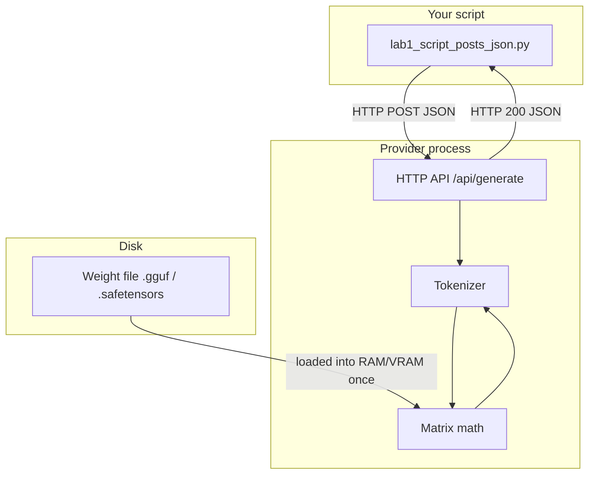

# 00: Script, Provider, Weights

After this chapter you can point at three separate things and say what each one does. A later chapter can wrap the POST in a function. This chapter does not.

## Data
Three things exist, and they are not the same object.

A **script** is a Python file you run. It builds a JSON object (keys and values, encoded as text) and sends it as an HTTP POST. HTTP means: send these bytes to this host and port, then wait for bytes back. A POST is the kind of request that carries a body.

A **provider** is a program that is already running and listening on a port. A port is a number the operating system uses so more than one program can accept network traffic on the same machine. Ollama, vLLM, LM Studio, llama.cpp server, and a cloud API are all providers. They are normal HTTP servers. They accept JSON and return JSON.

A **weight file** is a file of numbers on disk (`.gguf` or `.safetensors`). Those numbers are the model. The file does not open a port. It does not read HTTP. It does not know your script exists.

Your script never opens the weight file. The weight file never sees your script. The provider is the only process that loads the file into RAM or VRAM and does the math.

## Information
The only path is:

script → HTTP POST (JSON) → provider API → tokenizer → matrix math on the loaded weights → tokens → HTTP response (JSON) → script

The tokenizer turns your sentence into token IDs (small integers). The matrix math turns those IDs into new IDs. The provider turns the new IDs back into text and puts that text in a JSON field.

If the provider is not running, the script fails with a connection error (`URLError`, connection refused). If the weight file is missing or the model name is wrong, the provider is running but it returns an HTTP error (often 404). Those are two different failures. Fix the process first, then the model name.

## Knowledge
1. Start the provider, or confirm it is already running. On this workspace Ollama listens at `192.168.1.29:11434`.
2. Read the host and model from the environment (`OLLAMA_HOST`, `OLLAMA_MODEL`) so the URL is not hardcoded.
3. Build a JSON body with the keys that provider documents for that route.
4. POST it to the generate or chat route with `Content-Type: application/json`.
5. Decode the JSON that comes back.
6. Print one field. On Ollama `/api/generate` that field is `response`. On OpenAI-style `/v1/chat/completions` it is `choices[0].message.content`.

Lab 1 does one POST and prints the text. Lab 2 uses the same POST and prints every key in both directions so the contract is visible.

## Wisdom
Stop when one POST returns text. Do not add a client class, a stream parser, retries, or a loop yet. Those are later chapters. If you add them now, a failure could come from any of those extras and you will not know which of the three things broke.

## The When and Why
- **When:** the first time a program needs a model. Before tools, before a loop, before the word "agent".
- **Why:** every later piece (dispatcher, ReAct, handoff JSON) is this same POST with more keys. If this POST is fuzzy, you cannot tell which key later chapters are adding.

## How it works



Walkthrough of one request:

1. The script encodes `{"model": "...", "prompt": "...", "stream": false}` as bytes.
2. It opens a TCP connection to the provider host and port.
3. The provider maps the prompt string to token IDs, runs them through the loaded weights, and maps new token IDs back to text.
4. The provider puts that text in a JSON object and writes it back on the same connection.
5. The script decodes the JSON and prints the text field.

Nothing in that walkthrough opens the `.gguf` file. The provider already loaded it when it started, or when you first named that model.

## Data contract

Ollama native generate (what the labs use):

**Request** `POST /api/generate`

```json
{
  "model": "qwen3.6:35b-a3b-65k",
  "prompt": "string",
  "stream": false,
  "options": { "temperature": 0.0 }
}
```

`options` is optional. Lab 1 omits it. Lab 2 sends `temperature: 0.0` so the reply is repeatable.

**Response**

```json
{
  "model": "qwen3.6:35b-a3b-65k",
  "response": "string",
  "done": true,
  "eval_count": 0,
  "eval_duration": 0
}
```

`eval_count` is how many tokens the model produced, including thinking tokens you may not see. `eval_duration` is nanoseconds of decode on Ollama.

OpenAI-compatible chat (same job, different keys; you will use this in chapter 02):

**Request** `POST /v1/chat/completions`

```json
{
  "model": "qwen3.6:35b-a3b-65k",
  "messages": [{ "role": "user", "content": "string" }]
}
```

**Response**

```json
{
  "choices": [{ "message": { "role": "assistant", "content": "string" } }]
}
```

## Lab
Done when you can name the three things and one POST has printed model text.

- Module: [this file](./00_script_provider_weights.md)
- Lab 1: [lab1_script_posts_json.py](./lab1_script_posts_json.py) / [lab1_script_posts_json.md](./lab1_script_posts_json.md) — POST, print the text. Done when you see two sentences from the model.
- Lab 2: [lab2_read_the_json.py](./lab2_read_the_json.py) / [lab2_read_the_json.md](./lab2_read_the_json.md) — print request keys and response keys. Done when you can name every required key without looking.

## Related
- **Ollama:** local HTTP server. Default port `11434`. Easy model pull. Native `/api/generate` and OpenAI-style `/v1/chat/completions`.
- **LM Studio:** local desktop app that also serves HTTP. Same job as Ollama, GUI-first, OpenAI-style routes.
- **vLLM:** local or server inference for higher throughput. OpenAI-style `/v1`. Use when many requests share one GPU.
- **llama.cpp server:** C++ HTTP process in front of a GGUF file. Same three things, thinner stack.
- **OpenAI / Claude / Gemini:** same JSON job on a remote URL. You add an API key header. The weight file is on their machines, not yours.

## Notes
- Chapter 01 keeps the latency-profiling script. This chapter is the three things. Chapter 01 is the wrapper function and the metrics.
- Reasoning models (Qwen 3.6, DeepSeek-R1 style) may spend tokens on internal thinking before the visible `response` text. `eval_count` can look large for a two-sentence answer. That is expected. Chapter 12 strips those thinking tokens. Do not handle it here.
