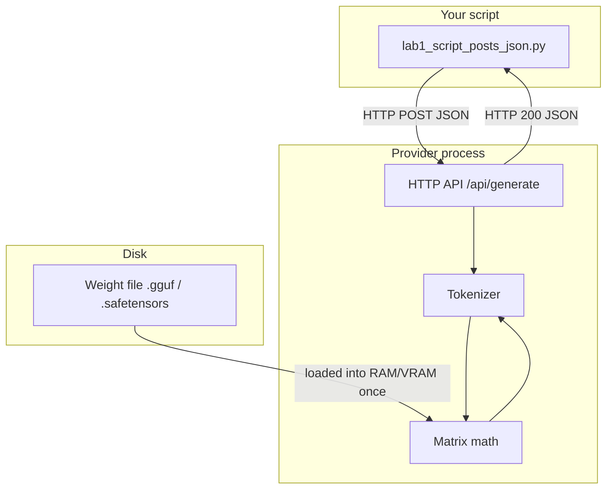

# 00: Script, Provider, Weights

By the end of this chapter, you will be able to clearly identify the three distinct parts of an AI system and understand what each one does. In later chapters, we will wrap network calls into reusable functions, but here we begin with the fundamental building blocks.

## Data
There are three separate pieces involved in running an AI interaction:

1. **The Python Script**: This is the file you write and execute. It constructs a JSON request body (specifying parameters like the model name and prompt) and sends it over the network as an HTTP POST request.
2. **The Provider**: This is a background server process (such as Ollama, LM Studio, vLLM, llama.cpp server, or a cloud API) that listens on a network port. It receives your JSON request, converts text into tokens, runs calculations through the model weights, and returns a JSON response.
3. **The Weight File**: This is a file stored on disk (such as a `.gguf` or `.safetensors` file) containing the numerical weights that define the trained model. The weight file itself cannot open network ports or respond to HTTP requests.

Your Python script never opens the weight file directly, and the weight file never interacts directly with your script. The provider server is the only process that loads the weights into memory (RAM or VRAM) to perform the mathematical calculations.

## Information
The complete lifecycle of a single request follows a straightforward path:

```text
Python Script ──(HTTP POST JSON)──> Provider API ──> Tokenizer ──> Matrix Math on Weights ──> Output Tokens ──(HTTP Response JSON)──> Python Script
```

1. The tokenizer breaks your prompt text into numeric token IDs.
2. The model processes those token IDs through its loaded weights to generate new token IDs.
3. The provider converts the new token IDs back into readable text and packages them into a JSON response sent back to your script.

If the provider server is not running, your script will fail with a connection error (`URLError` or connection refused). If the model name is incorrect or missing, the provider will return an HTTP error (such as a 404). Recognizing these as two distinct issues helps you troubleshoot quickly: check the server process first, then verify the model name.

## Knowledge
Here are the practical steps to make a basic model call:
1. Start your local provider (such as Ollama on `http://127.0.0.1:11434`), or confirm it is already running.
2. Read the server host and model name from your environment variables (`OLLAMA_HOST`, `OLLAMA_MODEL`) to avoid hardcoding configuration in your scripts.
3. Build a dictionary containing the required JSON fields.
4. Send an HTTP POST request to the provider endpoint with the `Content-Type: application/json` header.
5. Parse the returned JSON response.
6. Print the generated text field. For Ollama's native `/api/generate` endpoint, that field is `response`. For OpenAI-style `/v1/chat/completions`, it is `choices[0].message.content`.

Lab 1 sends a single POST request and prints the text. Lab 2 inspects and prints all the keys sent and received so you can see the complete data contract.

## Wisdom
Stop once your script successfully prints text from the model. Resist the urge to add helper classes, streaming parsers, retry logic, or agent loops at this stage. Those concepts are introduced step-by-step in later chapters. Keeping things simple now ensures you can immediately identify what broke if an error occurs.

## The When and Why
- **When**: Use this pattern the very first time an application needs to communicate with an AI model—before adding tools, loops, or complex agent behaviors.
- **Why**: Every advanced agentic pattern built later in this course is built on top of this exact same HTTP POST request. Having a clear mental model of the basic request makes it easy to understand the additional keys added in future chapters.

## How it works



Walkthrough of one request:

1. The script encodes `{"model": "...", "prompt": "...", "stream": false}` as bytes.
2. It opens a TCP connection to the provider host and port.
3. The provider maps the prompt string to token IDs, runs them through the loaded weights, and maps new token IDs back to text.
4. The provider puts that text in a JSON object and writes it back on the same connection.
5. The script decodes the JSON and prints the text field.

Nothing in that walkthrough opens the `.gguf` file. The provider already loaded it when it started, or when you first named that model.

## Data contract

Ollama native generate (what the labs use):

**Request** `POST /api/generate`

```json
{
  "model": "qwen3.6:35b-a3b-65k",
  "prompt": "string",
  "stream": false,
  "options": { "temperature": 0.0 }
}
```

`options` is optional. Lab 1 omits it. Lab 2 sends `temperature: 0.0` so the reply is repeatable.

**Response**

```json
{
  "model": "qwen3.6:35b-a3b-65k",
  "response": "string",
  "done": true,
  "eval_count": 0,
  "eval_duration": 0
}
```

`eval_count` is how many tokens the model produced, including thinking tokens you may not see. `eval_duration` is nanoseconds of decode on Ollama.

OpenAI-compatible chat (same job, different keys; you will use this in chapter 02):

**Request** `POST /v1/chat/completions`

```json
{
  "model": "qwen3.6:35b-a3b-65k",
  "messages": [{ "role": "user", "content": "string" }]
}
```

**Response**

```json
{
  "choices": [{ "message": { "role": "assistant", "content": "string" } }]
}
```

## Lab
Done when you can name the three things and one POST has printed model text.

- Module: [this file](./00_script_provider_weights.md)
- Lab 1: [lab1_script_posts_json.py](./lab1_script_posts_json.py) / [lab1_script_posts_json.md](./lab1_script_posts_json.md) - POST, print the text. Done when you see two sentences from the model.
- Lab 2: [lab2_read_the_json.py](./lab2_read_the_json.py) / [lab2_read_the_json.md](./lab2_read_the_json.md) - print request keys and response keys. Done when you can name every required key without looking.

## Related
- **Ollama:** local HTTP server. Default port `11434`. Easy model pull. Native `/api/generate` and OpenAI-style `/v1/chat/completions`.
- **LM Studio:** local desktop app that also serves HTTP. Same job as Ollama, GUI-first, OpenAI-style routes.
- **vLLM:** local or server inference for higher throughput. OpenAI-style `/v1`. Use when many requests share one GPU.
- **llama.cpp server:** C++ HTTP process in front of a GGUF file. Same three things, thinner stack.
- **OpenAI / Claude / Gemini:** same JSON job on a remote URL. You add an API key header. The weight file is on their machines, not yours.

## Notes
- Chapter 01 keeps the latency-profiling script. This chapter is the three things. Chapter 01 is the wrapper function and the metrics.
- Reasoning models (Qwen 3.6, DeepSeek-R1 style) may spend tokens on internal thinking before the visible `response` text. `eval_count` can look large for a two-sentence answer. That is expected. Chapter 12 strips those thinking tokens. Do not handle it here.
