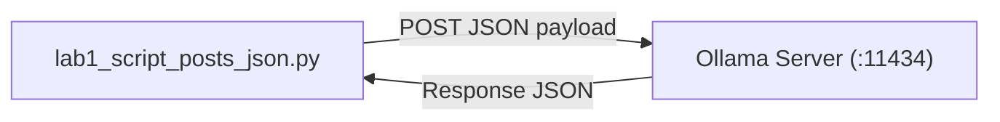

# Lab 1: Sending an HTTP POST Request to a Model

In this lab, you will write a standalone Python script that sends a JSON payload to a local model and prints the generated text response.

---

## What you touch
- Script: `lab1_script_posts_json.py`
- URL / Endpoint: `{OLLAMA_HOST}/api/generate` (defaults to `http://127.0.0.1:11434/api/generate`)
- Keys Sent: `model`, `prompt`, `stream` (`false`)
- Keys Read: `response`

---

## Steps


1. Read `OLLAMA_HOST` and `OLLAMA_MODEL` from environment variables using `os.environ.get()` (defaulting to `http://127.0.0.1:11434` and `llama3.2:1b` if unset).
2. Construct a Python dictionary with three fields:
   - `"model"`: your target model string
   - `"prompt"`: `"In 2 sentences, explain what an HTTP POST request is."`
   - `"stream"`: `False`
3. Send an HTTP POST request to `{OLLAMA_HOST}/api/generate` with the header `Content-Type: application/json` using Python's standard `urllib.request`.
4. Parse the returned JSON response bytes using `json.loads()`.
5. Extract and print the `response` string. If the response is missing or the host is unreachable, display a helpful error message.

---

## Data contract

**Request Payload**

```json
{
  "model": "llama3.2:1b",
  "prompt": "In 2 sentences, explain what an HTTP POST request is.",
  "stream": false
}
```

**Response Payload**

```json
{
  "response": "An HTTP POST request is used to send data to a server..."
}
```

---

## Run
From the repository root, run:

```bash
python education/00_atoms/lab1_script_posts_json.py
```

```powershell
python education/00_atoms/lab1_script_posts_json.py
```

---

## What you should see
You should see a clear, two-sentence explanation of HTTP POST printed to your terminal.

- If you encounter a `URLError` or connection error, verify that Ollama or your local server is actively running.
- If you receive an HTTP 404, check that your model name matches what is installed (`ollama list`).

---

## Stop here
This lab focuses purely on executing a single HTTP POST request. Do not build wrapper functions or add token streaming yet—those will be developed in Chapter 01.

Next up: [Lab 2: Reading the JSON Contract](./lab2_read_the_json.md).

---

## Notes
*(Record your output and any observations here after running the script)*

