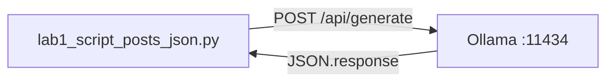

# Lab 1: Script posts JSON

After this lab a Python file on disk has received text from a model. No wrapper function. No streaming. No tools.

## Data
- Script: `lab1_script_posts_json.py`
- URL: `{OLLAMA_HOST}/api/generate` (default `http://192.168.1.29:11434/api/generate`)
- Model name string: `OLLAMA_MODEL` (default `qwen3.6:35b-a3b-65k`)
- Request keys used: `model`, `prompt`, `stream`
- Response key printed: `response`

## Information
The script POSTs one JSON object and prints one string. If the print works, the three boxes from the module are wired.

## Knowledge
1. Read host and model from env, or use the defaults.
2. Build the JSON body with `stream` set to `false`.
3. POST it with `Content-Type: application/json`.
4. Decode the response JSON.
5. Print `result["response"]`.

## Wisdom
This is not a client library. If you want `def query_llm(prompt) -> str`, that is chapter 01. If the POST fails, fix the provider or the URL before writing more code.

## The When and Why
- **When:** you have a provider running and you have never sent it a request from your own script.
- **Why:** a one-file POST is the smallest proof that the script, the API, and the weights are three separate things.

## How it works



## Data contract

**Request**

```json
{
  "model": "qwen3.6:35b-a3b-65k",
  "prompt": "In 2 sentences, explain what an HTTP POST request is.",
  "stream": false
}
```

**Response** (fields this lab reads)

```json
{
  "response": "string"
}
```

## Run
From the repo root:

```bash
python education/00_atoms/lab1_script_posts_json.py
```

```bash
set OLLAMA_HOST=http://192.168.1.29:11434
set OLLAMA_MODEL=qwen3.6:35b-a3b-65k
python education/00_atoms/lab1_script_posts_json.py
```

## What you should see
A short paragraph about HTTP POST. If you see `URLError` or `Connection refused`, the provider process is not reachable at that host. If you see HTTP 404, the model name is wrong or not pulled.

## What this becomes later
Chapter 01 wraps this POST in `query_llm(prompt) -> str` and then streams tokens. Lab 2 of this chapter stays on the same POST and names every JSON key.

## Related
- **Ollama `/api/chat`:** same server, `messages[]` instead of `prompt`. Chapter 02.
- **OpenAI `/v1/chat/completions`:** same job, different URL and keys. Ollama also exposes this route.

## Notes
- A prior run against the LAN host saw ~13s wall time with `stream: false`, plus a high `eval_count` from thinking tokens. Those numbers belong in chapter 01 notes, not here.
