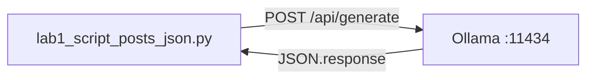

# Lab 1: Script posts JSON

A Python file on disk has received text from a model. No wrapper function. No streaming. No tools.

## What you touch
- Script: `lab1_script_posts_json.py`
- URL / path: `{OLLAMA_HOST}/api/generate` (default `http://192.168.1.29:11434/api/generate`)
- Keys sent: `model`, `prompt`, `stream` (`false`)
- Keys read: `response`

## Steps


1. Read `OLLAMA_HOST` and `OLLAMA_MODEL` from the environment. If they are unset, use `http://192.168.1.29:11434` and `qwen3.6:35b-a3b-65k`.
2. Build one JSON body: `model`, `prompt` ("In 2 sentences, explain what an HTTP POST request is."), `stream: false`. Do not send `options`.
3. POST it to `{host}/api/generate` with header `Content-Type: application/json`.
4. Decode the response JSON.
5. Print `result["response"]`. If that field is missing or empty, exit with an error. If the host is unreachable, exit with the URL and the connection error.

## Data contract
Only the keys this script sends and reads.

**Request**

```json
{
  "model": "qwen3.6:35b-a3b-65k",
  "prompt": "In 2 sentences, explain what an HTTP POST request is.",
  "stream": false
}
```

**Response**

```json
{
  "response": "string"
}
```

## Run
From the repo root:

```bash
python education/00_atoms/lab1_script_posts_json.py
```

```powershell
$env:OLLAMA_HOST="http://192.168.1.29:11434"
$env:OLLAMA_MODEL="qwen3.6:35b-a3b-65k"
python education/00_atoms/lab1_script_posts_json.py
```

## What you should see
Two sentences about HTTP POST. If you see `URLError` or `Connection refused`, the provider process is not reachable at that host. If you see HTTP 404, the model name is wrong or not pulled. If you see `empty 'response' field`, you hit the wrong route or the model returned no visible text.

## Stop here
This is not a client library. Do not add `def query_llm(prompt) -> str`. That is chapter 01. Do not stream. Do not add tools. Lab 2 of this chapter stays on the same POST and names every JSON key.

## Notes
Results from a real run. Questions that came up while running. Do not put module teaching here.
