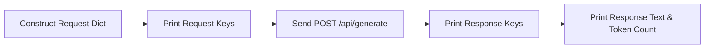

# Lab 2: Inspecting the Complete JSON Data Contract

In this lab, you will inspect both the request dictionary sent to the model provider and the response dictionary received back. Viewing every key directly builds confidence in the underlying protocol.

---

## What you touch
- Script: `lab2_read_the_json.py`
- URL / Endpoint: `{OLLAMA_HOST}/api/generate` (defaults to `http://127.0.0.1:11434/api/generate`)
- Keys Sent: `model`, `prompt`, `stream` (`false`), `options.temperature` (`0.0`)
- Keys Read: All top-level keys, with focus on `response`, `done`, and `eval_count`

---

## Steps


1. Read `OLLAMA_HOST` and `OLLAMA_MODEL` from environment variables, defaulting to `http://127.0.0.1:11434` and `llama3.2:1b`.
2. Construct the request dictionary with `model`, `prompt` (`"Reply with one sentence: what is JSON?"`), `stream: False`, and `options: {"temperature": 0.0}` to ensure consistent outputs.
3. Print the formatted request payload so you can see the outgoing JSON structure.
4. Send the HTTP POST request to the provider endpoint.
5. Parse the response JSON and print the sorted list of all top-level keys returned by the server.
6. Print the `response` string, the `done` boolean status, and the `eval_count` integer (the count of tokens generated).

---

## Data contract

**Request Payload**

```json
{
  "model": "llama3.2:1b",
  "prompt": "Reply with one sentence: what is JSON?",
  "stream": false,
  "options": {
    "temperature": 0.0
  }
}
```

**Response Payload**

```json
{
  "model": "llama3.2:1b",
  "response": "JSON (JavaScript Object Notation) is a lightweight data interchange format...",
  "done": true,
  "eval_count": 28,
  "total_duration": 450000000
}
```

---

## Run
From the repository root, run:

```bash
python education/00_atoms/lab2_read_the_json.py
```

```powershell
python education/00_atoms/lab2_read_the_json.py
```

---

## What you should see
You should see:
1. The formatted JSON request dictionary.
2. The list of returned response keys (such as `created_at`, `done`, `eval_count`, `eval_duration`, `model`, `response`, `total_duration`).
3. The generated sentence and `done: true`.

If you receive a connection error, verify that your local provider is running and accessible.

---

## Stop here
You now understand how the request and response shapes match up. We will not add Pydantic schemas or complex wrapper classes here. 

In Chapter 01, we will wrap this basic call into a reusable function and explore real-time token streaming.

Next up: [Chapter 01: The Call](../01_the_call/00_the_wrapper_and_the_stream.md).

---

## Notes
*(Record the key list and output from your run here)*

