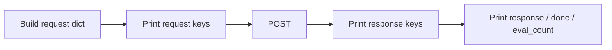

# Lab 2: Read the JSON

After this lab you can name the request keys and the response keys without looking. That named shape is the data contract.

## Data
Same POST as lab 1. This script prints:
- the request object (what you sent)
- the list of top-level keys in the response
- the value of `response`, `done`, `eval_count`

It does not pretty-print the whole raw body if it is huge. It prints keys, then the fields you will keep using.

## Information
A data contract is the agreed JSON shape in both directions. If a key is missing or the wrong type, your script raises `KeyError` or you read the wrong field. The provider does not care about your Python variable names. It only cares about these keys.

## Knowledge
1. Build the same body as lab 1.
2. Print the request keys and values (except keep the prompt short).
3. POST it.
4. Print `sorted(result.keys())`.
5. Print `response`, `done`, and `eval_count`.
6. If `eval_count` is much larger than the visible sentence count, write that down. Do not fix it.

## Wisdom
Do not add pydantic, a schema file, or a multi-provider wrapper yet. The contract is visible when you can list the keys. Chapter 02 turns this into `messages[]` and structured output. Chapter 03 adds a `tools` key.

## The When and Why
- **When:** the POST from lab 1 works and you are about to write a second script that reads the reply.
- **Why:** later bugs are almost always "I assumed a key that this provider does not send" or "I sent `prompt` to a route that wants `messages`".

## How it works



## Data contract

**Request keys this lab sends**

| Key | Type | Required |
|---|---|---|
| `model` | string | yes |
| `prompt` | string | yes for `/api/generate` |
| `stream` | bool | yes here (`false`) |
| `options.temperature` | number | no |

**Response keys this lab reads**

| Key | Type | Meaning |
|---|---|---|
| `response` | string | generated text |
| `done` | bool | generation finished |
| `eval_count` | int | generated token count, including thinking tokens |
| `eval_duration` | int | nanoseconds of decode (Ollama) |

Other keys may appear (`created_at`, `total_duration`, `context`). You do not need them yet. List them. Do not use them.

## Run

```bash
python education/00_atoms/lab2_read_the_json.py
```

## What you should see
A printed request, a printed key list, then the text and `done: true`. If `response` is empty and `done` is true, the model returned only thinking tokens or the field name is wrong for that route.

## What this becomes later
Chapter 02 switches this contract to `messages[]` / `role`. Chapter 03 adds `tools` on the request and `tool_calls` on the response. The dispatcher is a script that reads those new keys.

## Related
- **Ollama `/api/chat`:** request uses `messages`; response uses `message.content` instead of `response`.
- **OpenAI / Claude / Gemini:** same idea, different required keys and auth headers. Read their schema before writing the client.

## Notes
Leave this section empty until you run it. Paste the key list from your machine here.
