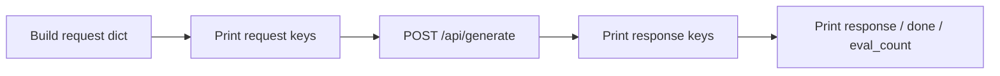

# Lab 2: Read the JSON

You can name the request keys and the response keys without looking. That named shape is the data contract.

## What you touch
- Script: `lab2_read_the_json.py`
- URL / path: `{OLLAMA_HOST}/api/generate` (default `http://192.168.1.29:11434/api/generate`)
- Keys sent: `model`, `prompt`, `stream` (`false`), `options.temperature` (`0.0`)
- Keys read: top-level key list, plus `response`, `done`, `eval_count`

## Steps


1. Build the same route as lab 1. Add `options.temperature: 0.0`. Use a short prompt: "Reply with one sentence: what is JSON?"
2. Print the request object (pretty JSON).
3. POST it to `{host}/api/generate` with `Content-Type: application/json`.
4. Print `sorted(result.keys())`.
5. Print `response`, `done`, and `eval_count`.
6. If `eval_count` is much larger than the visible sentence count, write that number under Notes. Do not strip thinking tokens.

## Data contract
Only the keys this script sends and reads.

**Request**

```json
{
  "model": "qwen3.6:35b-a3b-65k",
  "prompt": "Reply with one sentence: what is JSON?",
  "stream": false,
  "options": { "temperature": 0.0 }
}
```

**Response**

```json
{
  "response": "string",
  "done": true,
  "eval_count": 0
}
```

Other keys may appear (`created_at`, `total_duration`, `eval_duration`, `context`). List them. Do not use them.

## Run
From the repo root:

```bash
python education/00_atoms/lab2_read_the_json.py
```

```powershell
$env:OLLAMA_HOST="http://192.168.1.29:11434"
$env:OLLAMA_MODEL="qwen3.6:35b-a3b-65k"
python education/00_atoms/lab2_read_the_json.py
```

## What you should see
A printed request, a printed key list, then the text and `done: true`. If `response` is empty and `done` is true, the model returned only thinking tokens or the field name is wrong for that route. If you see `URLError`, the provider is not reachable.

## Stop here
Do not add pydantic, a schema file, or a multi-provider wrapper. The contract is visible when you can list the keys. Chapter 02 switches this contract to `messages[]` / `role`. Chapter 03 adds `tools` on the request and `tool_calls` on the response.

## Notes
Leave this empty until you run it. Paste the key list from your machine here.
