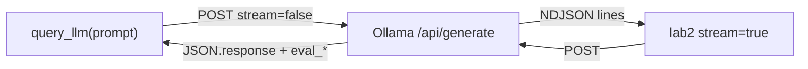

# 01: The Call

After this chapter you have `query_llm(prompt) -> str` and you can stream tokens. Chapter 00 was one raw POST. This chapter wraps that POST and then turns `stream` on.

## Data
- Function: `query_llm(prompt: str) -> str`
- Host: `OLLAMA_HOST` (default `http://192.168.1.29:11434`)
- Model: `OLLAMA_MODEL` (default `qwen3.6:35b-a3b-65k`)
- Routes: `POST /api/generate` with `stream: false` (lab 1) and `stream: true` (lab 2)
- Metrics keys: `eval_count`, `eval_duration` (nanoseconds). Wall time from `time.time()`.
- TTFT: seconds until the first JSON line arrives when `stream` is true.

## Information
Lab 1 wraps the chapter 00 POST in a function and prints latency and tokens/sec. Lab 2 sets `stream: true` and reads one JSON object per line. The first line is TTFT. Later lines are decode. Gateways, retries, and multi-provider clients are chapter 11.

## Knowledge
1. Read host and model from the environment.
2. Write `query_llm(prompt)` that POSTs `stream: false`, returns `response`, and prints wall time, `eval_count`, and TPS = `eval_count / (eval_duration / 1e9)`.
3. Write a second script that POSTs `stream: true`, iterates `for line in response`, prints `chunk["response"]` immediately, and records TTFT on the first line.
4. Do not add a circuit breaker or a second provider.

## Wisdom
A wrapper is enough when you need the same POST from more than one place. Streaming is enough when a 13s wait for the full body feels frozen. A gateway is not this chapter.

## The When and Why
- **When:** you already have one working POST and you are about to call the model from a second script.
- **Why:** without a function you copy the POST. Without streaming you wait for the whole body. Both are this chapter. Failover is not.

## How it works



Walkthrough of a streaming request:
1. The script POSTs `stream: true`.
2. The provider writes one JSON object per generated chunk, then a final object with `done: true` and the `eval_*` fields.
3. The script prints each `response` fragment as it arrives and computes TTFT from the first line.

## Data contract

**Request** `POST /api/generate`

```json
{
  "model": "qwen3.6:35b-a3b-65k",
  "prompt": "string",
  "stream": false,
  "options": { "temperature": 0.0 }
}
```

**Response** (non-stream)

```json
{
  "response": "string",
  "done": true,
  "eval_count": 0,
  "eval_duration": 0
}
```

**Response** (one stream line)

```json
{
  "response": "token-or-chunk",
  "done": false
}
```

## Lab
- [lab1_llm_api_basics.py](./lab1_llm_api_basics.py) / [lab1_llm_api_basics.md](./lab1_llm_api_basics.md) — wrap the POST, print latency and TPS. Done when you have a number for wall time and tokens/sec.
- [lab2_streaming_tokens.py](./lab2_streaming_tokens.py) / [lab2_streaming_tokens.md](./lab2_streaming_tokens.md) — stream lines, print TTFT. Done when the first token appears before the full answer.

## Related
- **Ollama `/api/generate`:** native NDJSON stream when `stream` is true. What these labs use.
- **OpenAI `/v1/chat/completions` + SSE:** same job, `data: {...}` lines and `data: [DONE]`. Chapter 10 if you serve that to a browser.

## Notes
- A prior non-stream run on the LAN host: ~13.01s wall time, 766 `eval_count` for a two-sentence answer, 61.29 tokens/sec. The extra tokens are thinking tokens. Chapter 12 strips them.
- `"stream": false` is why the 13s wait happened. That is the reason lab 2 exists.
