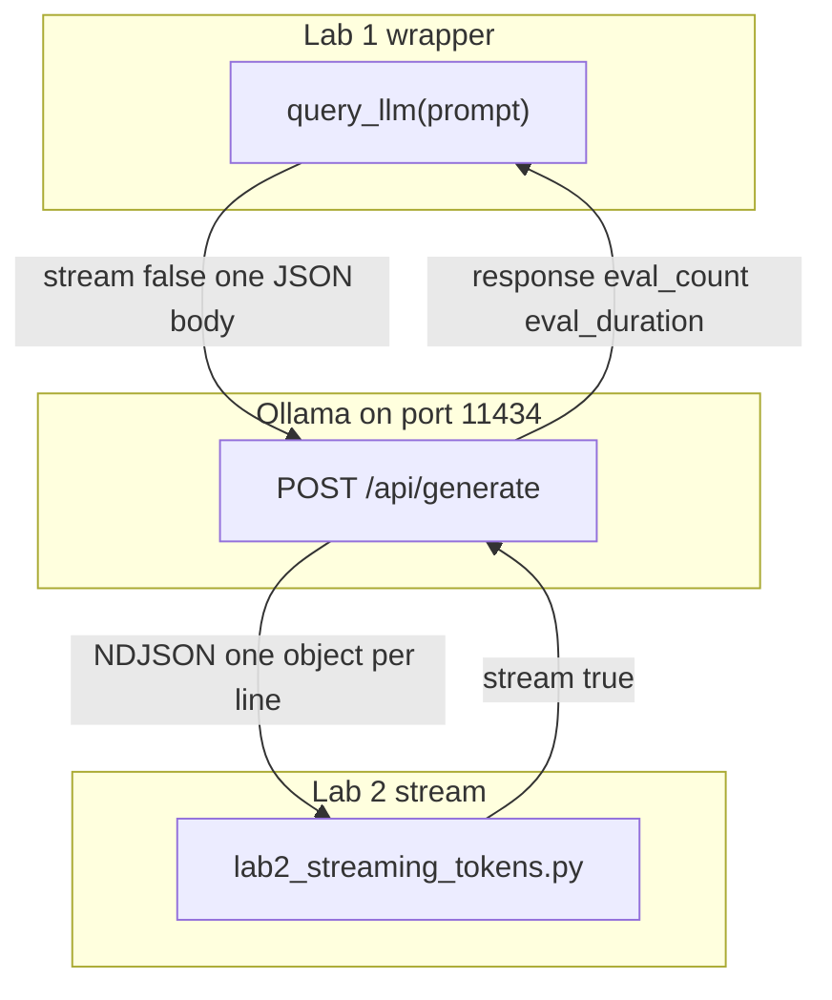

# 01: The Call

After this chapter you have a function `query_llm(prompt) -> str` and you can read tokens as they arrive. Chapter 00 was one raw POST in the script body. This chapter puts that POST in a function, then turns `stream` on.

## Data
The same three things from chapter 00 are still here: a script, a provider on a port, and a weight file the provider already loaded. Two new literals appear.

A **function** named `query_llm` takes one argument, `prompt` (a string), and returns one value, the model text (a string). Other scripts call `query_llm("...")` instead of copying the `urllib.request` POST.

The **host** and **model** still come from the environment. `OLLAMA_HOST` defaults to `http://192.168.1.29:11434`. `OLLAMA_MODEL` defaults to `qwen3.6:35b-a3b-65k`. The route is still `POST /api/generate`.

`stream` is a boolean on the request. `false` means the provider waits until the full answer exists, then sends one JSON object. `true` means the provider writes one JSON object per generated chunk, one object per line (NDJSON: newline-delimited JSON).

The metric keys on the response are `eval_count` (tokens the model produced) and `eval_duration` (nanoseconds of decode on Ollama). Wall time is `time.time()` in the script, not a provider field. TTFT is seconds from the POST start until the first JSON line arrives when `stream` is true. Tokens per second is `eval_count / (eval_duration / 1e9)`.

## Information
Wrapping means the chapter 00 POST lives inside `query_llm`. The URL, the JSON body, and the read of `response` stay the same. The new fact is that a second script can call the function without repeating those lines.

Streaming means the TCP connection stays open. The provider writes a line when it has a chunk. The script prints `chunk["response"]` and flushes stdout so text appears before the final `done: true` line. That final line carries `eval_count` and `eval_duration`.

Lab 1 keeps `stream: false`, returns the text, and prints wall time, `eval_count`, and tokens/sec. Lab 2 sets `stream: true`, prints each chunk as it arrives, and records TTFT on the first line. Gateways, retries, and a second provider are chapter 11.

## Knowledge
1. Read `OLLAMA_HOST` and `OLLAMA_MODEL` from the environment. Use the same defaults as chapter 00.
2. Write `query_llm(prompt: str) -> str`. Inside it, POST `model`, `prompt`, `stream: false`, and `options.temperature: 0.0` to `{host}/api/generate`. Return `result["response"]`.
3. Time the call with `time.time()`. Print the text, wall time, `eval_count`, and TPS = `eval_count / (eval_duration / 1e9)`.
4. Write a second script that POSTs the same keys with `stream: true`. Iterate `for line in response`. Parse each line as JSON. Print `chunk["response"]` immediately (`sys.stdout.write` then `flush`). Store TTFT on the first non-empty line. On `done: true`, read `eval_count` and `eval_duration` and print TPS.
5. Do not add a circuit breaker, a second host, or a client class.

## Wisdom
A wrapper is the right tool when you are about to copy the POST into a second file. Streaming is the right tool when a 13 second wait for one JSON body leaves the terminal blank. If you only need one POST and you do not care about the wait, chapter 00 is enough. A gateway, retries, and failover are not this chapter. Adding them now hides whether the function, the stream parser, or the host is what broke.

## The When and Why
- **When:** you already have one working POST and you are about to call the model from a second script, or a non-stream call sits silent for many seconds.
- **Why:** without a function you copy the POST. Without streaming you wait for the whole body. Both are this chapter. Failover is not.

## How it works



Walkthrough of one streaming request:

1. The script POSTs `{"model": "...", "prompt": "...", "stream": true, "options": {"temperature": 0.0}}` to `{OLLAMA_HOST}/api/generate`.
2. The provider writes one JSON object per generated chunk. Each object has `response` (the text fragment) and `done` (false until the last line).
3. The script prints each `response` fragment as it arrives. The clock at the first line minus the clock at the POST start is TTFT.
4. The last object has `done: true` plus `eval_count` and `eval_duration`. The script prints those numbers and TPS.

Nothing in that walkthrough changes the weight file or the port. The only request key that changed from lab 1 is `stream`.

## Data contract

**Request** `POST /api/generate`

```json
{
  "model": "qwen3.6:35b-a3b-65k",
  "prompt": "string",
  "stream": false,
  "options": { "temperature": 0.0 }
}
```

Lab 1 sends `stream: false`. Lab 2 sends `stream: true`. Both send `options.temperature: 0.0`.

**Response** (non-stream, one object)

```json
{
  "response": "string",
  "done": true,
  "eval_count": 0,
  "eval_duration": 0
}
```

**Response** (one stream line)

```json
{
  "response": "token-or-chunk",
  "done": false
}
```

The final stream line sets `done: true` and adds `eval_count` and `eval_duration`.

## Lab
Done when you can call a wrapper for the text and you have seen the first stream chunk before the full answer.

- Module: [this file](./00_the_wrapper_and_the_stream.md)
- Lab 1: [lab1_llm_api_basics.py](./lab1_llm_api_basics.py) / [lab1_llm_api_basics.md](./lab1_llm_api_basics.md) — wrap the POST, print wall time and tokens/sec. Done when those two numbers print.
- Lab 2: [lab2_streaming_tokens.py](./lab2_streaming_tokens.py) / [lab2_streaming_tokens.md](./lab2_streaming_tokens.md) — stream lines, print TTFT. Done when the first token appears before the full answer.

## Related
- **Ollama `/api/generate`:** native NDJSON stream when `stream` is true. What these labs use.
- **OpenAI `/v1/chat/completions` + SSE:** same job, `data: {...}` lines and `data: [DONE]`. Chapter 10 if you serve that to a browser.

## Notes
- A prior non-stream run on the LAN host: about 13.01 seconds wall time, 766 `eval_count` for a two-sentence answer, 61.29 tokens/sec. The extra tokens are thinking tokens. Chapter 12 strips them. Do not strip them here.
- `stream: false` is why the 13 second wait happened. That is the reason lab 2 exists.
- The reference `lab1_llm_api_basics.py` does the POST in the script body. It does not define `def query_llm`. The intended contract is still `query_llm(prompt) -> str`. Write the function in your copy. Leave the reference file as-is.
