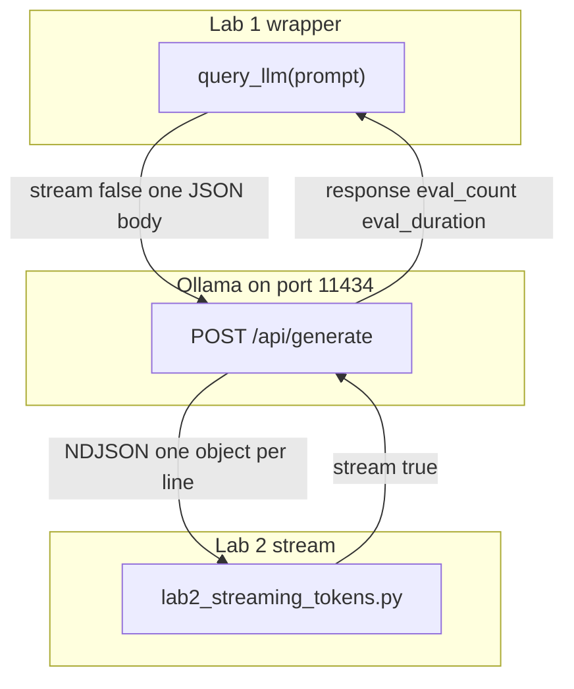

# 01: The Call: Function Wrappers and Token Streaming

By the end of this chapter, you will have a clean, reusable Python function `query_llm(prompt) -> str` and will understand how to stream response tokens to your terminal in real time.

In Chapter 00, we wrote a raw HTTP POST request in the main body of a script. In this chapter, we wrap that call into a reusable function and turn on streaming so you don't have to wait for the entire answer before seeing output.

## Data
We work with the same three components from Chapter 00: your Python script, the background provider server, and the loaded model weights.

Two new concepts appear:
1. **The Reusable Wrapper Function**: A function named `query_llm(prompt: str) -> str` that encapsulates building the payload, sending the HTTP request, and returning the output string. This prevents you from having to copy network boilerplate across different scripts.
2. **The `stream` Flag**: A boolean field in your JSON request:
   - `stream: false`: The server completes the entire response before sending back a single JSON object.
   - `stream: true`: The server sends back chunks of text as newline-delimited JSON (NDJSON) lines as they are generated.

We also measure two key performance metrics:
- **Time to First Token (TTFT)**: The number of seconds between sending your request and receiving the very first chunk of text.
- **Tokens Per Second (TPS)**: How fast the model generates text, calculated as `eval_count / (eval_duration / 1e9)`.

## Information
Wrapping code into a function organizes your project cleanly: the underlying HTTP headers and JSON serialization stay safely inside `query_llm`, allowing your application logic to simply ask a question and receive a string.

Streaming keeps the network connection open so you can display words on the screen as they are generated. Rather than waiting multiple seconds in front of a silent terminal, your script prints text chunks incrementally and records performance metrics when the stream finishes.

## Knowledge
Here is the step-by-step workflow:
1. Read `OLLAMA_HOST` and `OLLAMA_MODEL` from your environment variables, using default fallback values if unset.
2. Create `query_llm(prompt: str) -> str` to send `model`, `prompt`, `stream: false`, and `options: {"temperature": 0.0}` to `{OLLAMA_HOST}/api/generate`.
3. Track execution time using `time.time()` and calculate generation speed in tokens per second.
4. Set `stream: true` to iterate over incoming response lines (`for line in response:`).
5. Parse each JSON line, write `chunk["response"]` to `sys.stdout`, and call `sys.stdout.flush()`.
6. When the final chunk arrives (`done: true`), read `eval_count` and `eval_duration` to calculate final metrics.

## Wisdom
A wrapper function is helpful as soon as you find yourself copying HTTP request code into multiple files. Streaming is essential when you want responsive, real-time user experiences without long, silent delays.

Keep your wrapper focused on the single call: do not add complex retry loops or multi-model routing yet. We will cover resiliency patterns in Chapter 06.

## The When and Why
- **When**: Use a wrapper function whenever you need a clean, reusable way to query a model. Use streaming whenever you want real-time feedback and lower perceived latency.
- **Why**: Without a wrapper function, you have to duplicate HTTP code across every file. Without streaming, users must wait silently until the entire response finishes generating.

## How it works



Walkthrough of one streaming request:

1. The script POSTs `{"model": "...", "prompt": "...", "stream": true, "options": {"temperature": 0.0}}` to `{OLLAMA_HOST}/api/generate`.
2. The provider writes one JSON object per generated chunk. Each object has `response` (the text fragment) and `done` (false until the last line).
3. The script prints each `response` fragment as it arrives. The clock at the first line minus the clock at the POST start is TTFT.
4. The last object has `done: true` plus `eval_count` and `eval_duration`. The script prints those numbers and TPS.

Nothing in that walkthrough changes the weight file or the port. The only request key that changed from lab 1 is `stream`.

## Data contract

**Request** `POST /api/generate`

```json
{
  "model": "qwen3.6:35b-a3b-65k",
  "prompt": "string",
  "stream": false,
  "options": { "temperature": 0.0 }
}
```

Lab 1 sends `stream: false`. Lab 2 sends `stream: true`. Both send `options.temperature: 0.0`.

**Response** (non-stream, one object)

```json
{
  "response": "string",
  "done": true,
  "eval_count": 0,
  "eval_duration": 0
}
```

**Response** (one stream line)

```json
{
  "response": "token-or-chunk",
  "done": false
}
```

The final stream line sets `done: true` and adds `eval_count` and `eval_duration`.

## Lab
Done when you can call a wrapper for the text and you have seen the first stream chunk before the full answer.

- Module: [this file](./00_the_wrapper_and_the_stream.md)
- Lab 1: [lab1_llm_api_basics.py](./lab1_llm_api_basics.py) / [lab1_llm_api_basics.md](./lab1_llm_api_basics.md) — wrap the POST, print wall time and tokens/sec. Done when those two numbers print.
- Lab 2: [lab2_streaming_tokens.py](./lab2_streaming_tokens.py) / [lab2_streaming_tokens.md](./lab2_streaming_tokens.md) — stream lines, print TTFT. Done when the first token appears before the full answer.

## Related
- **Ollama `/api/generate`:** native NDJSON stream when `stream` is true. What these labs use.
- **OpenAI `/v1/chat/completions` + SSE:** same job, `data: {...}` lines and `data: [DONE]`. Chapter 10 if you serve that to a browser.

## Notes
- A prior non-stream run on the LAN host: about 13.01 seconds wall time, 766 `eval_count` for a two-sentence answer, 61.29 tokens/sec. The extra tokens are thinking tokens. Chapter 12 strips them. Do not strip them here.
- `stream: false` is why the 13 second wait happened. That is the reason lab 2 exists.
- The reference `lab1_llm_api_basics.py` does the POST in the script body. It does not define `def query_llm`. The intended contract is still `query_llm(prompt) -> str`. Write the function in your copy. Leave the reference file as-is.
