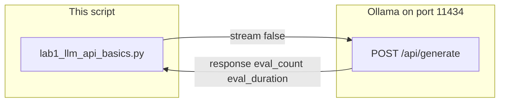

# Lab 1: Wrapper and latency

`query_llm` returns the model text and the script has printed wall time, `eval_count`, and tokens/sec.

## What you touch
- Script: `lab1_llm_api_basics.py`
- URL / path: `{OLLAMA_HOST}/api/generate` (default `http://192.168.1.29:11434/api/generate`)
- Keys sent: `model`, `prompt`, `stream` (`false`), `options.temperature` (`0.0`)
- Keys read: `response`, `eval_count`, `eval_duration`

## Steps


1. Read `OLLAMA_HOST` and `OLLAMA_MODEL` from the environment. If they are unset, use `http://192.168.1.29:11434` and `qwen3.6:35b-a3b-65k`.
2. Write `query_llm(prompt: str) -> str`. Inside it, build one JSON body: `model`, `prompt`, `stream: false`, `options.temperature: 0.0`.
3. POST that body to `{host}/api/generate` with header `Content-Type: application/json`.
4. Start a timer with `time.time()` before the POST. Stop it after the body is read.
5. Decode the response JSON. Return `result["response"]` from the function.
6. Print the text, then wall time, `eval_count`, and TPS = `eval_count / (eval_duration / 1e9)`. Use the prompt `In 2 sentences, explain what an HTTP POST request is.`
7. If the host is unreachable, print the error and exit. Do not retry.

## Data contract
Only the keys this script sends and reads.

**Request**

```json
{
  "model": "qwen3.6:35b-a3b-65k",
  "prompt": "In 2 sentences, explain what an HTTP POST request is.",
  "stream": false,
  "options": { "temperature": 0.0 }
}
```

**Response**

```json
{
  "response": "string",
  "eval_count": 0,
  "eval_duration": 0
}
```

## Run
From the repo root:

```bash
python education/01_the_call/lab1_llm_api_basics.py
```

```powershell
$env:OLLAMA_HOST="http://192.168.1.29:11434"
$env:OLLAMA_MODEL="qwen3.6:35b-a3b-65k"
python education/01_the_call/lab1_llm_api_basics.py
```

## What you should see
The two-sentence answer, then wall time, token count, and tokens/sec. If you see `URLError` or `Error connecting to Ollama`, the provider is not reachable at that host. If the call hangs, the provider is slow or `stream` is still false and the model is thinking. If `eval_count` is hundreds for two sentences, those are thinking tokens. Do not strip them.

## Stop here
This is not a multi-provider client. Do not add retries, a second host, or a stream parser. Lab 2 of this chapter turns `stream` on. Chapter 11 wraps this call with retries.

## Notes
- A prior run on the LAN host: 13.01 seconds wall time, 766 `eval_count`, 61.29 tokens/sec. The extra tokens are thinking tokens.
- Contract drift: the reference `lab1_llm_api_basics.py` POSTs in the script body. It does not define `def query_llm`. Keys sent and read match this brief. Write the function in your copy. Do not edit the `.py` in the repo.
