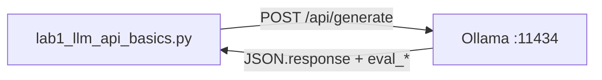

# Lab 1: Wrapper and latency

After this lab you have `query_llm` (or the same POST in one function) and a printed wall time, token count, and tokens/sec.

## Data
- Script: `lab1_llm_api_basics.py`
- URL: `{OLLAMA_HOST}/api/generate`
- Keys sent: `model`, `prompt`, `stream: false`, `options.temperature`
- Keys read: `response`, `eval_count`, `eval_duration`

## Information
One POST. The function returns the text. The prints are the metrics.

## Knowledge
1. Read host and model from env (defaults match chapter 00).
2. POST `stream: false`.
3. Time the call with `time.time()`.
4. Print `response`, wall time, `eval_count`, and TPS.

## Wisdom
This is not a multi-provider client. Chapter 11 adds retries and a second host.

## The When and Why
- **When:** chapter 00 POST works and you need the same call from more than one place, plus numbers.
- **Why:** a wrapper plus metrics is the smallest step after a raw POST.

## How it works



## Data contract

**Request**

```json
{
  "model": "qwen3.6:35b-a3b-65k",
  "prompt": "In 2 sentences, explain what an HTTP POST request is.",
  "stream": false,
  "options": { "temperature": 0.0 }
}
```

**Response fields this lab reads**

```json
{
  "response": "string",
  "eval_count": 0,
  "eval_duration": 0
}
```

## Run
From the repo root:

```bash
python education/01_the_call/lab1_llm_api_basics.py
```

## What you should see
The two-sentence answer, then wall time, token count, and TPS. If the call hangs, the provider is slow or unreachable. If `eval_count` is hundreds for two sentences, those are thinking tokens.

## What this becomes later
Lab 2 of this chapter turns `stream` on. Chapter 11 wraps this call with retries.

## Related
- **Ollama `/api/chat`:** `messages[]` instead of `prompt`. Chapter 02.

## Notes
- Why 766 tokens for a 2-sentence output? Reasoning models generate internal thinking tokens before the visible text. Throughput stayed ~61.29 tokens/sec.
- `"stream": false` made the user wait 13.01 seconds. That is lab 2.
