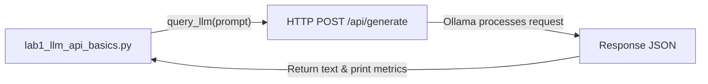

# Lab 1: Creating a Reusable Function Wrapper and Measuring Latency

In this lab, you will wrap your model request inside a clean Python function `query_llm(prompt: str) -> str` and measure key performance metrics: total elapsed time, token count, and generation speed (tokens per second).

---

## What you touch
- Script: `lab1_llm_api_basics.py`
- URL / Endpoint: `{OLLAMA_HOST}/api/generate` (defaults to `http://127.0.0.1:11434/api/generate`)
- Keys Sent: `model`, `prompt`, `stream` (`false`), `options.temperature` (`0.0`)
- Keys Read: `response`, `eval_count`, `eval_duration`

---

## Steps


1. Read `OLLAMA_HOST` and `OLLAMA_MODEL` from environment variables, defaulting to `http://127.0.0.1:11434` and `llama3.2:1b`.
2. Define `query_llm(prompt: str) -> str`:
   - Construct the request payload dictionary with `model`, `prompt`, `stream: False`, and `options: {"temperature": 0.0}`.
   - Record the start timestamp using `time.time()`.
   - Send the HTTP POST request to `{OLLAMA_HOST}/api/generate`.
   - Parse the response JSON and calculate elapsed wall time.
   - Extract `response`, `eval_count`, and `eval_duration`.
3. Calculate generation speed using the formula:
   $$\text{Tokens Per Second} = \frac{\text{eval\_count}}{\text{eval\_duration} / 10^9}$$
4. Call `query_llm("In 2 sentences, explain what an HTTP POST request is.")`.
5. Print the returned text followed by elapsed time, token count, and tokens per second.

---

## Data contract

**Request Payload**

```json
{
  "model": "llama3.2:1b",
  "prompt": "In 2 sentences, explain what an HTTP POST request is.",
  "stream": false,
  "options": {
    "temperature": 0.0
  }
}
```

**Response Payload**

```json
{
  "response": "An HTTP POST request transmits data to a specified server...",
  "eval_count": 35,
  "eval_duration": 480000000
}
```

---

## Run
From the repository root, run:

```bash
python education/01_the_call/lab1_llm_api_basics.py
```

```powershell
python education/01_the_call/lab1_llm_api_basics.py
```

---

## What you should see
You should see:
1. The model's two-sentence response.
2. The total elapsed time in seconds.
3. The number of tokens evaluated.
4. The generation speed in tokens per second.

---

## Stop here
This lab focuses purely on creating a clean function wrapper and measuring baseline performance. We will implement real-time token streaming in Lab 2.

Next up: [Lab 2: Streaming Tokens](./lab2_streaming_tokens.md).

---

## Notes
*(Record your output and performance numbers from your run here)*

