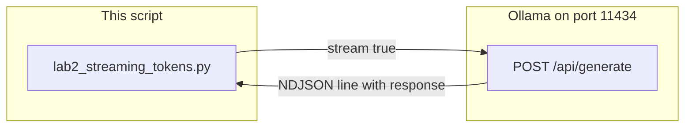

# Lab 2: Stream tokens

Tokens print as they arrive and the script has a TTFT number.

## What you touch
- Script: `lab2_streaming_tokens.py`
- URL / path: `{OLLAMA_HOST}/api/generate` (default `http://127.0.0.1:11434/api/generate`)
- Keys sent: `model`, `prompt`, `stream` (`true`), `options.temperature` (`0.0`)
- Keys read: each line `response` and `done`; on `done: true`, `eval_count` and `eval_duration`

## Steps


1. Read `OLLAMA_HOST` and `OLLAMA_MODEL` from the environment. If they are unset, use `http://127.0.0.1:11434` and `llama3.2:1b`.
2. Build one JSON body: `model`, `prompt` (`Write a 3-step technical summary of why streaming HTTP responses reduces perceived latency.`), `stream: true`, `options.temperature: 0.0`.
3. POST it to `{host}/api/generate` with header `Content-Type: application/json`. Start `time.time()` before the POST.
4. Iterate `for line in response`. Skip empty lines. Parse each line with `json.loads`.
5. On the first non-empty line, store TTFT as now minus the start time.
6. Write `chunk["response"]` with `sys.stdout.write` and `sys.stdout.flush()` so text appears before the next line.
7. When `chunk["done"]` is true, read `eval_count` and `eval_duration`. Print TTFT, total duration, `eval_count`, and TPS = `eval_count / (eval_duration / 1e9)`.

## Data contract
Only the keys this script sends and reads.

**Request**

```json
{
  "model": "llama3.2:1b",
  "prompt": "Write a 3-step technical summary of why streaming HTTP responses reduces perceived latency.",
  "stream": true,
  "options": { "temperature": 0.0 }
}
```

**Response** (one stream line)

```json
{
  "response": "string",
  "done": false
}
```

The last line sets `done: true` and adds `eval_count` and `eval_duration`.

## Run
From the repo root:

```bash
OLLAMA_HOST=http://127.0.0.1:11434 OLLAMA_MODEL=llama3.2:1b python education/01_the_call/lab2_streaming_tokens.py
```

```powershell
$env:OLLAMA_HOST="http://127.0.0.1:11434"
$env:OLLAMA_MODEL="llama3.2:1b"
python education/01_the_call/lab2_streaming_tokens.py
```

## What you should see
Text appearing incrementally, then TTFT, total duration, token count, and tokens/sec. If you see nothing until the end, `stream` is still false or stdout is buffered (you skipped `flush`). If you see `Error reading stream`, the provider closed the connection or a line was not JSON. If TTFT is close to total duration, you waited for the full body.

## Stop here
This is not a browser SSE server. Do not add FastAPI, a WebSocket, or a thinking-token filter. Next: [00_messages_and_json.md](../02_the_contract/00_messages_and_json.md).

## Notes
- Mechanism: iterate the HTTP body line by line, parse JSON, write `response`, flush.
- A prior run recorded TTFT near 0.44 seconds versus 13.01 seconds for the lab 1 non-stream call.
- The reference script increments a `token_count` once per JSON line, then prints `eval_count` from the final line. The printed token number is `eval_count`, not the line counter. No key drift.
- Chapter 10 serves this stream over SSE. Chapter 12 demuxes thinking tokens out of the same stream.
