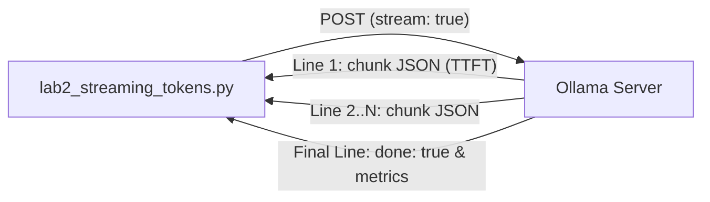

# Lab 2: Streaming Model Tokens in Real Time

In this lab, you will enable token streaming (`stream: true`) to display text chunks in real time as the model generates them, and record the Time to First Token (TTFT).

---

## What you touch
- Script: `lab2_streaming_tokens.py`
- URL / Endpoint: `{OLLAMA_HOST}/api/generate` (defaults to `http://127.0.0.1:11434/api/generate`)
- Keys Sent: `model`, `prompt`, `stream` (`true`), `options.temperature` (`0.0`)
- Keys Read: On each stream line: `response` and `done`. On final line (`done: true`): `eval_count` and `eval_duration`

---

## Steps


1. Read `OLLAMA_HOST` and `OLLAMA_MODEL` from environment variables, defaulting to `http://127.0.0.1:11434` and `llama3.2:1b`.
2. Construct the request payload dictionary with `model`, `prompt` (`"Write a 3-step technical summary of why streaming HTTP responses reduces perceived latency."`), `stream: True`, and `options: {"temperature": 0.0}`.
3. Record the start timestamp with `time.time()` and send the HTTP POST request.
4. Iterate over incoming lines from the response body (`for line in response:`), skipping any empty lines and parsing each line with `json.loads()`.
5. On the first non-empty line received, compute Time to First Token:
   $$\text{TTFT} = \text{timestamp}_{\text{first line}} - \text{start\_time}$$
6. Write each `chunk["response"]` directly to `sys.stdout` and call `sys.stdout.flush()` so each token appears immediately on screen.
7. When `chunk["done"]` is `True`, extract `eval_count` and `eval_duration`, and print the final metrics (TTFT, total elapsed time, token count, and tokens per second).

---

## Data contract

**Request Payload**

```json
{
  "model": "llama3.2:1b",
  "prompt": "Write a 3-step technical summary of why streaming HTTP responses reduces perceived latency.",
  "stream": true,
  "options": {
    "temperature": 0.0
  }
}
```

**Response Stream Chunk (Intermediate)**

```json
{
  "response": "Streaming ",
  "done": false
}
```

**Final Response Stream Chunk**

```json
{
  "response": "",
  "done": true,
  "eval_count": 64,
  "eval_duration": 850000000
}
```

---

## Run
From the repository root, run:

```bash
python education/01_the_call/lab2_streaming_tokens.py
```

```powershell
python education/01_the_call/lab2_streaming_tokens.py
```

---

## What you should see
You should see words appearing progressively on screen without any initial pause, followed by a summary of performance metrics:
- TTFT (typically under 0.5s)
- Total elapsed time
- Generated token count
- Generation speed in tokens per second

---

## Stop here
You now have working token streaming! In Chapter 02, we will explore structured conversation formats using message arrays and system prompts.

Next up: [Chapter 02: The Contract](../02_the_contract/00_messages_and_json.md).

---

## Notes
*(Record your TTFT and streaming metrics here after running)*

