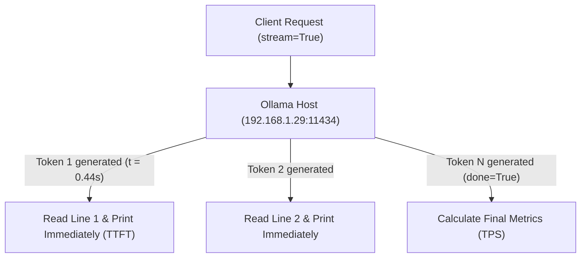

# Lab 2: Stream tokens

After this lab you print tokens as they arrive and you have a TTFT number.

## Data
- Script: `lab2_streaming_tokens.py`
- Same URL as lab 1
- Request change: `stream: true`
- Each line is one JSON object with `response` and `done`

## Information
The TCP connection stays open. The provider writes one JSON line per chunk. The script prints each chunk and records the time of the first line.

## Knowledge
1. POST with `stream: true`.
2. `for line in response:`
3. On the first line, store TTFT.
4. `sys.stdout.write(chunk["response"]); sys.stdout.flush()`
5. On `done: true`, read `eval_count` / `eval_duration` and print TPS.

## Wisdom
This is not a browser SSE server. Chapter 10 puts this stream behind FastAPI.

## The When and Why
- **When:** a non-stream call takes many seconds and the user sees nothing until the end.
- **Why:** first token at ~0.44s is the smallest proof that streaming changes the wait.

## How it works



## Data contract

**Request**

```json
{
  "model": "qwen3.6:35b-a3b-65k",
  "prompt": "Write a 3-step technical summary of why streaming HTTP responses reduces perceived latency.",
  "stream": true,
  "options": { "temperature": 0.0 }
}
```

**One stream line**

```json
{
  "response": "string",
  "done": false
}
```

## Run

```bash
python education/01_the_call/lab2_streaming_tokens.py
```

## What you should see
Text appearing incrementally, then TTFT, total duration, token count, TPS. If you see nothing until the end, `stream` is still false or you buffered stdout.

## What this becomes later
Chapter 10 serves this stream over SSE or a WebSocket. Chapter 12 demuxes thinking tokens out of the same stream.

## Related
- **OpenAI SSE:** `data: {"choices":[{"delta":{"content":"..."}}]}` then `data: [DONE]`.

## Notes
- Mechanism: iterate the HTTP body line by line, parse JSON, write `response`, flush.
- A prior run recorded TTFT near 0.44s versus 13s for the non-stream call.
