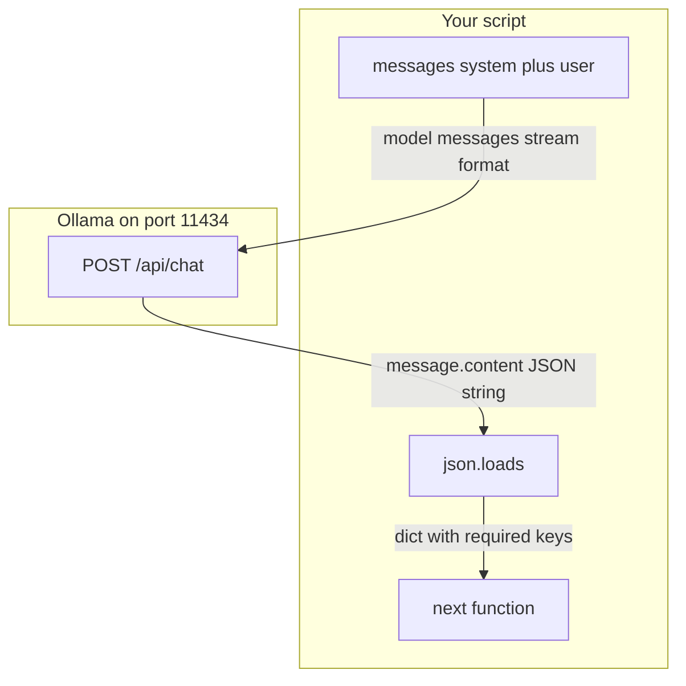

# 02: The Contract: Messages Arrays and Structured JSON Output

By the end of this chapter, you will structure your model interactions using the industry-standard `messages` array format and enforce predictable, machine-readable JSON responses that can be safely parsed with `json.loads()`.

In Chapter 01, our wrapper function returned unstructured text strings. In this chapter, we establish a formal communication contract between your application code and the AI model.

## Data
We shift to the standard chat completions endpoint (`POST /api/chat` for Ollama or `POST /v1/chat/completions` for OpenAI-compatible APIs), replacing the single `prompt` string with a structured `messages` list.

Each item in the `messages` list is a dictionary containing two keys:
- `role`: Specifies who is speaking (`system` for instructions, `user` for the prompt, `assistant` for model replies, or `tool` for function results).
- `content`: The text content of that specific turn.

We also request structured output by setting `"format": "json"` in our request payload. The returned string at `message.content` is parsed into a native Python dictionary using `json.loads()`, and validated to ensure required fields (such as `intent` and `confidence`) are present with the correct data types.

## Information
Using the `messages` array allows you to maintain clean separation between global system behavior instructions and immediate user tasks. 

Enforcing structured JSON output ensures that downstream application code receives reliable key-value data rather than ambiguous text paragraphs. If a model omits a required field or returns invalid JSON, your application catches a clear `KeyError` or `JSONDecodeError` immediately, rather than failing silently.

## Knowledge
Here is the step-by-step implementation:
1. Direct your HTTP POST request to `{OLLAMA_HOST}/api/chat`.
2. Construct the `messages` array with a `system` instruction specifying exact JSON keys and a `user` prompt.
3. Pass `"format": "json"` in your request payload to instruct the model to produce valid JSON.
4. Extract `data["message"]["content"]` from the response.
5. Parse the content string with `json.loads()` and validate the presence and types of your required keys.

## Wisdom
A clean JSON contract with simple dictionary validation is often all you need for reliable application logic. Resist adding heavy schema compilation frameworks or Pydantic models until your project grows in complexity.

## The When and Why
- **When**: Use structured JSON whenever downstream code needs specific values (like categories, numbers, or boolean flags) rather than freeform text.
- **Why**: Freeform text parsing with regular expressions is brittle and fails silently when wording changes. A strict JSON contract guarantees that missing or malformed fields raise immediate, actionable errors.

## How it works



Walkthrough of one request:

1. You send `[{ "role": "system", "content": "Reply with JSON only." }, { "role": "user", "content": "Classify: reset my password" }]` to `{OLLAMA_HOST}/api/chat`.
2. The model returns `{ "message": { "role": "assistant", "content": "{\"intent\": \"password_reset\", \"confidence\": 0.9}" } }`.
3. You run `json.loads` on `message.content` and check `intent` is a non-empty string and `confidence` is a number.
4. If parse fails, you retry or stop. You do not guess the fields from prose.

## Data contract

**Request** `POST /api/chat`

```json
{
  "model": "qwen3.6:35b-a3b-65k",
  "messages": [
    { "role": "system", "content": "Reply with JSON only." },
    { "role": "user", "content": "string" }
  ],
  "stream": false,
  "format": "json"
}
```

**Response**

```json
{
  "message": {
    "role": "assistant",
    "content": "{ \"intent\": \"string\", \"confidence\": 0.0 }"
  }
}
```

`content` is a string. It is not a nested object until you call `json.loads`.

## Lab
Done when `json.loads` returns the required keys from a `messages[]` call.

- Module: [this file](./00_messages_and_json.md)
- Lab: [lab1_structured_json.md](./lab1_structured_json.md) — brief only. Write `lab1_structured_json.py` in the session. Done when the printed dict has `intent` and `confidence`.

## Related
- **Ollama `format: "json"`:** asks the model for a JSON object. Still validate.
- **JSON Schema / constrained decode:** the provider refuses invalid tokens. Use when retries are too costly.
- **Pydantic / Zod:** same validation job after the string exists.

## Notes
- There is no reference `.py` in this folder. The brief is the contract.
- Reasoning models may wrap the JSON in thinking text or markdown fences (`` ```json ``). `json.loads` will fail. Strip fences or tighten the system message. Do not add a second parser library.
- Chapter 03 adds a `tools` array on the request and `tool_calls` on the response. Do not add them here.
