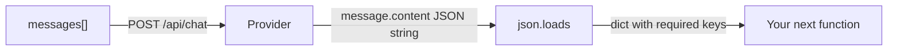

# 02: The Contract

After this chapter you send `messages[]` with roles and you ask the model for JSON you can `json.loads`. Chapter 01 returned a string. This chapter names the shape.

## Data
- Route: `POST /api/chat` (or `/v1/chat/completions`)
- Request key: `messages` — a list of `{role, content}`
- Roles used here: `system`, `user`, `assistant`
- Output: a JSON object you validate with `json.loads` (and a schema check if you have one)
- Optional provider key: `format: "json"` on Ollama, or a JSON Schema on providers that support constrained decode

## Information
A message list is the conversation state. `system` is policy. `user` is the request. `assistant` is the last model turn. Structured output means the assistant content is JSON that matches a declared shape, not free prose. Downstream code reads keys. If a key is missing, that is a contract failure.

## Knowledge
1. Switch the POST from `prompt` to `messages`.
2. Put instructions in `role: system`. Put the task in `role: user`.
3. Ask for a specific JSON object (for example `{ "intent": string, "confidence": number }`).
4. Parse the assistant content with `json.loads`. Reject it if required keys are missing or the types are wrong.
5. Do not add Pydantic, CFG logit masking, or a prompt compiler unless the brief says so.

## Wisdom
A string plus `json.loads` is enough for one script. Constrained sampling (Outlines, vLLM CFG) is for when invalid JSON is expensive. Prompt-injection firewalls and DSPy are not this chapter.

## The When and Why
- **When:** the next function needs fields, not a paragraph.
- **Why:** regex on free text fails silently. A named JSON object fails loudly at `KeyError` or `JSONDecodeError`.

## How it works



Walkthrough:
1. You send `[{role: system, content: "..."}, {role: user, content: "..."}]`.
2. The model returns `{role: assistant, content: "{\"intent\": \"...\"}"}`.
3. You parse and check keys. If parse fails, you retry or stop. You do not guess.

## Data contract

**Request** `POST /api/chat`

```json
{
  "model": "qwen3.6:35b-a3b-65k",
  "messages": [
    { "role": "system", "content": "Reply with JSON only." },
    { "role": "user", "content": "string" }
  ],
  "stream": false,
  "format": "json"
}
```

**Response**

```json
{
  "message": {
    "role": "assistant",
    "content": "{ \"intent\": \"string\", \"confidence\": 0.0 }"
  }
}
```

## Lab
- [lab1_structured_json.md](./lab1_structured_json.md) — brief only. Write the script in the session. Done when `json.loads` returns the required keys.

## Related
- **Ollama `format: "json"`:** asks the model for a JSON object. Still validate.
- **JSON Schema / constrained decode:** provider refuses invalid tokens. Use when retries are too costly.
- **Pydantic / Zod:** same validation job after the string exists.

## Notes
Leave empty until you run the lab.
