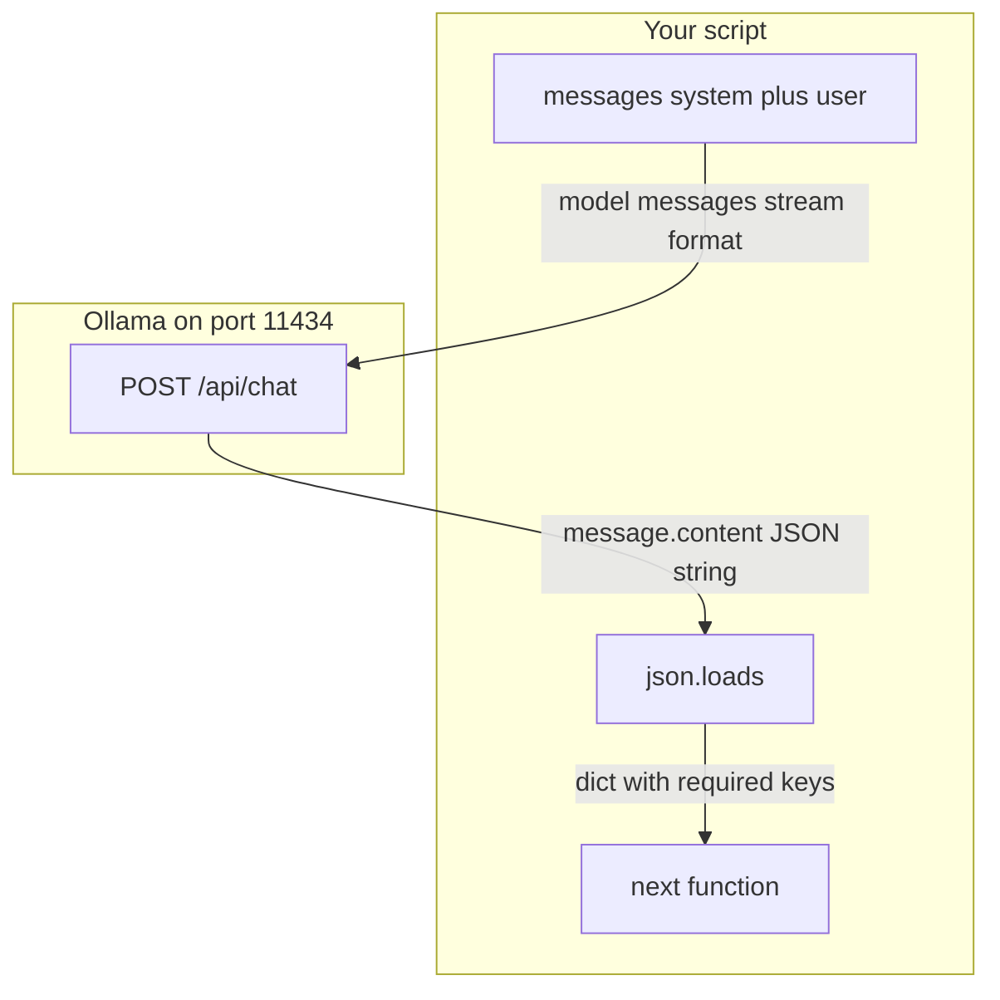

# 02: The Contract

After this chapter you send `messages[]` with roles and you ask the model for JSON you can `json.loads`. Chapter 01 returned a string from `query_llm`. This chapter names the shape of that string.

## Data
The route changes. Chapter 00 and 01 used `POST /api/generate` with a single key `prompt`. This chapter uses `POST /api/chat` (Ollama native) or `POST /v1/chat/completions` (OpenAI-style). Both take a key named `messages`.

`messages` is a list. Each item is an object with two keys: `role` (a string) and `content` (a string). The roles used here are `system` (instructions for the whole call), `user` (this turn's request), and `assistant` (what the model said on a previous turn). The first call usually sends `system` plus `user` only.

The host and model are still `OLLAMA_HOST` (default `http://192.168.1.29:11434`) and `OLLAMA_MODEL` (default `qwen3.6:35b-a3b-65k`). `stream` stays `false` in this chapter.

The model text now lives at `message.content` (Ollama `/api/chat`) or `choices[0].message.content` (OpenAI-style). That content is a JSON string. You turn it into a Python dict with `json.loads`. Then you check the keys you declared, for example `intent` (string) and `confidence` (number).

Ollama accepts an optional request key `format: "json"`. That asks the model to emit a JSON object. It is not a guarantee. You still parse and check keys.

## Information
A message list is the conversation state. `system` is policy. `user` is the request. `assistant` is the last model turn. You send the list. The provider appends one assistant message. You read that message's `content`.

Structured output means that `content` is JSON that matches a declared shape, not a paragraph. Downstream code reads keys. If a key is missing, that is a contract failure (`KeyError` or your own check). If the string is not JSON, that is `JSONDecodeError`. Both are louder than a regex on free text that silently matches the wrong span.

This chapter does not add tools. `tools` and `tool_calls` are chapter 03.

## Knowledge
1. Switch the POST from `{host}/api/generate` to `{host}/api/chat`. Drop `prompt`. Send `messages`.
2. Put instructions in `{ "role": "system", "content": "..." }`. Put the task in `{ "role": "user", "content": "..." }`.
3. Ask for a specific JSON object, for example `{ "intent": string, "confidence": number }`. You may send `format: "json"`.
4. Read `data["message"]["content"]`. Run `json.loads` on that string. Reject the result if required keys are missing or the types are wrong. Print the dict. Exit non-zero on parse or key failure.
5. Do not add Pydantic, CFG logit masking, a prompt compiler, or a tool list unless the brief says so.

## Wisdom
A string plus `json.loads` plus a key check is enough for one script. Constrained sampling (Outlines, vLLM CFG, a JSON Schema the provider enforces) is for when an invalid object is expensive to retry. Prompt-injection firewalls and DSPy are not this chapter. If the next function only needs a paragraph, stay on chapter 01 and skip the parse.

## The When and Why
- **When:** the next function needs fields, not a paragraph.
- **Why:** regex on free text fails silently. A named JSON object fails at `KeyError` or `JSONDecodeError`. Roles exist so the instruction and the task are separate strings, not one concatenated `prompt`.

## How it works



Walkthrough of one request:

1. You send `[{ "role": "system", "content": "Reply with JSON only." }, { "role": "user", "content": "Classify: reset my password" }]` to `{OLLAMA_HOST}/api/chat`.
2. The model returns `{ "message": { "role": "assistant", "content": "{\"intent\": \"password_reset\", \"confidence\": 0.9}" } }`.
3. You run `json.loads` on `message.content` and check `intent` is a non-empty string and `confidence` is a number.
4. If parse fails, you retry or stop. You do not guess the fields from prose.

## Data contract

**Request** `POST /api/chat`

```json
{
  "model": "qwen3.6:35b-a3b-65k",
  "messages": [
    { "role": "system", "content": "Reply with JSON only." },
    { "role": "user", "content": "string" }
  ],
  "stream": false,
  "format": "json"
}
```

**Response**

```json
{
  "message": {
    "role": "assistant",
    "content": "{ \"intent\": \"string\", \"confidence\": 0.0 }"
  }
}
```

`content` is a string. It is not a nested object until you call `json.loads`.

## Lab
Done when `json.loads` returns the required keys from a `messages[]` call.

- Module: [this file](./00_messages_and_json.md)
- Lab: [lab1_structured_json.md](./lab1_structured_json.md) — brief only. Write `lab1_structured_json.py` in the session. Done when the printed dict has `intent` and `confidence`.

## Related
- **Ollama `format: "json"`:** asks the model for a JSON object. Still validate.
- **JSON Schema / constrained decode:** the provider refuses invalid tokens. Use when retries are too costly.
- **Pydantic / Zod:** same validation job after the string exists.

## Notes
- There is no reference `.py` in this folder. The brief is the contract.
- Reasoning models may wrap the JSON in thinking text or markdown fences (`` ```json ``). `json.loads` will fail. Strip fences or tighten the system message. Do not add a second parser library.
- Chapter 03 adds a `tools` array on the request and `tool_calls` on the response. Do not add them here.
