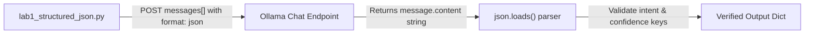

# Lab 1: Enforcing and Parsing Structured JSON Responses

In this lab, you will send a conversation array (`messages`) to the chat endpoint, request structured JSON output, parse the result with `json.loads()`, and validate the dictionary fields.

---

## What you touch
- Script to create: `lab1_structured_json.py`
- URL / Endpoint: `{OLLAMA_HOST}/api/chat` (defaults to `http://127.0.0.1:11434/api/chat`)
- Request Keys: `model`, `messages`, `stream` (`false`), `format` (`"json"`)
- Message Roles: `system`, `user`
- Parsed Fields: `intent` (string), `confidence` (float between 0.0 and 1.0)

---

## Steps


1. Read `OLLAMA_HOST` and `OLLAMA_MODEL` from environment variables, defaulting to `http://127.0.0.1:11434` and `llama3.2:1b`.
2. Construct the `messages` array:
   - System message: `"Reply with JSON only. Required keys: 'intent' (string) and 'confidence' (float between 0 and 1)."`
   - User message: `"Classify: reset my password"`
3. Send an HTTP POST request to `{OLLAMA_HOST}/api/chat` with `format: "json"` and `stream: false`.
4. Extract `data["message"]["content"]` from the response.
5. Parse the content string using `json.loads()`. (If the model includes markdown code blocks like ` ```json `, clean the string before parsing).
6. Verify that `intent` is a non-empty string and `confidence` is a float/number. Print the validated dictionary.
7. Raise an error or exit non-zero if parsing fails or required keys are missing.

---

## Data contract

**Request Payload**

```json
{
  "model": "llama3.2:1b",
  "messages": [
    {
      "role": "system",
      "content": "Reply with JSON only. Required keys: intent (string), confidence (number 0-1)."
    },
    {
      "role": "user",
      "content": "Classify: reset my password"
    }
  ],
  "stream": false,
  "format": "json"
}
```

**Parsed Response Object**

```json
{
  "intent": "password_reset",
  "confidence": 0.95
}
```

---

## Run
From the repository root, execute your script:

```bash
python education/02_the_contract/lab1_structured_json.py
```

```powershell
python education/02_the_contract/lab1_structured_json.py
```

---

## What you should see
A clean Python dictionary printed to your console with verified `intent` and `confidence` fields:

```text
Parsed response: {'intent': 'password_reset', 'confidence': 0.95}
```

If you encounter a `JSONDecodeError`, ensure your parsing logic trims any leading markdown fences (` ```json `).

---

## Stop here
You now have verified structured JSON output! In Chapter 03, we will introduce function calling and tool dispatch.

Next up: [Chapter 03: The Dispatcher](../03_the_dispatcher/00_tool_dispatch.md).

---

## Notes
*(Record your parsed dictionary output and observations here)*

