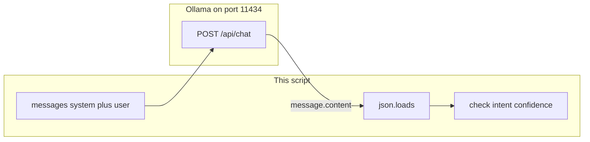

# Lab 1: Structured JSON

You send `messages[]` and you validate a JSON object from the assistant.

## What you touch
- Script you will write: `lab1_structured_json.py`
- URL / path: `{OLLAMA_HOST}/api/chat` (default `http://127.0.0.1:11434/api/chat`)
- Keys sent: `model`, `messages`, `stream` (`false`), `format` (`"json"`)
- Roles sent: `system`, `user`
- Keys read: `message.content`, then after `json.loads`: `intent` (string), `confidence` (number)

## Steps


1. Read `OLLAMA_HOST` and `OLLAMA_MODEL` from the environment. If they are unset, use `http://127.0.0.1:11434` and `llama3.2:1b`.
2. Build `messages = [{"role": "system", "content": "Reply with JSON only. Keys: intent (string), confidence (number 0-1)."}, {"role": "user", "content": "Classify: reset my password"}]`.
3. POST `{ "model", "messages", "stream": false, "format": "json" }` to `{host}/api/chat` with header `Content-Type: application/json`.
4. Read `data["message"]["content"]`. Run `obj = json.loads(...)`.
5. Check `intent` is a non-empty string and `confidence` is a number. Print the object.
6. Exit non-zero if parse fails or a required key is missing or the type is wrong. Do not guess the fields from prose.

## Data contract
Only the keys this script sends and reads.

**Request**

```json
{
  "model": "llama3.2:1b",
  "messages": [
    { "role": "system", "content": "Reply with JSON only. Keys: intent (string), confidence (number 0-1)." },
    { "role": "user", "content": "Classify: reset my password" }
  ],
  "stream": false,
  "format": "json"
}
```

**Response you parse**

```json
{
  "message": {
    "role": "assistant",
    "content": "{ \"intent\": \"password_reset\", \"confidence\": 0.9 }"
  }
}
```

## Run
From the repo root, after you write the script:

```bash
OLLAMA_HOST=http://127.0.0.1:11434 OLLAMA_MODEL=llama3.2:1b python education/02_the_contract/lab1_structured_json.py
```

```powershell
$env:OLLAMA_HOST="http://127.0.0.1:11434"
$env:OLLAMA_MODEL="llama3.2:1b"
python education/02_the_contract/lab1_structured_json.py
```

## What you should see
A printed dict with `intent` and `confidence`. If you get `JSONDecodeError`, the model wrapped the JSON in markdown fences or thinking text. Strip the fences or tighten the system message. If a key is missing or `confidence` is not a number, fail the script. If you see `URLError`, the provider is not reachable.

## Stop here
This is not tool calling. Do not add `tools`, `tool_calls`, Pydantic, or a 200-line client. Next: [00_tool_dispatch.md](../03_the_dispatcher/00_tool_dispatch.md).

## Notes
There is no reference `.py` in this folder. Paste a real run here: the printed dict, and whether you had to strip fences.
