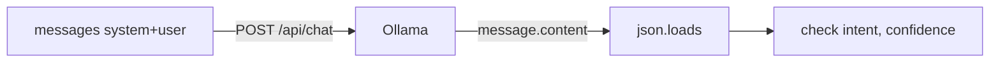

# Lab 1: Structured JSON

After this lab you send `messages[]` and you validate a JSON object from the assistant.

## Data
- Script you will write: `lab1_structured_json.py`
- URL: `{OLLAMA_HOST}/api/chat`
- Request keys: `model`, `messages`, `stream: false`. Optional: `format: "json"`.
- Roles: `system`, `user`
- Required output keys (minimum): `intent` (string), `confidence` (number)

## Information
The script POSTs a two-message list, reads `message.content`, runs `json.loads`, and checks the keys.

## Knowledge
1. Read host and model from env.
2. Build `messages = [{"role": "system", "content": "Reply with JSON only. Keys: intent (string), confidence (number 0-1)."}, {"role": "user", "content": "Classify: reset my password"}]`.
3. POST to `/api/chat`.
4. `obj = json.loads(data["message"]["content"])`.
5. Assert `intent` is a non-empty string and `confidence` is a number. Print the object. Exit non-zero if parse or keys fail.

## Wisdom
This is not tool calling. Chapter 03 adds `tools` and `tool_calls`. Do not write a 200-line client.

## The When and Why
- **When:** chapter 01 returns a string and the next function needs fields.
- **Why:** this is the smallest script that proves roles plus a validated JSON object.

## How it works



## Data contract

**Request**

```json
{
  "model": "qwen3.6:35b-a3b-65k",
  "messages": [
    { "role": "system", "content": "Reply with JSON only. Keys: intent, confidence." },
    { "role": "user", "content": "Classify: reset my password" }
  ],
  "stream": false,
  "format": "json"
}
```

**Response you parse**

```json
{
  "message": {
    "role": "assistant",
    "content": "{ \"intent\": \"password_reset\", \"confidence\": 0.9 }"
  }
}
```

## Run
From the repo root, after you write the script:

```bash
python education/02_the_contract/lab1_structured_json.py
```

## What you should see
A printed dict with `intent` and `confidence`. If you get `JSONDecodeError`, the model wrapped the JSON in markdown fences — strip them or tighten the system message. If a key is missing, fail the script.

## What this becomes later
Chapter 03 adds a `tools` array on the request and `tool_calls` on the response.

## Related
- **Ollama `/api/generate`:** `prompt` string, no roles. Chapter 00–01.
- **OpenAI `response_format`:** same job, different key.

## Notes
Leave empty until you run it.
