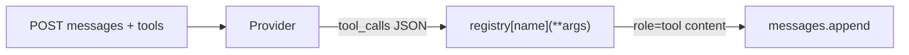

# 03: The Dispatcher

After this chapter you read `tool_calls`, run a local function from a registry dict, and send a `role: tool` message back. MCP and RAG-for-tools are chapter 14.

## Data
- Request key: `tools` — a list of `{type: "function", function: {name, description, parameters}}`
- Response key: `message.tool_calls` — a list of `{function: {name, arguments}}`
- Registry: `dict[str, callable]`, for example `{"add_numbers": add_numbers}`
- Feedback message: `{ "role": "tool", "content": "<result string>" }`
- Route: `POST /api/chat`

## Information
The model does not run your function. It emits a JSON call. Your script looks up the name, calls the Python function, and appends the result. The next POST includes that tool message. That lookup is the dispatcher.

## Knowledge
1. Define one local function and put it in a registry dict.
2. Send its JSON Schema in `tools`.
3. POST `messages` + `tools`.
4. If `tool_calls` is present, `fn = registry[name]; result = fn(**arguments)`.
5. Append `{role: "tool", content: result}` and POST again if you need a final sentence. One dispatch is enough for this chapter. The `while` loop is chapter 04.

## Wisdom
A registry dict is enough for a handful of functions. Do not add MCP, vector search over 100 schemas, or parallel `asyncio.gather` here.

## The When and Why
- **When:** the model must use a value your process can compute (math, a file, a row) instead of guessing.
- **Why:** without a dispatcher, `tool_calls` is unused JSON. Without the tool role, the model never sees the result.

## How it works



Walkthrough:
1. You send a user message and a `tools` list.
2. The model returns `tool_calls: [{function: {name: "add_numbers", arguments: {a: 2, b: 3}}}]`.
3. You run `TOOL_REGISTRY["add_numbers"](a=2, b=3)` and append `{role: "tool", content: "5"}`.

## Data contract

**Request**

```json
{
  "model": "qwen3.6:35b-a3b-65k",
  "messages": [{ "role": "user", "content": "What is 2 plus 3?" }],
  "tools": [
    {
      "type": "function",
      "function": {
        "name": "add_numbers",
        "description": "Add two numbers.",
        "parameters": {
          "type": "object",
          "properties": {
            "a": { "type": "number" },
            "b": { "type": "number" }
          },
          "required": ["a", "b"]
        }
      }
    }
  ],
  "stream": false
}
```

**Response (tool call)**

```json
{
  "message": {
    "role": "assistant",
    "tool_calls": [
      {
        "function": {
          "name": "add_numbers",
          "arguments": { "a": 2, "b": 3 }
        }
      }
    ]
  }
}
```

**Tool result you append**

```json
{ "role": "tool", "content": "5" }
```

## Lab
- [lab1_tool_dispatch.md](./lab1_tool_dispatch.md) — brief only. Done when one local function ran from a `tool_calls` payload.

## Related
- **MCP:** the same registry, moved to another process over JSON-RPC. Chapter 14.
- **OpenAI `tool_calls` + `tool_call_id`:** same job; some APIs require the id on the tool message.

## Notes
Leave empty until you run the lab.
