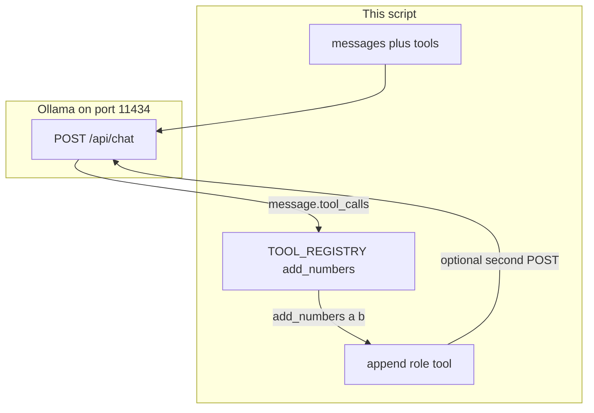

# 03: The Dispatcher: Function Registries and Tool Execution

By the end of this chapter, you will understand how AI models trigger local Python code. You will declare a function's schema, inspect the model's `tool_calls` request, execute the matching Python function from a local registry, and feed the result back using a `role: tool` message.

In Chapter 02, the model returned structured data for you to read. In this chapter, the model asks your program to perform an action on its behalf.

## Data
We use the standard chat endpoint (`POST /api/chat` for Ollama or `POST /v1/chat/completions` for OpenAI-compatible APIs).

Three new components are introduced:
1. **The `tools` Schema List**: A list sent in your request describing available functions using standard JSON Schema (including name, description, and required parameters).
2. **The `message.tool_calls` Array**: The model's response field containing the requested function name and argument values (e.g. `{"name": "add_numbers", "arguments": {"a": 2, "b": 3}}`).
3. **The Tool Registry & Dispatcher**: A standard Python dictionary mapping function names to callable functions (e.g. `TOOL_REGISTRY = {"add_numbers": add_numbers}`). When a tool call is received, your script calls `TOOL_REGISTRY[name](**arguments)`.
4. **The `role: tool` Message**: A dictionary formatted as `{"role": "tool", "content": "<result string>"}` appended to the conversation history so the model can observe the function's output.

## Information
An AI model cannot execute code on your computer directly. Instead, when the model recognizes that answering a prompt requires a specific tool, it outputs a structured JSON command specifying which function to call and what arguments to supply.

Your Python host program inspects that command, executes the actual Python function in your environment, and appends the computed result back into the `messages` array. This process—looking up a requested tool name and invoking the corresponding function—is called **tool dispatching**.

## Knowledge
Here is the step-by-step procedure:
1. Define a standard Python function (e.g. `add_numbers(a: float, b: float) -> str`) and register it in a dictionary: `TOOL_REGISTRY = {"add_numbers": add_numbers}`.
2. Define a JSON schema for the function and send it in the `tools` parameter of your chat request.
3. Send a user message that requires tool usage (e.g. `"What is 2 plus 3? Please use the tool."`).
4. When `tool_calls` is returned, extract the function name and arguments. If `arguments` is a JSON string, deserialize it with `json.loads()`.
5. Execute the callable from your registry: `result = TOOL_REGISTRY[name](**arguments)`.
6. Append a `role: tool` message containing the result back into your `messages` array.
7. Optionally make one follow-up POST request with the updated message list to allow the model to summarize the final answer in plain English.

## Wisdom
A simple dictionary lookup is clean, secure, and easy to debug for local applications. Keep your dispatcher focused: do not add heavy external protocols or automatic discovery mechanisms until you need them.

## The When and Why
- **When**: Use tool dispatching whenever the model needs real-time calculations, file system access, database queries, or external API data to answer accurately.
- **Why**: Language models are not calculators and cannot inspect your local machine on their own. Giving models access to deterministic Python tools prevents hallucinations and enables real-world actions.

## How it works



Walkthrough of one dispatch:

1. You send a user message and a `tools` list that describes `add_numbers(a, b)`.
2. The model returns `tool_calls: [{ "function": { "name": "add_numbers", "arguments": { "a": 2, "b": 3 } } }]`.
3. You invoke `add_numbers(a=2, b=3)` from `TOOL_REGISTRY` and get `"5"`.
4. You append `{ "role": "tool", "content": "5" }`. A second POST is how the model sees that string. A third POST is already a loop. Stop.

## Data contract

**Request** `POST /api/chat`

```json
{
  "model": "qwen3.6:35b-a3b-65k",
  "messages": [{ "role": "user", "content": "What is 2 plus 3?" }],
  "tools": [
    {
      "type": "function",
      "function": {
        "name": "add_numbers",
        "description": "Add two numbers.",
        "parameters": {
          "type": "object",
          "properties": {
            "a": { "type": "number" },
            "b": { "type": "number" }
          },
          "required": ["a", "b"]
        }
      }
    }
  ],
  "stream": false
}
```

**Response** (tool call)

```json
{
  "message": {
    "role": "assistant",
    "tool_calls": [
      {
        "function": {
          "name": "add_numbers",
          "arguments": { "a": 2, "b": 3 }
        }
      }
    ]
  }
}
```

**Tool result you append**

```json
{ "role": "tool", "content": "5" }
```

## Lab
Done when one local function ran from a `tool_calls` payload and a `role: tool` message exists on the list.

- Module: [this file](./00_tool_dispatch.md)
- Lab: [lab1_tool_dispatch.md](./lab1_tool_dispatch.md) — brief only. Write `lab1_tool_dispatch.py` in the session. Done when `add_numbers` printed its return value.

## Related
- **MCP:** the same registry, moved to another process over JSON-RPC. Chapter 14.
- **OpenAI `tool_calls` + `tool_call_id`:** same job. Some APIs require the id on the tool message.

## Notes
- There is no reference `.py` in this folder. The brief is the contract.
- If `arguments` arrives as a string, parse it with `json.loads` before `**`. That is still this chapter.
- If `tool_calls` is empty, the model answered in prose. Tighten the user prompt. Do not fake a call.
- Chapter 04 wraps this dispatch in a `while` loop. Do not write that loop here.
