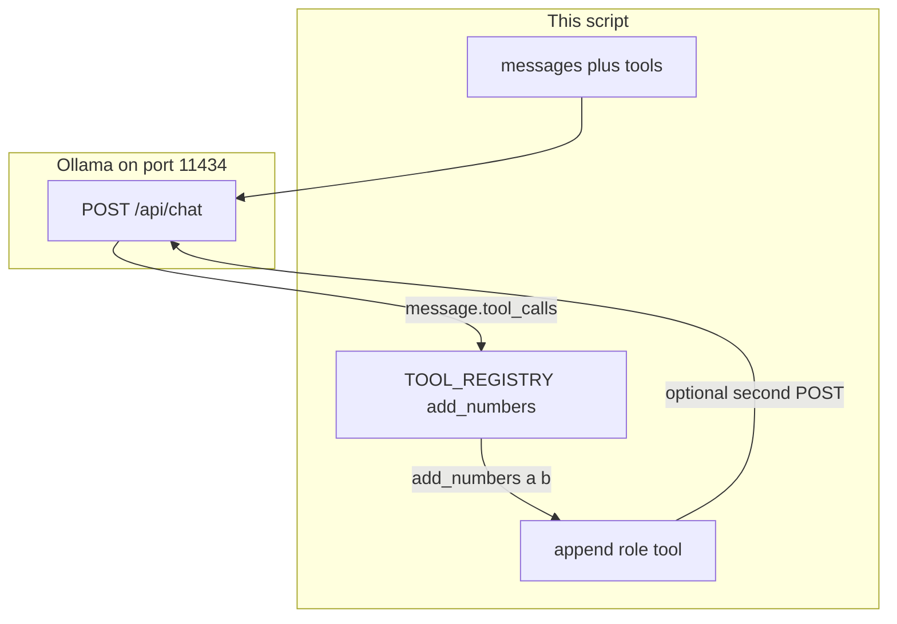

# 03: The Dispatcher

After this chapter you read `tool_calls`, run a local function from a registry dict, and send a `role: tool` message back. Chapter 02 validated JSON fields. This chapter runs your Python. MCP and RAG-for-tools are chapter 14.

## Data
The route stays `POST /api/chat` on `{OLLAMA_HOST}` (default `http://192.168.1.29:11434`). The model is still `OLLAMA_MODEL` (default `qwen3.6:35b-a3b-65k`). `stream` stays `false`.

A new request key appears: `tools`. It is a list. Each item looks like `{ "type": "function", "function": { "name", "description", "parameters" } }`. `parameters` is a JSON Schema object: `type`, `properties`, `required`.

A new response key appears: `message.tool_calls`. It is a list. Each item has `function.name` (a string) and `function.arguments` (an object, or a JSON string you must `json.loads`).

A **registry** is a Python dict from name to function, for example `TOOL_REGISTRY = {"add_numbers": add_numbers}`. Lookup is `TOOL_REGISTRY[name]`. Call is `fn(**arguments)`.

The result goes back on the message list as `{ "role": "tool", "content": "<result string>" }`. Some APIs also want `tool_call_id`. Ollama native chat often accepts the role and content alone.

## Information
The model does not run your function. It emits a JSON call. Your script looks up the name, calls the Python function, and appends the result. The next POST includes that tool message so the model can see the number it asked for. That lookup is the dispatcher.

Chapter 02 JSON (`intent`, `confidence`) is a shape the model invented. A tool result is a value your process computed. If the model guesses `2 + 3 = 6`, the dispatcher still returns `5` because `add_numbers` ran.

One dispatch is this chapter. A `while` loop that keeps dispatching until there are no `tool_calls` is chapter 04 (ReAct).

## Knowledge
1. Define one local function, for example `add_numbers(a, b) -> str`. Put it in a registry dict.
2. Send its JSON Schema in `tools` on the same `/api/chat` POST as `messages`.
3. POST a user message that needs that function (for example `What is 2 plus 3? Use the tool.`).
4. If `message.tool_calls` is present, read `name` and `arguments`. If `arguments` is a string, `json.loads` it. Then `result = TOOL_REGISTRY[name](**arguments)`.
5. Append `{ "role": "tool", "content": result }` to `messages`. POST once more if you want a final sentence. Do not write a `while` loop.

## Wisdom
A registry dict is enough for a handful of functions you wrote. Do not add MCP, vector search over 100 schemas, or parallel `asyncio.gather` here. If the model only needs to fill fields you already declared, chapter 02 is enough and you do not need `tools`.

## The When and Why
- **When:** the model must use a value your process can compute (math, a file, a row) instead of guessing.
- **Why:** without a dispatcher, `tool_calls` is unused JSON. Without the tool role, the model never sees the result.

## How it works



Walkthrough of one dispatch:

1. You send a user message and a `tools` list that describes `add_numbers(a, b)`.
2. The model returns `tool_calls: [{ "function": { "name": "add_numbers", "arguments": { "a": 2, "b": 3 } } }]`.
3. You invoke `add_numbers(a=2, b=3)` from `TOOL_REGISTRY` and get `"5"`.
4. You append `{ "role": "tool", "content": "5" }`. A second POST is how the model sees that string. A third POST is already a loop. Stop.

## Data contract

**Request** `POST /api/chat`

```json
{
  "model": "qwen3.6:35b-a3b-65k",
  "messages": [{ "role": "user", "content": "What is 2 plus 3?" }],
  "tools": [
    {
      "type": "function",
      "function": {
        "name": "add_numbers",
        "description": "Add two numbers.",
        "parameters": {
          "type": "object",
          "properties": {
            "a": { "type": "number" },
            "b": { "type": "number" }
          },
          "required": ["a", "b"]
        }
      }
    }
  ],
  "stream": false
}
```

**Response** (tool call)

```json
{
  "message": {
    "role": "assistant",
    "tool_calls": [
      {
        "function": {
          "name": "add_numbers",
          "arguments": { "a": 2, "b": 3 }
        }
      }
    ]
  }
}
```

**Tool result you append**

```json
{ "role": "tool", "content": "5" }
```

## Lab
Done when one local function ran from a `tool_calls` payload and a `role: tool` message exists on the list.

- Module: [this file](./00_tool_dispatch.md)
- Lab: [lab1_tool_dispatch.md](./lab1_tool_dispatch.md) — brief only. Write `lab1_tool_dispatch.py` in the session. Done when `add_numbers` printed its return value.

## Related
- **MCP:** the same registry, moved to another process over JSON-RPC. Chapter 14.
- **OpenAI `tool_calls` + `tool_call_id`:** same job. Some APIs require the id on the tool message.

## Notes
- There is no reference `.py` in this folder. The brief is the contract.
- If `arguments` arrives as a string, parse it with `json.loads` before `**`. That is still this chapter.
- If `tool_calls` is empty, the model answered in prose. Tighten the user prompt. Do not fake a call.
- Chapter 04 wraps this dispatch in a `while` loop. Do not write that loop here.
