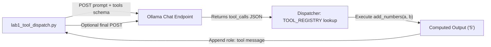

# Lab 1: Implementing a Local Tool Registry and Dispatcher

In this lab, you will provide an `add_numbers` function schema to the model, parse its `tool_calls` request, execute the Python function from a dictionary registry, and pass the computed result back as a `role: tool` message.

---

## What you touch
- Script to create: `lab1_tool_dispatch.py`
- URL / Endpoint: `{OLLAMA_HOST}/api/chat` (defaults to `http://127.0.0.1:11434/api/chat`)
- Registry Dictionary: `TOOL_REGISTRY = {"add_numbers": add_numbers}`
- Request Keys: `model`, `messages`, `tools`, `stream` (`false`)
- Response Keys Read: `message.tool_calls[0].function.name`, `message.tool_calls[0].function.arguments`
- Appended Tool Message: `{"role": "tool", "content": "<result string>"}`

---

## Steps


1. Read `OLLAMA_HOST` and `OLLAMA_MODEL` from environment variables, defaulting to `http://127.0.0.1:11434` and `llama3.2:1b`.
2. Define a Python function `add_numbers(a: float, b: float) -> str` that returns the string representation of `a + b`.
3. Register the function in `TOOL_REGISTRY = {"add_numbers": add_numbers}`.
4. Construct the `tools` schema array describing `add_numbers` with properties `a` and `b` (type `number`) as required parameters.
5. Send an HTTP POST request to `{OLLAMA_HOST}/api/chat` with user prompt: `"What is 2 plus 3? Please use the add_numbers tool."`
6. Check for `message.tool_calls` in the response. Extract `function.name` and `function.arguments`. If `arguments` is a JSON string, deserialize it with `json.loads()`.
7. Look up the function in `TOOL_REGISTRY` and call it: `result = TOOL_REGISTRY[name](**arguments)`.
8. Print the executed tool name, input arguments, and computed return value.
9. Append `{"role": "tool", "content": str(result)}` to `messages` and send one follow-up POST to receive the final summary sentence.

---

## Data contract

**Request Payload with Tool Schema**

```json
{
  "model": "llama3.2:1b",
  "messages": [
    {
      "role": "user",
      "content": "What is 2 plus 3? Please use the add_numbers tool."
    }
  ],
  "tools": [
    {
      "type": "function",
      "function": {
        "name": "add_numbers",
        "description": "Add two numbers together.",
        "parameters": {
          "type": "object",
          "properties": {
            "a": { "type": "number" },
            "b": { "type": "number" }
          },
          "required": ["a", "b"]
        }
      }
    }
  ],
  "stream": false
}
```

**Response Payload with Tool Call**

```json
{
  "message": {
    "role": "assistant",
    "tool_calls": [
      {
        "function": {
          "name": "add_numbers",
          "arguments": { "a": 2, "b": 3 }
        }
      }
    ]
  }
}
```

**Tool Result Message Appended to Conversation**

```json
{
  "role": "tool",
  "content": "5"
}
```

---

## Run
From the repository root, run your script:

```bash
python education/03_the_dispatcher/lab1_tool_dispatch.py
```

```powershell
python education/03_the_dispatcher/lab1_tool_dispatch.py
```

---

## What you should see
You should see:
1. The tool name and parsed arguments identified by the model (`add_numbers`, `{'a': 2, 'b': 3}`).
2. The local Python function execution output (`5`).
3. The model's final response sentence incorporating the tool's result.

---

## Stop here
This lab executes a single tool dispatch turn. We do not write an automated `while` loop here—multi-turn loops will be built in Chapter 04 (The ReAct Loop).

Next up: [Chapter 04: The Loop](../04_the_loop/00_the_react_loop.md).

---

## Notes
*(Record your tool dispatch logs and observations here)*

