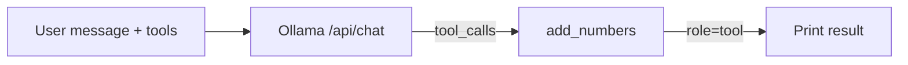

# Lab 1: Tool dispatch

After this lab you have run one local function because the model asked for it in `tool_calls`.

## Data
- Script you will write: `lab1_tool_dispatch.py`
- URL: `{OLLAMA_HOST}/api/chat`
- Registry: `TOOL_REGISTRY = {"add_numbers": add_numbers}`
- Keys: `tools` on the request, `message.tool_calls` on the response, `role: tool` on the follow-up

## Information
One POST. If `tool_calls` is set, look up the name, call the function, print the result. A second POST with `role: tool` is optional but useful so you see a final sentence.

## Knowledge
1. Define `add_numbers(a, b) -> str`.
2. Put it in a registry dict.
3. Send its schema in `tools`.
4. POST a user message that needs addition.
5. Read `tool_calls[0].function.name` and `.arguments`.
6. Call `TOOL_REGISTRY[name](**arguments)` and print the return value.
7. Optionally append `{role: "tool", content: result}` and POST once more for the final text.

## Wisdom
Do not write a while loop. That is chapter 04. Do not add MCP.

## The When and Why
- **When:** chapter 02 JSON is not enough because the number must come from your process.
- **Why:** this is the smallest script that proves `tool_calls` → registry → `role: tool`.

## How it works



## Data contract

**Request**

```json
{
  "model": "qwen3.6:35b-a3b-65k",
  "messages": [{ "role": "user", "content": "What is 2 plus 3? Use the tool." }],
  "tools": [{ "type": "function", "function": { "name": "add_numbers", "parameters": { "type": "object", "properties": { "a": { "type": "number" }, "b": { "type": "number" } }, "required": ["a", "b"] } } }],
  "stream": false
}
```

**Response**

```json
{
  "message": {
    "tool_calls": [
      { "function": { "name": "add_numbers", "arguments": { "a": 2, "b": 3 } } }
    ]
  }
}
```

## Run

```bash
python education/03_the_dispatcher/lab1_tool_dispatch.py
```

## What you should see
A printed tool name, arguments, and the function return value (for example `5`). If `tool_calls` is empty, the model answered in prose — tighten the system message or the user prompt.

## What this becomes later
Chapter 04 wraps this dispatch in a `while` loop. That loop is ReAct.

## Related
- **Ollama chat tools:** native `tools` / `tool_calls` on `/api/chat`.

## Notes
Leave empty until you run it.
