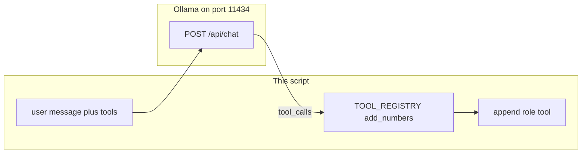

# Lab 1: Tool dispatch

One local function has run because the model asked for it in `tool_calls`, and a `role: tool` message is on the list.

## What you touch
- Script you will write: `lab1_tool_dispatch.py`
- URL / path: `{OLLAMA_HOST}/api/chat` (default `http://192.168.1.29:11434/api/chat`)
- Registry: `TOOL_REGISTRY = {"add_numbers": add_numbers}`
- Keys sent: `model`, `messages`, `tools`, `stream` (`false`)
- Keys read: `message.tool_calls[0].function.name`, `message.tool_calls[0].function.arguments`
- Message you append: `{ "role": "tool", "content": "<result string>" }`

## Steps


1. Read `OLLAMA_HOST` and `OLLAMA_MODEL` from the environment. Defaults: `http://192.168.1.29:11434` and `qwen3.6:35b-a3b-65k`.
2. Define `add_numbers(a, b) -> str` that returns the sum as a string. Put it in `TOOL_REGISTRY`.
3. Build a `tools` list with one function schema: name `add_numbers`, properties `a` and `b` (numbers), `required: ["a", "b"]`.
4. POST `{ "model", "messages": [{ "role": "user", "content": "What is 2 plus 3? Use the tool." }], "tools", "stream": false }` to `{host}/api/chat` with header `Content-Type: application/json`.
5. Read `tool_calls[0].function.name` and `.arguments`. If `arguments` is a string, `json.loads` it.
6. Call `TOOL_REGISTRY[name](**arguments)`. Print the name, the arguments, and the return value.
7. Append `{ "role": "tool", "content": result }` to `messages`. POST once more if you want a final sentence. Do not write a `while` loop.

## Data contract
Only the keys this script sends and reads.

**Request**

```json
{
  "model": "qwen3.6:35b-a3b-65k",
  "messages": [{ "role": "user", "content": "What is 2 plus 3? Use the tool." }],
  "tools": [
    {
      "type": "function",
      "function": {
        "name": "add_numbers",
        "description": "Add two numbers.",
        "parameters": {
          "type": "object",
          "properties": {
            "a": { "type": "number" },
            "b": { "type": "number" }
          },
          "required": ["a", "b"]
        }
      }
    }
  ],
  "stream": false
}
```

**Response**

```json
{
  "message": {
    "tool_calls": [
      { "function": { "name": "add_numbers", "arguments": { "a": 2, "b": 3 } } }
    ]
  }
}
```

**Tool result you append**

```json
{ "role": "tool", "content": "5" }
```

## Run
From the repo root, after you write the script:

```bash
python education/03_the_dispatcher/lab1_tool_dispatch.py
```

```powershell
$env:OLLAMA_HOST="http://192.168.1.29:11434"
$env:OLLAMA_MODEL="qwen3.6:35b-a3b-65k"
python education/03_the_dispatcher/lab1_tool_dispatch.py
```

## What you should see
A printed tool name, arguments, and the function return value (for example `5`). If `tool_calls` is empty, the model answered in prose. Tighten the user prompt. Do not invent a call. If `arguments` is a string and you pass it to `**` without `json.loads`, Python will raise `TypeError`. If you see `URLError`, the provider is not reachable. If `name` is missing from the registry, print the name and exit. Do not catch that by calling a random function.

## Stop here
Do not write a `while` loop. That is chapter 04 (ReAct). Do not add MCP, a second tool, or parallel calls. This script is one dispatch and one optional follow-up POST.

## Notes
There is no reference `.py` in this folder. Paste a real run here: the printed name, arguments, return value, and whether you needed a second POST for a final sentence.
