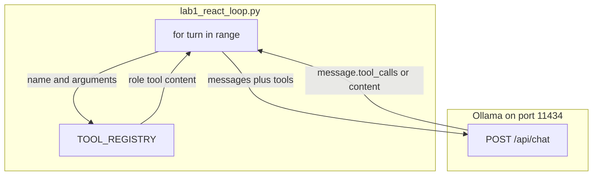

# 04: The Loop

After this chapter you run a `for turn in range` over the chapter 03 dispatcher. That loop is ReAct. Cycle detection and thinking-token demux are chapter 12.

## Data
Chapter 03 already has one dispatch: the model returns `tool_calls`, Python looks up the name in `TOOL_REGISTRY`, runs the function, and prints the result. This chapter keeps those same objects and adds one new one.

A **turn** is one `POST /api/chat` plus whatever the script does with that reply. The loop is `for turn in range(1, max_turns + 1)` inside `run_react_agent` in `lab1_react_loop.py`. The lab sets `max_turns` to 5.

**State** for this chapter is the `messages` list in memory. It starts with a `system` message and a `user` message. Each turn appends the assistant `message` object the provider returned. If that object has `tool_calls`, the script also appends one `{ "role": "tool", "content": result }` per call. The list is sent again on the next POST. Nothing is written to disk. Chapter 05 saves this list.

The **tools** are the same pair as chapter 03: `TOOLS_SCHEMA` (what the model sees) and `TOOL_REGISTRY` (name to Python function). The lab registers `add_numbers` and `multiply_numbers`. Both take `a` and `b` as numbers and return a string.

The **stop condition** is `message.tool_calls` missing or empty. Then the script prints `message.content` and returns. If the loop hits `max_turns` with no empty `tool_calls`, it prints a warning and stops.

`OLLAMA_HOST` defaults to `http://192.168.1.29:11434`. `OLLAMA_MODEL` defaults to `qwen3.6:35b-a3b-65k`. The route is `POST /api/chat` on port `11434`.

## Information
One turn is: POST `messages` plus `tools` to the provider. If the reply has `tool_calls`, run each name through `TOOL_REGISTRY`, append `role: tool`, go to the next turn. If the reply has only `content`, that string is the answer and the function returns.

The model chooses the next tool name and arguments. That is the policy. Python runs the function and appends the string. That is the runtime. The model cannot add 42 and 58, then multiply by 3, in one tool-less turn if it must use your functions. It needs the first result in `messages` before it can call the second tool.

ReAct means Reason + Act. It is a 2022 design pattern, not a product and not a language. The reason step is the model picking a tool or final text. The act step is Python running `TOOL_REGISTRY[tool_name](**tool_args)`.

## Knowledge
1. Keep a `messages` list. Start it with `role: system` and `role: user`.
2. Each turn POST `model`, `messages`, `tools` (`TOOLS_SCHEMA`), `stream: false`, and `options.temperature: 0.0` to `{OLLAMA_HOST}/api/chat`.
3. Read `data["message"]`. Append that object to `messages`.
4. If `message["tool_calls"]` is a non-empty list, for each call read `function.name` and `function.arguments`, run `TOOL_REGISTRY[name](**arguments)`, and append `{ "role": "tool", "content": result }`.
5. If `tool_calls` is missing or empty, print `message["content"]` and return that string.
6. Cap the loop at 5 turns. Do not add cycle hashing, thinking-token demux, or a second agent.

## Wisdom
A loop over one dispatcher is enough for multi-step tool use. Plan-Execute, ReWoo, and Tree of Thoughts are not this chapter. Saving `messages` to disk is chapter 05. Cycle detection and thinking-token demux are chapter 12. If you add those now, a wrong answer could come from the loop, the save, or the demux, and you will not know which.

## The When and Why
- **When:** one dispatch is not enough because the next tool needs the previous result.
- **Why:** the model cannot add, then multiply, in one tool-less turn if it must use your functions. The loop is how the second POST sees the first tool string.

## How it works



Walkthrough of the lab prompt `What is 42 plus 58, and then multiply that result by 3?`:

1. `run_react_agent` builds `messages` with a system line and that user prompt.
2. Turn 1 POSTs the list plus `TOOLS_SCHEMA`. The model returns `tool_calls` for `add_numbers` with `a=42` and `b=58`. Python runs the function and appends `role: tool` with content `100`.
3. Turn 2 POSTs the longer list. The model returns `tool_calls` for `multiply_numbers` with `a=100` and `b=3`. Python appends `300`.
4. Turn 3 POSTs again. `tool_calls` is empty. The script prints `message.content` (the final text that includes 300) and returns.

Nothing in that walkthrough writes a file or starts a second model. The only new control is the `for` loop and the stop on empty `tool_calls`.

## Data contract

**Request each turn** `POST /api/chat`

```json
{
  "model": "qwen3.6:35b-a3b-65k",
  "messages": [],
  "tools": [],
  "stream": false,
  "options": { "temperature": 0.0 }
}
```

`messages` is the full list so far. `tools` is `TOOLS_SCHEMA`.

**Response** (one turn)

```json
{
  "message": {
    "role": "assistant",
    "content": "",
    "tool_calls": [
      {
        "function": {
          "name": "add_numbers",
          "arguments": { "a": 42, "b": 58 }
        }
      }
    ]
  }
}
```

**Stop condition:** `message.tool_calls` missing or empty. Use `message.content`.

**Tool result appended by the script** (not a provider field):

```json
{ "role": "tool", "content": "100" }
```

## Lab
Done when 42 plus 58 then times 3 becomes 300 across three turns.

- Module: [this file](./00_the_react_loop.md)
- Lab 1: [lab1_react_loop.py](./lab1_react_loop.py) / [lab1_react_loop.md](./lab1_react_loop.md) — loop the dispatcher. Done when turn 1 prints 100, turn 2 prints 300, and turn 3 prints final text with no tool calls.

## Related
- **Chapter 03 dispatcher:** one `tool_calls` list, one registry lookup, no loop. This chapter is that dispatch inside `for turn in range`.
- **LangChain / CrewAI ReAct wrappers:** same loop, more objects. The lab is the loop in one function.

## Notes
- ReAct is a design pattern (Reason + Act), published 2022. It is not a product or a language.
- Real run: Turn 1 `add_numbers(a=42, b=58)` → `100`. Turn 2 `multiply_numbers(a=100, b=3)` → `300`. Turn 3 final text, no tool calls.
- The reference script appends `{ "role": "tool", "content": result }` and does not send `tool_call_id`. Some OpenAI-style servers want that id. Ollama `/api/chat` accepts the two-key object this lab uses.
