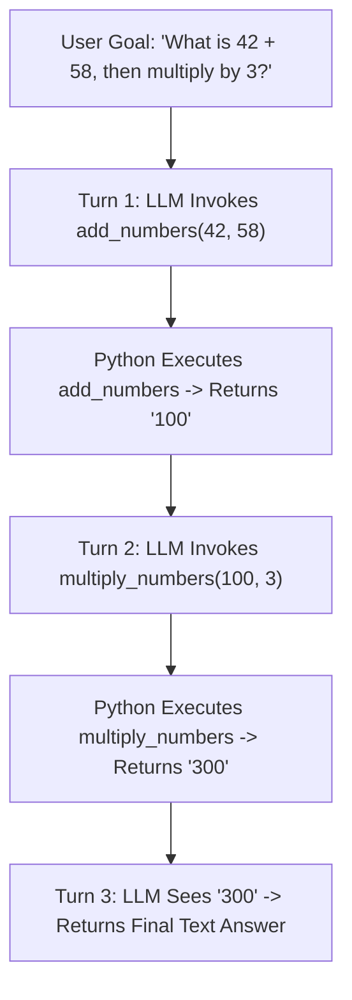

# 04: The Loop

After this chapter you run a `while` (or `for turn in range`) over the chapter 03 dispatcher. That loop is ReAct. Cycle detection and CoT demux are chapter 12.

## Data
- Loop: `for turn in range(1, max_turns + 1)` around `POST /api/chat`
- State: `messages` list (`system`, `user`, `assistant`, `tool`)
- Tools: same `TOOLS_SCHEMA` + `TOOL_REGISTRY` as chapter 03
- Stop when `tool_calls` is empty (final text) or `max_turns` is hit
- Example tools in the lab: `add_numbers`, `multiply_numbers`

## Information
One turn is: call the model → if it emitted `tool_calls`, run the registry, append `role: tool`, loop. If it emitted only `content`, return that string. The model is the policy. Python is the runtime.

## Knowledge
1. Keep a `messages` list.
2. Each turn POST `messages` + `tools`.
3. Append the assistant message.
4. If `tool_calls`, dispatch and append tool results.
5. Else print `content` and return.
6. Cap turns (lab uses 5). Do not add cycle hashing or thinking-token demux here.

## Wisdom
A loop over one dispatcher is enough for multi-step tool use. Plan-Execute, ReWoo, and ToT are not this chapter. Cycle detection is chapter 12.

## The When and Why
- **When:** one dispatch is not enough because the next tool needs the previous result.
- **Why:** the model cannot add, then multiply, in one tool-less turn if it must use your functions.

## How it works



## Data contract

**Request each turn**

```json
{
  "model": "qwen3.6:35b-a3b-65k",
  "messages": [],
  "tools": [],
  "stream": false,
  "options": { "temperature": 0.0 }
}
```

**Stop condition:** `message.tool_calls` missing or empty; use `message.content`.

## Lab
- [lab1_react_loop.py](./lab1_react_loop.py) / [lab1_react_loop.md](./lab1_react_loop.md) — Done when 42+58 then ×3 becomes 300 across three turns.

## Related
- **LangChain / CrewAI ReAct wrappers:** same loop, more objects. The lab is ~40 lines of Python.

## Notes
- ReAct is a design pattern (Reason + Act), published 2022. It is not a product or a language.
- Real run: Turn 1 `add_numbers(a=42, b=58)` → `100`. Turn 2 `multiply_numbers(a=100, b=3)` → `300`. Turn 3 final text, no tool calls.
