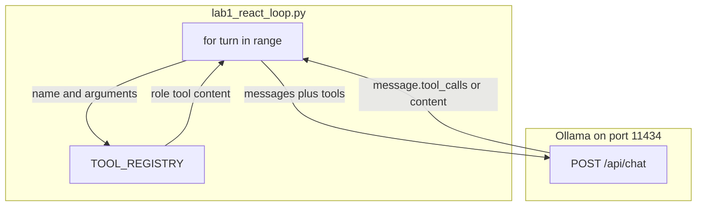

# 04: The Loop: The ReAct Pattern in Pure Python

By the end of this chapter, you will build an automated ReAct (Reason + Act) loop using a standard Python `for` or `while` loop. This allows an AI model to sequence multiple tool calls step-by-step to solve multi-stage problems.

In Chapter 03, we executed a single tool dispatch. In this chapter, we automate the process so the model can inspect a tool's result, decide on the next action, and continue until the task is complete.

## Data
We build on the exact same primitives from Chapter 03:
- **A Conversation Turn**: One iteration consisting of sending `messages` and `tools` to `POST /api/chat`, inspecting the response, and handling any tool calls.
- **The Turn Loop**: A loop running for up to `max_turns` iterations (typically 5 turns for simple tasks).
- **Working Memory**: An in-memory Python list `messages` that grows on each turn. When the model requests a tool, we append the assistant's request message and the corresponding `{"role": "tool", "content": result}` message.
- **Stop Condition**: When the model returns a response with no `tool_calls` (only text in `message.content`), the loop terminates and returns the final answer.

## Information
The **ReAct** pattern (Reason + Act) operates as an iterative feedback loop:
1. **Reason**: The model examines the conversation history and determines what calculation or action is needed next.
2. **Act**: The Python runtime executes the requested function and appends the result to `messages`.
3. **Observe & Repeat**: The updated history is sent back to the model, allowing it to use the intermediate result in subsequent steps.

For example, when solving `(42 + 58) * 3`, the model first calls `add_numbers(42, 58)`. Once it sees the returned `100`, it immediately triggers `multiply_numbers(100, 3)` on the next turn, finally returning `300`.

## Knowledge
Here is the step-by-step implementation:
1. Initialize `messages` with a system prompt and the user's initial prompt.
2. Loop over turns: `for turn in range(1, max_turns + 1):`.
3. Send `model`, `messages`, and `tools` to `{OLLAMA_HOST}/api/chat`.
4. Append `data["message"]` to `messages`.
5. If `tool_calls` are present:
   - For each tool call, look up the function name in `TOOL_REGISTRY` and call it with the parsed arguments.
   - Append `{"role": "tool", "content": str(result)}` to `messages`.
6. If `tool_calls` is empty or `None`:
   - Print and return `message["content"]`.
7. If the loop reaches `max_turns` without completing, terminate with a warning.

## Wisdom
A clean Python loop over your dispatcher is all that is required to build a functioning ReAct agent. You do not need third-party agent orchestration frameworks to achieve multi-step reasoning.

## The When and Why
- **When**: Use a ReAct loop whenever solving a goal requires a sequence of dependent steps (e.g. searching for a document, reading its contents, and summarizing findings).
- **Why**: Language models cannot know the result of a tool before calling it. An iterative loop is necessary to feed intermediate results back into the model's working memory.

## How it works



Walkthrough of the lab prompt `What is 42 plus 58, and then multiply that result by 3?`:

1. `run_react_agent` builds `messages` with a system line and that user prompt.
2. Turn 1 POSTs the list plus `TOOLS_SCHEMA`. The model returns `tool_calls` for `add_numbers` with `a=42` and `b=58`. Python runs the function and appends `role: tool` with content `100`.
3. Turn 2 POSTs the longer list. The model returns `tool_calls` for `multiply_numbers` with `a=100` and `b=3`. Python appends `300`.
4. Turn 3 POSTs again. `tool_calls` is empty. The script prints `message.content` (the final text that includes 300) and returns.

Nothing in that walkthrough writes a file or starts a second model. The only new control is the `for` loop and the stop on empty `tool_calls`.

## Data contract

**Request each turn** `POST /api/chat`

```json
{
  "model": "qwen3.6:35b-a3b-65k",
  "messages": [],
  "tools": [],
  "stream": false,
  "options": { "temperature": 0.0 }
}
```

`messages` is the full list so far. `tools` is `TOOLS_SCHEMA`.

**Response** (one turn)

```json
{
  "message": {
    "role": "assistant",
    "content": "",
    "tool_calls": [
      {
        "function": {
          "name": "add_numbers",
          "arguments": { "a": 42, "b": 58 }
        }
      }
    ]
  }
}
```

**Stop condition:** `message.tool_calls` missing or empty. Use `message.content`.

**Tool result appended by the script** (not a provider field):

```json
{ "role": "tool", "content": "100" }
```

## Lab
Done when 42 plus 58 then times 3 becomes 300 across three turns.

- Module: [this file](./00_the_react_loop.md)
- Lab 1: [lab1_react_loop.py](./lab1_react_loop.py) / [lab1_react_loop.md](./lab1_react_loop.md) — loop the dispatcher. Done when turn 1 prints 100, turn 2 prints 300, and turn 3 prints final text with no tool calls.

## Related
- **Chapter 03 dispatcher:** one `tool_calls` list, one registry lookup, no loop. This chapter is that dispatch inside `for turn in range`.
- **Higher-level agent frameworks:** abstract this same loop behind classes. The lab is the raw loop in one function.

## Notes
- ReAct is a design pattern (Reason + Act), published 2022. It is not a product or a language.
- Real run: Turn 1 `add_numbers(a=42, b=58)` → `100`. Turn 2 `multiply_numbers(a=100, b=3)` → `300`. Turn 3 final text, no tool calls.
- The reference script appends `{ "role": "tool", "content": result }` and does not send `tool_call_id`. Some OpenAI-style servers want that id. Ollama `/api/chat` accepts the two-key object this lab uses.
