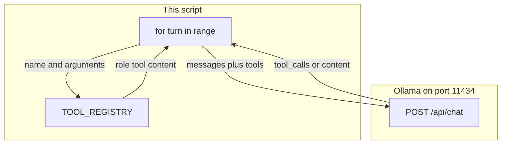

# Lab 1: The ReAct loop

A `for` loop has called `add_numbers` then `multiply_numbers` and printed a final answer that contains 300.

## What you touch
- Script: `lab1_react_loop.py`
- Function: `run_react_agent(user_prompt, max_turns=5)`
- URL / path: `{OLLAMA_HOST}/api/chat` (default `http://127.0.0.1:11434/api/chat`)
- Registry: `TOOL_REGISTRY` maps `add_numbers` and `multiply_numbers` to Python functions
- Schema: `TOOLS_SCHEMA` is the same two functions, sent as the `tools` key
- Keys sent: `model`, `messages`, `tools`, `stream` (`false`), `options.temperature` (`0.0`)
- Keys read: `message`, then `message.tool_calls` or `message.content`
- Tool result appended: `{ "role": "tool", "content": result }` (no `tool_call_id`)

## Steps


1. Read `OLLAMA_HOST` and `OLLAMA_MODEL` from the environment. If they are unset, use `http://127.0.0.1:11434` and `llama3.2:1b`. The route is `{host}/api/chat`.
2. Define `add_numbers(a, b)` and `multiply_numbers(a, b)`. Each returns `str(a + b)` or `str(a * b)`. Put both in `TOOL_REGISTRY` by name. Put the same names and parameter keys `a` and `b` in `TOOLS_SCHEMA`.
3. Write `run_react_agent(user_prompt: str, max_turns: int = 5)`. Start `messages` with `{ "role": "system", "content": "You are a helpful assistant. Use tools when calculations are required." }` and `{ "role": "user", "content": user_prompt }`.
4. Loop `for turn in range(1, max_turns + 1)`. Each turn POST `model`, `messages`, `tools` (`TOOLS_SCHEMA`), `stream: false`, and `options.temperature: 0.0` with header `Content-Type: application/json`.
5. Decode the JSON. Read `data["message"]`. Append that object to `messages`.
6. If `message.get("tool_calls", [])` is non-empty, for each call read `function.name` and `function.arguments`, run `TOOL_REGISTRY[name](**arguments)`, print the action and the observation, and append `{ "role": "tool", "content": result }`.
7. If `tool_calls` is missing or empty, print `message["content"]` and return that string. Stop. Do not start another turn.
8. Use the prompt `What is 42 plus 58, and then multiply that result by 3?`. If the host is unreachable, print the error and exit. Do not retry.

## Data contract
Only the keys this script sends and reads.

**Request each turn** `POST /api/chat`

```json
{
  "model": "llama3.2:1b",
  "messages": [],
  "tools": [],
  "stream": false,
  "options": { "temperature": 0.0 }
}
```

`messages` is the full list so far. `tools` is `TOOLS_SCHEMA`.

**Response** (one turn, tool call)

```json
{
  "message": {
    "role": "assistant",
    "content": "",
    "tool_calls": [
      {
        "function": {
          "name": "add_numbers",
          "arguments": { "a": 42, "b": 58 }
        }
      }
    ]
  }
}
```

**Tool result this script appends**

```json
{ "role": "tool", "content": "100" }
```

**Stop:** `message.tool_calls` missing or empty. Print `message.content`.

## Run
From the repo root:

```bash
OLLAMA_HOST=http://127.0.0.1:11434 OLLAMA_MODEL=llama3.2:1b python education/04_the_loop/lab1_react_loop.py
```

```powershell
$env:OLLAMA_HOST="http://127.0.0.1:11434"
$env:OLLAMA_MODEL="llama3.2:1b"
python education/04_the_loop/lab1_react_loop.py
```

## What you should see
Three turns. Turn 1 prints `[ACTION]` for `add_numbers` with `a=42` and `b=58`, then `[OBSERVATION]` `100`. Turn 2 prints `multiply_numbers` with `a=100` and `b=3`, then `300`. Turn 3 prints `[FINAL ANSWER]` containing 300 and `ReAct Loop completed successfully in 3 turn(s).` If it stops after one tool, the `role: tool` message was not appended. If you see `[WARNING] ReAct loop reached max turns threshold.`, the model kept emitting `tool_calls` or the stop check is wrong. If you see `URLError`, the provider is not reachable at that host.

## Stop here
This is not cycle detection. Do not hash repeated tool signatures. Do not save `messages` to disk. Do not add a persona or a second agent. Next: [00_the_budget.md](../05_the_budget/00_the_budget.md).

## Notes
- ReAct is a software design pattern (Reason + Act), not a framework.
- Real run: `add_numbers(a=42, b=58)` then `multiply_numbers(a=100, b=3)` then final text with no tool calls.
- The reference `lab1_react_loop.py` appends `{ "role": "tool", "content": result }` and does not send `tool_call_id`. Keys sent and read match this brief. Do not edit the `.py` in the repo.
- Chapter 05 bounds the budget. Chapter 06 hashes cycles. Chapter 07 saves the state. Chapter 13 treats this loop as an agent.
