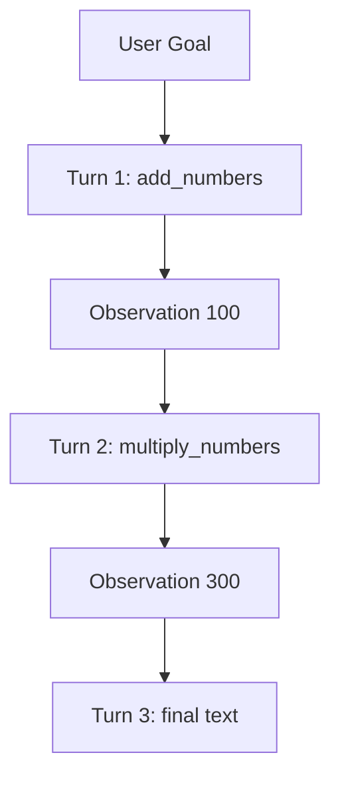

# Lab 1: The ReAct loop

After this lab a `for` loop has called two tools in sequence and printed a final answer.

## Data
- Script: `lab1_react_loop.py`
- URL: `{OLLAMA_HOST}/api/chat`
- Registry: `add_numbers`, `multiply_numbers`
- `max_turns = 5`

## Information
Each iteration POSTs the growing `messages` list. Tool results go back as `role: tool`.

## Knowledge
1. Register two functions.
2. Start `messages` with system + user.
3. Loop: POST, append assistant message, dispatch tools or return content.

## Wisdom
This is not cycle detection. Chapter 12 hashes repeated tool signatures.

## The When and Why
- **When:** chapter 03 dispatch works and the task needs more than one call.
- **Why:** this is the smallest loop that proves ReAct.

## How it works



## Data contract

**Tool result message**

```json
{ "role": "tool", "content": "100" }
```

## Run

```bash
python education/04_the_loop/lab1_react_loop.py
```

## What you should see
Three turns. Actions and observations printed. Final answer containing 300. If it stops after one tool, the tool message was not appended.

## What this becomes later
Chapter 05 saves `messages`. Chapter 07 adds a persona and treats this loop as an agent.

## Related
- **Chapter 03 dispatcher:** one turn of this loop.

## Notes
- ReAct is a software design pattern, not a framework.
- Real run used `add_numbers(42, 58)` then `multiply_numbers(100, 3)` then final text.
