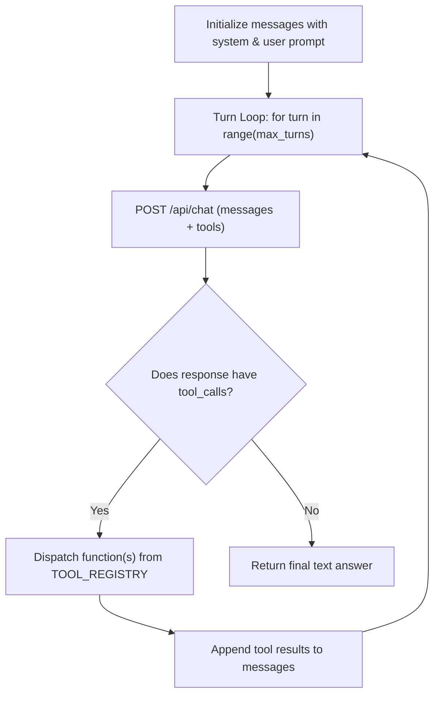

# Lab 1: Building a Multi-Turn ReAct Execution Loop

In this lab, you will write a function `run_react_agent(user_prompt, max_turns=5)` that uses an iterative `for` loop to sequence multiple tool calls (`add_numbers` and `multiply_numbers`) until the model reaches a final text answer.

---

## What you touch
- Script: `lab1_react_loop.py`
- Main Function: `run_react_agent(user_prompt: str, max_turns: int = 5) -> str`
- URL / Endpoint: `{OLLAMA_HOST}/api/chat` (defaults to `http://127.0.0.1:11434/api/chat`)
- Registry Dictionary: `TOOL_REGISTRY` mapping `"add_numbers"` and `"multiply_numbers"` to local Python functions
- Schema Array: `TOOLS_SCHEMA` describing both functions for the model
- Request Keys: `model`, `messages`, `tools`, `stream` (`false`), `options.temperature` (`0.0`)
- Response Keys Read: `message.tool_calls` (for intermediate actions) and `message.content` (for the final answer)

---

## Steps


1. Read `OLLAMA_HOST` and `OLLAMA_MODEL` from environment variables, defaulting to `http://127.0.0.1:11434` and `llama3.2:1b`.
2. Define `add_numbers(a: float, b: float) -> str` and `multiply_numbers(a: float, b: float) -> str`. Register both in `TOOL_REGISTRY`.
3. Create `TOOLS_SCHEMA` describing both functions.
4. Implement `run_react_agent(user_prompt: str, max_turns: int = 5)`:
   - Initialize `messages` with a helpful system message and the user prompt.
   - Loop over `turn` from 1 up to `max_turns`.
   - Send an HTTP POST request to `{OLLAMA_HOST}/api/chat`.
   - Append the returned `message` object to `messages`.
   - If `message.get("tool_calls")` contains calls:
     - For each call, execute the function from `TOOL_REGISTRY` with the supplied arguments.
     - Print `[ACTION]` and `[OBSERVATION]` for transparency.
     - Append `{"role": "tool", "content": str(result)}` to `messages`.
   - If `tool_calls` is empty or absent:
     - Print `[FINAL ANSWER]` and return `message["content"]`.
5. Test the agent with the multi-step prompt:
   `"What is 42 plus 58, and then multiply that result by 3?"`

---

## Data contract

**Request Payload per Turn**

```json
{
  "model": "llama3.2:1b",
  "messages": [
    { "role": "system", "content": "You are a helpful assistant..." },
    { "role": "user", "content": "What is 42 plus 58, and then multiply that result by 3?" }
  ],
  "tools": [ /* TOOLS_SCHEMA definitions */ ],
  "stream": false,
  "options": { "temperature": 0.0 }
}
```

**Intermediate Turn Response (Tool Call)**

```json
{
  "message": {
    "role": "assistant",
    "tool_calls": [
      {
        "function": {
          "name": "add_numbers",
          "arguments": { "a": 42, "b": 58 }
        }
      }
    ]
  }
}
```

**Final Turn Response (Completion Text)**

```json
{
  "message": {
    "role": "assistant",
    "content": "42 plus 58 is 100, and 100 multiplied by 3 is 300.",
    "tool_calls": null
  }
}
```

---

## Run
From the repository root, run:

```bash
python education/04_the_loop/lab1_react_loop.py
```

```powershell
python education/04_the_loop/lab1_react_loop.py
```

---

## What you should see
A transparent 3-turn trace:
- **Turn 1**: Tool call `add_numbers(a=42, b=58)` returning `100`.
- **Turn 2**: Tool call `multiply_numbers(a=100, b=3)` returning `300`.
- **Turn 3**: Final text answer containing `300` and confirmation that the loop finished in 3 turns.

---

## Stop here
You now have a fully functioning ReAct agent loop! In Chapter 05, we will explore execution budgets and safety stop rules to handle long-running workflows reliably.

Next up: [Chapter 05: The Budget](../05_the_budget/00_the_budget.md).

---

## Notes
*(Record your turn trace and observations here)*

