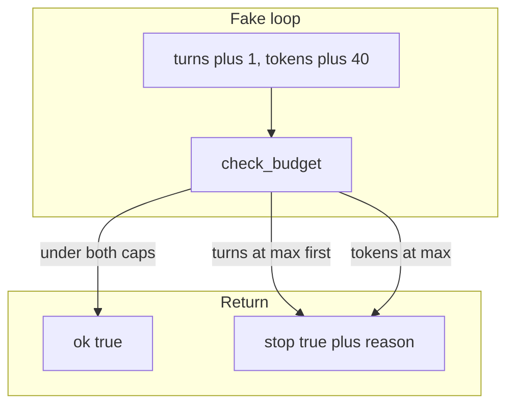

# 05: The Budget: Managing Execution Limits and Safety Stop Rules

By the end of this chapter, you will implement deterministic budget limits for agent execution. You will create a `check_budget(budget, spent)` evaluator that returns clear stop reasons (such as hitting a turn limit or token ceiling), ensuring your agent loops never run out of control.

In Chapter 04, we built an iterative loop. In this chapter, we add safety boundaries so multi-turn agents stop predictably and explain why they stopped.

## Data
We define two simple data structures:
- **`budget`**: A configuration dictionary defining maximum thresholds: `{"max_turns": int, "max_tokens": int}`.
- **`spent`**: A tracking dictionary measuring resources consumed so far: `{"turns": int, "tokens": int}`.

The evaluator function `check_budget(budget, spent)` tests limits in order:
1. First, check turns: if `spent["turns"] >= budget["max_turns"]`, return `{"stop": true, "reason": "max_turns"}`.
2. Second, check tokens: if `spent["tokens"] >= budget["max_tokens"]`, return `{"stop": true, "reason": "max_tokens"}`.
3. If both resources remain within limits, return `{"ok": true}`.

This chapter uses pure Python logic without network calls.

## Information
In real-world applications, autonomy without clear constraints can lead to infinite loops or unexpected resource consumption. 

A structured stop evaluator provides two key benefits:
1. **Predictability**: It prevents runaway execution before it happens.
2. **Observability**: When an agent finishes or halts, downstream systems receive an explicit machine-readable `reason` code rather than a silent failure.

## Knowledge
Here is the step-by-step implementation:
1. Define a `budget` dictionary specifying `max_turns` and `max_tokens`.
2. Initialize `spent` with zeros: `{"turns": 0, "tokens": 0}`.
3. After each iteration or model call, update `spent["turns"]` and `spent["tokens"]`.
4. Call `check_budget(budget, spent)` at the start or end of each turn.
5. If the evaluator returns `stop: true`, halt execution and log the specific `reason`.

## Wisdom
Keeping stop rules deterministic and transparent makes debugging multi-turn agent systems straightforward. Keep this evaluator focused purely on resource budgets—cyclic loop detection will be handled separately in Chapter 06.

## The When and Why
- **When**: Use budget evaluation whenever an agent executes multi-turn workflows or processes asynchronous tasks.
- **Why**: Unbounded agent loops can consume excessive tokens, exhaust system memory, or become stuck in infinite loops. Structured stop rules guarantee that execution stops safely and predictably.

## How it works



Walkthrough of one check:

1. Start `spent` at `{ "turns": 0, "tokens": 0 }`.
2. Each step: `turns += 1`, then `tokens += 40`, then `check_budget`.
3. `check_budget` tests `max_turns` first, then `max_tokens`.
4. The return is `{ "ok": true }` or `{ "stop": true, "reason": "max_turns" }` or `{ "stop": true, "reason": "max_tokens" }`.

## Data contract

**budget**

```json
{
  "max_turns": 3,
  "max_tokens": 100
}
```

**spent**

```json
{
  "turns": 0,
  "tokens": 0
}
```

**check_budget ok**

```json
{
  "ok": true
}
```

**check_budget stop**

```json
{
  "stop": true,
  "reason": "max_turns"
}
```

`reason` is `max_turns` or `max_tokens`. Check `max_turns` first.

## Lab
Done when two fixtures print a deterministic stop reason: `max_turns` on the first, `max_tokens` on the second.

- Module: [this file](./00_the_budget.md)
- Lab: [lab1_stop_rules.md](./lab1_stop_rules.md)

## Related
- **Chapter 04 range / while:** a turn cap in the loop. No reason object.
- **Chapter 12 cycle halt:** stops on a repeat hash, not a budget.
- **Chapter 16 job row:** the budget can sit on the job later. Not required in this lab.

## Notes
- Write the lab `.py` next to the brief. There is no reference `.py` in the repo yet.
- Do not add USD or a billing API.
- Do not POST. Do not read `OLLAMA_HOST` or `OLLAMA_MODEL`.
