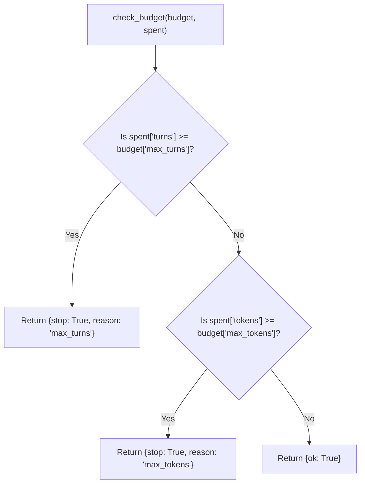

# Lab 1: Implementing Budget Stop Rules

In this lab, you will implement `check_budget(budget, spent)` and test it against two distinct test fixtures to verify that it halts deterministically for both turn limits (`max_turns`) and token ceilings (`max_tokens`).

---

## What you touch
- Script to create: `lab1_stop_rules.py`
- Main Function: `check_budget(budget: dict, spent: dict) -> dict`
- Input Dictionaries: `budget` (`max_turns`, `max_tokens`) and `spent` (`turns`, `tokens`)
- Pure Python logic (no network requests or environment variables required)

---

## Steps


1. Create `check_budget(budget: dict, spent: dict) -> dict`:
   - Check turn count first: if `spent["turns"] >= budget["max_turns"]`, return `{"stop": True, "reason": "max_turns"}`.
   - Check token count second: if `spent["tokens"] >= budget["max_tokens"]`, return `{"stop": True, "reason": "max_tokens"}`.
   - Otherwise, return `{"ok": True}`.
2. Implement a test runner loop that initializes `spent` to `{"turns": 0, "tokens": 0}` and simulates up to 5 steps, incrementing `turns += 1` and `tokens += 40` on each step until `check_budget` signals a stop.
3. Test **Fixture 1** (Turn Bound):
   - Budget: `{"max_turns": 3, "max_tokens": 100}`
   - Expected: Steps 1 and 2 return `ok: True`. Step 3 reaches turn 3 and halts with `reason: "max_turns"`.
4. Test **Fixture 2** (Token Bound):
   - Budget: `{"max_turns": 10, "max_tokens": 50}`
   - Expected: Step 1 returns `ok: True`. Step 2 reaches 80 tokens (exceeding 50) and halts with `reason: "max_tokens"`.
5. Run both fixtures and verify that both reasons are printed accurately.

---

## Data contract

**Budget Configuration**

```json
{
  "max_turns": 3,
  "max_tokens": 100
}
```

**Resource Consumption (Initial)**

```json
{
  "turns": 0,
  "tokens": 0
}
```

**Evaluator Return (Within Limits)**

```json
{
  "ok": true
}
```

**Evaluator Return (Limit Exceeded)**

```json
{
  "stop": true,
  "reason": "max_turns"
}
```

---

## Run
From the repository root, run your script:

```bash
python education/05_the_budget/lab1_stop_rules.py
```

```powershell
python education/05_the_budget/lab1_stop_rules.py
```

---

## What you should see
- **Fixture 1**: Two `ok` statuses followed by `stop` with reason `max_turns`.
- **Fixture 2**: One `ok` status followed by `stop` with reason `max_tokens`.

---

## Stop here
You now have a reliable stop evaluator! In Chapter 06, we will build reliability layers, including Chain-of-Thought demuxing and infinite loop detection.

Next up: [Chapter 06: The Reliability](../06_the_reliability/00_cot_and_reasoning.md).

---

## Notes
*(Record your test runs and observations here)*

