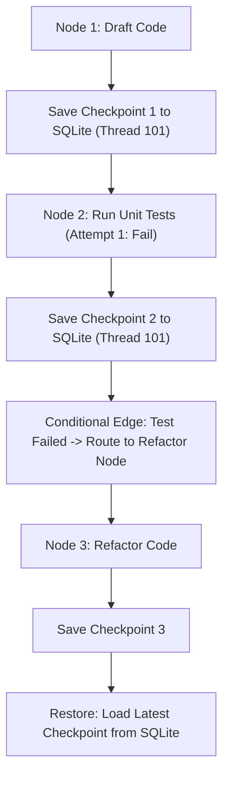

# 05: The State

After this chapter you can save and load the message list (or a state dict) so a restart does not start from zero. JSON first, then SQLite.

## Data
- In-memory state: a `dict` or `messages` list
- File/DB: SQLite table `checkpoints(thread_id, step_name, checkpoint_id, state_data, timestamp)`
- Functions: `save_checkpoint(thread_id, step_name, state)`, `load_latest_checkpoint(thread_id)`
- Lab DB path: local `checkpoints.db` next to the script (gitignored)
- Compaction (sliding window, summarization, AST prune) and vector long-term memory are chapter 13

## Information
Working memory is the payload you send this turn. A checkpointer writes that payload to disk after a step. Load by `thread_id` to resume. Without this, a crash drops the conversation.

## Knowledge
1. Keep state as a JSON-serializable dict.
2. After each step, `json.dumps` and INSERT.
3. On resume, SELECT latest row for `thread_id` and `json.loads`.
4. Do not build a 4-tier memory taxonomy or a vector store here.

## Wisdom
A JSON file is enough for one process. SQLite is enough for pause/resume on one machine. Postgres/Redis checkpointers are the same contract on a server.

## The When and Why
- **When:** a task has more than one step and the process might stop.
- **Why:** without a checkpoint, you re-run from the first message.

## How it works



## Data contract

**Table**

```sql
CREATE TABLE checkpoints (
    thread_id TEXT,
    step_name TEXT,
    checkpoint_id INTEGER PRIMARY KEY AUTOINCREMENT,
    state_data TEXT,
    timestamp REAL
)
```

**state_data example**

```json
{ "code": "string", "attempts": 0, "test_passed": false }
```

## Lab
- [lab2_state_checkpointer.py](./lab2_state_checkpointer.py) / [lab2_state_checkpointer.md](./lab2_state_checkpointer.md) — Done when a reload prints the last saved `code`.

## Related
- **LangGraph checkpointer:** same INSERT/SELECT behind a framework class.
- **JSON file:** `json.dump` / `json.load` if you do not need SQL yet.

## Notes
- Windows console: use `[FAIL]` / `[PASS]` instead of emoji (cp1252).
