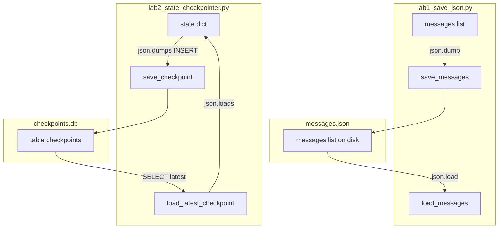

# 05: The State

After this chapter you can save and load the message list (or a state dict) so a restart does not start from zero. JSON first, then SQLite. This chapter does not POST to the model.

## Data
Chapter 04 keeps `messages` in a Python list. When the process exits, that list is gone. This chapter adds a file (or a SQLite row) that holds the same data.

**In-memory state** is a JSON-serializable `dict` or the `messages` list. JSON-serializable means `json.dumps` can encode it: strings, numbers, booleans, lists, and dicts. No live function objects.

A **JSON file** is the first form. Lab 1 writes a `messages` list with `save_messages` (`json.dump`) and reads it with `load_messages` (`json.load`). The file is `messages.json` next to `lab1_save_json.py`. One process, one file, no SQL.

A **checkpoint** is one saved snapshot. Lab 2 stores checkpoints in SQLite. The file is `checkpoints.db` next to `lab2_state_checkpointer.py` (or the path in `CHECKPOINT_DB`). The table is `checkpoints` with columns `thread_id`, `step_name`, `checkpoint_id`, `state_data`, `timestamp`.

A **thread_id** is a string that names one run, such as `task_session_101`. Several rows can share a thread. Load returns the newest row for that id. Lab 1 has no `thread_id`.

The SQLite functions are `save_checkpoint(thread_id, step_name, state)` (INSERT after `json.dumps`) and `load_latest_checkpoint(thread_id)` (SELECT latest, then `json.loads`). `init_sqlite_checkpointer` creates the table if it is missing.

The lab 2 state keys are `code` (string), `attempts` (int), and `test_passed` (bool). Lab 1 keys are `role` and `content` on each list item. Compaction (sliding window, summarization, AST prune) and vector long-term memory are chapter 13.

## Information
Working memory is the payload you would send this turn: the `messages` list, or a dict the next node will read. A checkpointer writes that payload to disk after a step. On resume you load by `thread_id` and continue from that dict.

Without a write, a crash drops the conversation. You re-run from the first message. The write is the new fact. The model is not involved. Neither lab opens port `11434`.

JSON is enough to prove save and load. SQLite is the same bytes in a table so you can keep more than one snapshot and pick the latest by `checkpoint_id`.

## Knowledge
1. Keep state as a JSON-serializable dict or list. Lab 1 starts with a `messages` list of `{ "role", "content" }` items.
2. Lab 1: call `save_messages`. It runs `json.dump` to `messages.json`. Call `load_messages` to `json.load` the same path and print each `role` and `content`.
3. Lab 2: after each step, call `save_checkpoint`. It runs `json.dumps(state)` and INSERTs `thread_id`, `step_name`, `state_data`, and `time.time()`.
4. On resume in lab 2, call `load_latest_checkpoint(thread_id)`. It SELECTs `step_name, state_data` for that thread, `ORDER BY checkpoint_id DESC LIMIT 1`, then `json.loads`.
5. Do not build a 4-tier memory taxonomy or a vector store here.

## Wisdom
A JSON file is enough for one process. SQLite is enough for pause and resume on one machine. Postgres or Redis checkpointers are the same INSERT/SELECT on a server. Compaction and RAG are chapter 13. If you add a vector store now, you will not know whether a bad resume came from the checkpoint row or from retrieval.

## The When and Why
- **When:** a task has more than one step and the process might stop.
- **Why:** without a checkpoint, you re-run from the first message. The save is how the next process sees the last dict.

## How it works



Walkthrough of lab 1:

1. Build a short `messages` list with `system`, `user`, and `assistant` items.
2. `save_messages` writes that list to `messages.json` with `json.dump`.
3. `load_messages` reads the same path with `json.load` and prints each `role` and `content`.

Walkthrough of the lab 2 thread `task_session_101`:

1. `init_sqlite_checkpointer` creates `checkpoints` if the table is missing.
2. `node_draft_code` sets `code` to a one-line `calculate_total`. `save_checkpoint` writes step `draft_code`.
3. `node_run_tests` sets `attempts` to 1 and `test_passed` to false. The script prints `[FAIL]`. Step `run_tests_attempt_1` is saved.
4. `node_refactor_code` replaces `code` with a version that checks `price < 0`. Step `refactor_attempt_1` is saved.
5. `node_run_tests` sets `attempts` to 2 and `test_passed` to true. The script prints `[PASS]`. Step `run_tests_attempt_2` is saved.
6. After the run, `load_latest_checkpoint("task_session_101")` SELECTs that last row and prints `Restored Code` plus the refactored function.

Nothing in those walkthroughs calls Ollama. The nodes are ordinary Python functions. Lab 1 is the file. Lab 2 is the INSERT and the SELECT.

## Data contract

**JSON-file form** (lab 1)

```json
[
  { "role": "system", "content": "string" },
  { "role": "user", "content": "string" },
  { "role": "assistant", "content": "string" }
]
```

**save** `json.dump` of that list to `messages.json`.

**load** `json.load` of that list. Print each `role` and `content`.

**Table** (lab 2)

```sql
CREATE TABLE checkpoints (
    thread_id TEXT,
    step_name TEXT,
    checkpoint_id INTEGER PRIMARY KEY AUTOINCREMENT,
    state_data TEXT,
    timestamp REAL
)
```

**state_data example** (what `json.dumps` writes into the TEXT column)

```json
{ "code": "string", "attempts": 0, "test_passed": false }
```

**save** INSERTs `thread_id`, `step_name`, `state_data`, `timestamp`. SQLite fills `checkpoint_id`.

**load** SELECTs `step_name, state_data WHERE thread_id = ? ORDER BY checkpoint_id DESC LIMIT 1`.

## Lab
Done when lab 1 prints each loaded `role` and `content`, and lab 2 reloads the last saved `code`.

- Module: [this file](./00_save_the_messages.md)
- Lab 1: [lab1_save_json.md](./lab1_save_json.md) — write `lab1_save_json.py`. `json.dump` / `json.load` of a `messages` list to `messages.json`. Functions `save_messages` / `load_messages`. Done when load prints each `role` and `content`.
- Lab 2: [lab2_state_checkpointer.py](./lab2_state_checkpointer.py) / [lab2_state_checkpointer.md](./lab2_state_checkpointer.md) — SQLite INSERT/SELECT. Done when `load_latest_checkpoint` prints the refactored `code`.

## Related
- **JSON file:** `json.dump` / `json.load` if you do not need more than one snapshot. Lab 1.
- **LangGraph checkpointer:** same INSERT/SELECT behind a framework class.
- **SQLite:** one file, no server. What lab 2 uses.

## Notes
- Windows console: use `[FAIL]` / `[PASS]` instead of emoji (cp1252).
- `messages.json` sits next to lab 1. `checkpoints.db` sits next to lab 2 and is gitignored. Override the DB path with `CHECKPOINT_DB`.
- Neither lab sends `OLLAMA_HOST` or `OLLAMA_MODEL`. There is no HTTP call.
