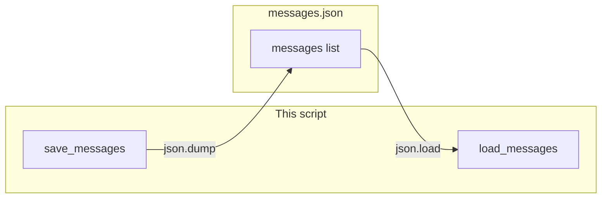

# Lab 1: Save messages as JSON

A `messages` list is written to `messages.json` and `load_messages` prints each `role` and `content`.

## What you touch
- Script: `lab1_save_json.py` (write it next to this brief; there is no reference `.py` yet)
- Functions: `save_messages(messages)`, `load_messages()`
- File: `messages.json` beside the script (`os.path.join(os.path.dirname(__file__), "messages.json")`)
- List items: `{ "role": "string", "content": "string" }`
- No HTTP. This script does not read `OLLAMA_HOST` or `OLLAMA_MODEL`.
- No SQLite. No `thread_id`. No compaction.

## Steps


1. Set the path to `os.path.join(os.path.dirname(__file__), "messages.json")`.
2. Write `save_messages(messages)`. Open that path for write. Call `json.dump` on the list (use `indent=2`). Print the path.
3. Write `load_messages()`. Open the same path for read. Call `json.load`. Return the list. If the file is missing, return `[]`.
4. In `__main__`, build a short list with a `system` item, a `user` item, and an `assistant` item. Call `save_messages`. Then call `load_messages`. Print each loaded `role` and `content`.
5. Confirm the printed lines match the list you dumped. Do not open SQLite. Do not POST. Do not add `thread_id`.

## Data contract
Only the keys this script writes and reads.

**messages.json**

```json
[
  { "role": "system", "content": "You add numbers." },
  { "role": "user", "content": "What is 42 plus 58?" },
  { "role": "assistant", "content": "100" }
]
```

**save** `json.dump` of that list.

**load** `json.load` of that list. Print each `role` and `content`.

## Run
From the repo root:

```bash
python education/05_the_state/lab1_save_json.py
```

```powershell
python education/05_the_state/lab1_save_json.py
```

This script does not read `OLLAMA_HOST` or `OLLAMA_MODEL`. Do not set those vars for this lab.

## What you should see
The path of `messages.json`. Then one line per loaded item with `role` and `content` (`system` / `You add numbers.`, `user` / `What is 42 plus 58?`, `assistant` / `100`). If load prints nothing, the file was not written or `json.load` returned an empty list. If you see a SQLite error, you opened lab 2.

## Stop here
This is not a checkpointer. Do not add SQLite. Do not add `thread_id`. Do not compact the list. Next: [lab2_state_checkpointer.md](./lab2_state_checkpointer.md).

## Notes
- Write `lab1_save_json.py` next to this brief. There is no reference `.py` in the repo yet.
- `messages.json` sits next to the script. Do not commit a huge dump.
- Keys written and read match this brief. Do not edit other `.py` files in the repo.
- Chapter 13 adds compaction.
