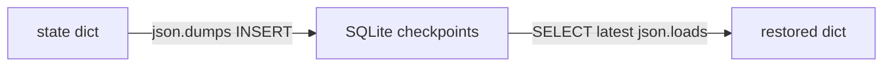

# Lab 2: State checkpointer

After this lab a SQLite row holds the latest state dict and a reload returns it.

## Data
- Script: `lab2_state_checkpointer.py`
- DB: `checkpoints.db` beside the script (not committed)
- Keys in state: `code`, `attempts`, `test_passed`

## Information
Each node returns an updated dict. `save_checkpoint` writes it. `load_latest_checkpoint` reads the newest row for the thread.

## Knowledge
1. CREATE TABLE if needed.
2. Run draft → test → maybe refactor, saving after each node.
3. After the run, load the latest checkpoint and print `code`.

## Wisdom
This is not RAG. Chapter 13 stores facts across sessions in a different store.

## The When and Why
- **When:** a multi-step run must survive a restart.
- **Why:** this is the smallest save/load of a state dict.

## How it works



## Data contract

See the module table. `thread_id` is a string such as `task_session_101`.

## Run

```bash
python education/05_the_state/lab2_state_checkpointer.py
```

## What you should see
Checkpoint saved lines, then a restored `code` string. If the DB path is wrong, create the directory or point `DB_PATH` at the chapter folder.

## What this becomes later
Chapter 06 uses the same dict as graph state. Chapter 13 adds compaction.

## Related
- **SQLite:** one file, no server.

## Notes
- Schema is `thread_id`, `step_name`, `checkpoint_id`, `state_data`, `timestamp`.
- Emoji in prints broke Windows cp1252; the script uses `[FAIL]` / `[PASS]`.
