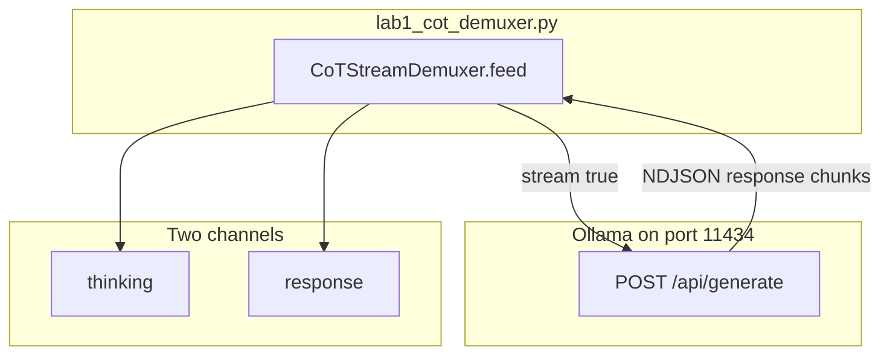

# 06: Chain-of-Thought and Reasoning Demuxing

By the end of this chapter, you will understand how modern reasoning models generate internal thought tokens and how to separate these internal thoughts from the user-facing response.

In Chapter 01, you may have noticed that reasoning models can evaluate many tokens before producing a short answer. In this chapter, we create a stream demuxer to route internal thoughts and visible answers into separate channels.

## Data
Reasoning models (such as DeepSeek-R1 or Qwen reasoning variants) output two distinct kinds of text in a single generation stream:
1. **Thinking Tokens**: The internal reasoning chain wrapped inside `<think>` and `</think>` tags. The model uses these tokens to work through complex logic step-by-step.
2. **Response Content**: The final text outside of the `<think>` tags intended for the user or downstream parsers.

Because providers like Ollama emit both sets of tokens in the same streaming response string, our application uses a `CoTStreamDemuxer` to split incoming chunks in real time.

## Information
Separating thinking tokens from final response text is critical for two reasons:
1. **User Experience**: End users should see a clean answer, with internal reasoning optionally placed in an expandable thought log.
2. **Data Integrity**: If an agent relies on structured JSON (as built in Chapter 02), unparsed `<think>` tags will break `json.loads()` and cause parsing errors.

## Knowledge
Here is the step-by-step workflow:
1. Stream incoming chunks from the provider with `stream: true`.
2. Feed each text chunk into a `CoTStreamDemuxer` state machine (`IDLE`, `THINKING`, `RESPONSE`).
3. Route text between `<think>` and `</think>` to the thinking log.
4. Route text after `</think>` to the final answer payload.
5. Print each channel with clear visual prefixes (`[THINKING LOG]` and `[RESPONSE PAYLOAD]`).

## Wisdom
Keeping the demuxer lightweight and stream-oriented ensures real-time feedback without adding heavy dependencies.

## The When and Why
- **When**: Use a CoT demuxer whenever you interact with reasoning models that emit `<think>` blocks.
- **Why**: Keeping reasoning tokens mixed in with response text clutters the UI and causes downstream JSON validation failures.

## How it works



Walkthrough of one streamed reply:

1. The script POSTs `{"model": "...", "prompt": "...", "stream": true, "options": {"temperature": 0.0}}` to `{OLLAMA_HOST}/api/generate`.
2. Each NDJSON line has key `response`. That string may contain `<think>`, `</think>`, or neither.
3. `feed` keeps a buffer and a state (`IDLE`, `THINKING`, `RESPONSE`). Text after `<think>` goes to the think log. Text after `</think>` goes to the answer.
4. The script prints thinking on one prefix and the answer on another. The return shape is `{ "thinking": "string", "response": "string" }`.

Nothing in that walkthrough changes the port or the weight file. The new work is the split.

## Data contract

**Request** `POST /api/generate`

```json
{
  "model": "qwen3.6:35b-a3b-65k",
  "prompt": "string",
  "stream": true,
  "options": { "temperature": 0.0 }
}
```

**One stream line from Ollama**

```json
{
  "response": "token-or-chunk",
  "done": false
}
```

**Intended demux result**

```json
{
  "thinking": "string",
  "response": "string"
}
```

## Lab
Done when thinking and the answer print on two channels and the answer string has no `<think>` tags.

- Module: [this file](./00_cot_and_reasoning.md)
- Lab 1: [lab1_cot_demuxer.py](./lab1_cot_demuxer.py) / [lab1_cot_demuxer.md](./lab1_cot_demuxer.md) - stream, split, print both channels. Done when the think log and the answer are separate.

## Related
- **Chapter 01 metrics:** 766 `eval_count` for two sentences. Those extra tokens are this chapter.
- **Chapter 07 kernel:** already calls a small `CoTStreamDemuxer`. This chapter is the teaching copy.

## Notes
- One CoT lab only. The old `labs/01_single_agent/lab3_reasoning_demux` is deleted.
- Contract drift vs `lab1_cot_demuxer.py`: no `OLLAMA_HOST` / `OLLAMA_MODEL` read (URL and model are literals). `feed` returns a tuple `(thinking_tokens, response_tokens)`, not a dict. The script prints character counts, not a JSON object. The intended contract is still `{ "thinking", "response" }`. Write that in your copy. Leave the reference file as-is.
