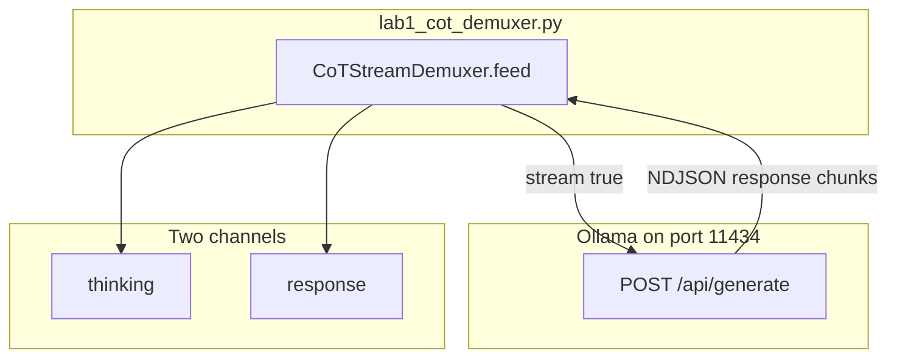

# 06: Chain-of-thought and reasoning

After this chapter thinking tokens are a separate channel from the user-visible string. Chapter 01 already counted 766 `eval_count` tokens for two sentences. This chapter names those extra tokens and splits them off.

## Data
A reasoning model (Qwen 3.6, DeepSeek-R1 style) can write two kinds of text in one reply.

**Thinking** is the text between `<think>` and `</think>`. The model uses it to work the problem. The user should not see it in the final string. `json.loads` should not see it either.

**Response** is everything outside those tags. That is the answer you print, store, or parse.

The tags are literals in the token stream. They are not a separate HTTP field. Ollama still puts every chunk in `response` on `POST /api/generate`. Your script has to split the string.

The lab file is `lab1_cot_demuxer.py`. Class `CoTStreamDemuxer` has `feed(chunk)` and returns a pair: thinking text, response text. An older copy at `labs/01_single_agent/lab3_reasoning_demux` is deleted. Keep one demux lab.

`OLLAMA_HOST` should default to `http://192.168.1.29:11434`. `OLLAMA_MODEL` should default to `qwen3.6:35b-a3b-65k`. The route is `POST /api/generate`.

## Information
Chapter 01 printed `eval_count` and saw a large number for a short answer. Those extra tokens were thinking. If you leave them in the same string as the answer, two things break:

1. A UI that prints `response` shows the scratch work.
2. A later `json.loads` on the answer fails because `<think>` is not valid JSON.

The split can run on a full string (`stream: false`) or on each NDJSON line (`stream: true`). The lab streams. Each line still has key `response`. `feed` looks for the tags inside that string.

Chapter 07 already embeds a small `CoTStreamDemuxer` in the kernel. This chapter is the place that teaches the split. Cycle detection, logit steering, evals, and reflexion are the next files in this folder.

## Knowledge
1. Read `OLLAMA_HOST` and `OLLAMA_MODEL` from the environment. Use the defaults above.
2. POST `model`, `prompt`, `stream: true`, `options.temperature: 0.0` to `{host}/api/generate`.
3. For each NDJSON line, read `data["response"]` and pass it to `CoTStreamDemuxer.feed`.
4. Buffer text after `<think>` into a think log. Buffer text after `</think>` (and any text before `<think>`) as the answer.
5. Print the two channels on separate prefixes. Do not keep a second demux lab.

## Wisdom
Stop when thinking and response are two strings. Do not add cycle detection, logit bias, or a reflexion loop yet. Those are later files in this chapter. If you add them now, a bad parse could come from the tags, the loop, or the eval.

## The When and Why
- **When:** the model emits `<think>` tags, or `eval_count` is much larger than the visible answer.
- **Why:** UI text and `json.loads` break if thinking stays in the same string as the answer.

## How it works



Walkthrough of one streamed reply:

1. The script POSTs `{"model": "...", "prompt": "...", "stream": true, "options": {"temperature": 0.0}}` to `{OLLAMA_HOST}/api/generate`.
2. Each NDJSON line has key `response`. That string may contain `<think>`, `</think>`, or neither.
3. `feed` keeps a buffer and a state (`IDLE`, `THINKING`, `RESPONSE`). Text after `<think>` goes to the think log. Text after `</think>` goes to the answer.
4. The script prints thinking on one prefix and the answer on another. The return shape is `{ "thinking": "string", "response": "string" }`.

Nothing in that walkthrough changes the port or the weight file. The new work is the split.

## Data contract

**Request** `POST /api/generate`

```json
{
  "model": "qwen3.6:35b-a3b-65k",
  "prompt": "string",
  "stream": true,
  "options": { "temperature": 0.0 }
}
```

**One stream line from Ollama**

```json
{
  "response": "token-or-chunk",
  "done": false
}
```

**Intended demux result**

```json
{
  "thinking": "string",
  "response": "string"
}
```

## Lab
Done when thinking and the answer print on two channels and the answer string has no `<think>` tags.

- Module: [this file](./00_cot_and_reasoning.md)
- Lab 1: [lab1_cot_demuxer.py](./lab1_cot_demuxer.py) / [lab1_cot_demuxer.md](./lab1_cot_demuxer.md) - stream, split, print both channels. Done when the think log and the answer are separate.

## Related
- **Chapter 01 metrics:** 766 `eval_count` for two sentences. Those extra tokens are this chapter.
- **Chapter 07 kernel:** already calls a small `CoTStreamDemuxer`. This chapter is the teaching copy.

## Notes
- One CoT lab only. The old `labs/01_single_agent/lab3_reasoning_demux` is deleted.
- Contract drift vs `lab1_cot_demuxer.py`: no `OLLAMA_HOST` / `OLLAMA_MODEL` read (URL and model are literals). `feed` returns a tuple `(thinking_tokens, response_tokens)`, not a dict. The script prints character counts, not a JSON object. The intended contract is still `{ "thinking", "response" }`. Write that in your copy. Leave the reference file as-is.
