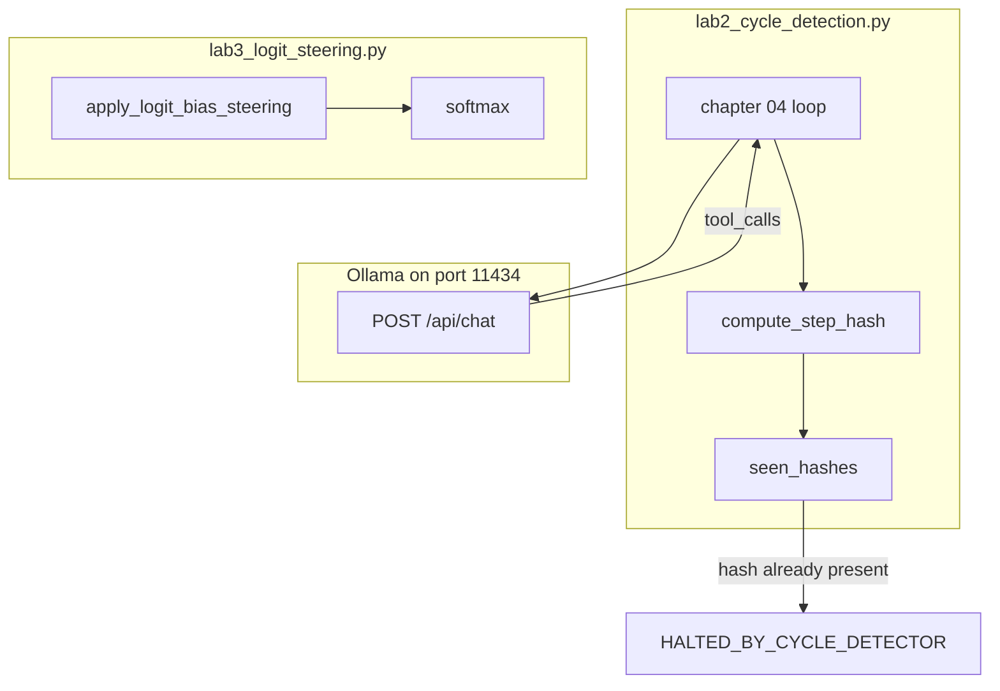

# 06: Cycle detection and logit steering

After this page a repeated tool signature stops the loop, and optional logit bias can block tokens. Chapter 04 already has `max_turns`. That cap is not enough if the same tool and args repeat until the cap.

## Data
A **cycle** is the same tool step happening again. The signature is `tool_name` plus the args plus the tool result. `compute_step_hash` in `lab2_cycle_detection.py` builds one string `tool_name:{json.dumps(args, sort_keys=True)}:{output}` and runs SHA-256. The hash is the key. If that key is already in `seen_hashes`, the loop returns `HALTED_BY_CYCLE_DETECTOR`.

**Logit bias** is a number added to a token's raw score before softmax. A large negative number (the lab uses `-100.0`) makes that token almost never win. A positive number (the lab uses `+5.0` on `{`) makes a token more likely. `apply_logit_bias_steering` in `lab3_logit_steering.py` does that add. Stop strings are the other optional halt: tell the provider to stop when it emits a given string.

The cycle lab talks to Ollama. The steering lab does not. It uses a local `VOCAB_TABLE` of token strings to integer ids.

`OLLAMA_HOST` should default to `http://192.168.1.29:11434`. `OLLAMA_MODEL` should default to `qwen3.6:35b-a3b-65k`. The cycle route is `POST /api/chat`.

These files were moved from `modules/08` and `labs/01` lab2. Cycle stays `lab2_cycle_detection`. Steering is `lab3_logit_steering`.

## Information
Chapter 04 stops when `tool_calls` is empty or `max_turns` is hit. If the model asks for `read_database_record({"record_id": 999})` every turn, and that tool always returns `ERROR: Record 999 not found`, `max_turns` still spends those turns. Hashing each step (the lab keeps every hash in `seen_hashes`) stops the repeat as soon as it appears.

Steering is a different lever. It does not watch history. It changes which next token is likely. Use it when you want to block words (`apologize`, `cannot`) or boost a format token (`{`). Guardrails that reject a prompt or reject non-JSON output are extra in the steering script. They are not the cycle hash.

Do not add MCTS (tree search over many futures). That is a different algorithm and not this page.

## Knowledge
1. After each tool call, hash `tool_name`, sorted args, and the result string.
2. If that hash is in `seen_hashes`, halt. Do not POST again.
3. If it is new, append it and keep the chapter 04 loop.
4. Optional: add a logit bias map (token id to float) or a stop string list.
5. Do not add MCTS.

## Wisdom
A hash of the last step is enough to stop a repeat. `max_turns` is the blunt backup. Logit bias is optional and local in this lab. If you add a search tree now, a hang could come from the hash, the tree, or the model.

## The When and Why
- **When:** the same `tool_name` plus args (and the same result) repeats, or you need to block a small set of tokens.
- **Why:** a turn cap still spends those turns. A hash stops the second copy. Bias is for tokens, not for loops.

## How it works



Walkthrough of the cycle lab:

1. The script POSTs `model`, `messages`, `tools`, `stream: false`, `options.temperature: 0.0` to `{OLLAMA_HOST}/api/chat`.
2. It reads `message.tool_calls`. For each call it runs `read_database_record` from `TOOL_REGISTRY`.
3. `compute_step_hash` hashes `tool_name`, the args JSON, and the result. If that hex string is already in `seen_hashes`, it returns `HALTED_BY_CYCLE_DETECTOR`.
4. The baked prompt asks for record `999` twice. That record always returns the same error, so the second identical step should halt.

Walkthrough of the steering lab:

1. `raw_logits` is a dict of token id to float. No HTTP.
2. `apply_logit_bias_steering` adds `-100.0` to `apologize` and `cannot`, and `+5.0` to `{`.
3. `softmax` turns the new scores into probabilities. The banned tokens should drop near zero. `{` should rise.

## Data contract

**Cycle request** `POST /api/chat`

```json
{
  "model": "qwen3.6:35b-a3b-65k",
  "messages": [],
  "tools": [],
  "stream": false,
  "options": { "temperature": 0.0 }
}
```

**Hash key** (string, then SHA-256)

```
tool_name:{"record_id": 999}:ERROR: Record 999 not found in table 'users'.
```

**Halt return**

```json
"HALTED_BY_CYCLE_DETECTOR"
```

**Steering inputs** (local, no HTTP)

```json
{
  "raw_logits": { "101": 2.0, "201": 4.5, "202": 5.0, "203": 4.8 },
  "logit_bias": { "202": -100.0, "203": -100.0, "101": 5.0 }
}
```

Token ids come from `VOCAB_TABLE`: `{` is 101, `I` is 201, `apologize` is 202, `cannot` is 203.

## Lab
Done when a repeated tool hash stops the loop, and a bias map changes token probabilities.

- Module: [this file](./01_cycle_and_steering.md)
- Lab 2 (cycle): [lab2_cycle_detection.py](./lab2_cycle_detection.py) / [lab2_cycle_detection.md](./lab2_cycle_detection.md) - hash each tool step, halt on a repeat. Done when you see `HALTED_BY_CYCLE_DETECTOR`.
- Lab 3 (steering): [lab3_logit_steering.py](./lab3_logit_steering.py) / [lab3_logit_steering.md](./lab3_logit_steering.md) - add bias, print softmax before and after. Done when `apologize` drops and `{` rises.

## Related
- **max_turns:** the blunt stop from chapter 04. Still keep it. The hash is the early stop.
- **Chapter 12 CoT:** previous file. Split thinking first. Then stop loops.

## Notes
- Moved from `modules/08` and `labs/01` lab2. Cycle is lab2. Steering is lab3.
- Contract drift vs `lab2_cycle_detection.py`: no `OLLAMA_HOST` / `OLLAMA_MODEL` read (URL and model are literals). Route is `/api/chat`. The print says the hash was "repeated consecutively" even though the check is "hash in the full `seen_hashes` list".
- Contract drift vs `lab3_logit_steering.py`: no HTTP and no Ollama. The script also runs `GuardrailInterceptor.inspect_prompt` and `validate_output`. Those are extra. The intended idea on this page is the hash plus optional logit bias / stop strings. Write that in your copy. Leave the reference files as-is.
