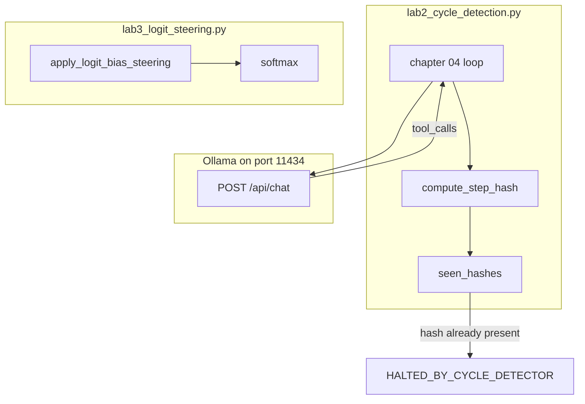

# 06: Cycle Detection and Logit Steering

By the end of this chapter, you will implement cycle detection to automatically detect and halt repetitive tool loops, and learn how logit steering guides token generation probabilities.

In Chapter 04, we relied on `max_turns` to bound execution. In this chapter, we add proactive hash-based cycle detection so repeated failures are stopped immediately on the second identical attempt rather than wasting remaining turns.

## Data
We introduce two key techniques:
1. **Step Hashing for Cycle Detection**: A deterministic hash computed from `tool_name`, sorted `arguments`, and the returned `result` string:
   $$\text{Step Hash} = \text{SHA256}(\text{tool\_name} + \text{args\_json} + \text{result})$$
   We track all step hashes in a `seen_hashes` set. If an identical step signature repeats, the loop immediately halts with `HALTED_BY_CYCLE_DETECTOR`.
2. **Logit Bias Steering**: Adjusting the raw unnormalized logits before the softmax activation function to either ban specific tokens (e.g. adding `-100.0` to prevent filler words) or encourage specific formatting tokens (e.g. adding `+5.0` to `{`).

## Information
When an agent encounters a persistent tool error (such as a database query for a non-existent record), naive loops may repeatedly invoke the exact same function with the exact same parameters. Cycle detection catches this oscillation on the very first repetition.

Logit steering operates directly on model probabilities during token generation, allowing developers to enforce vocabulary constraints without changing prompts.

## Knowledge
Here is the step-by-step procedure:
1. After every tool execution, compute the SHA-256 hash of the tool name, serialized arguments, and output result.
2. Check if the hash is already present in `seen_hashes`.
3. If present, immediately stop the loop and return `HALTED_BY_CYCLE_DETECTOR`.
4. If new, add the hash to `seen_hashes` and continue normal execution.
5. For steering, apply logit bias adjustments to token IDs before calculating softmax probabilities.

## Wisdom
Step hashing is an inexpensive, foolproof guardrail against infinite agent loops. Keep the hash check fast and simple.

## The When and Why
- **When**: Use cycle detection in any multi-turn agent that executes external tools. Use logit steering when strict vocabulary control or formatting constraints are required.
- **Why**: Turn limits eventually stop loops, but cycle detection stops them immediately, saving API costs and execution time.

## How it works



Walkthrough of the cycle lab:

1. The script POSTs `model`, `messages`, `tools`, `stream: false`, `options.temperature: 0.0` to `{OLLAMA_HOST}/api/chat`.
2. It reads `message.tool_calls`. For each call it runs `read_database_record` from `TOOL_REGISTRY`.
3. `compute_step_hash` hashes `tool_name`, the args JSON, and the result. If that hex string is already in `seen_hashes`, it returns `HALTED_BY_CYCLE_DETECTOR`.
4. The baked prompt asks for record `999` twice. That record always returns the same error, so the second identical step should halt.

Walkthrough of the steering lab:

1. `raw_logits` is a dict of token id to float. No HTTP.
2. `apply_logit_bias_steering` adds `-100.0` to `apologize` and `cannot`, and `+5.0` to `{`.
3. `softmax` turns the new scores into probabilities. The banned tokens should drop near zero. `{` should rise.

## Data contract

**Cycle request** `POST /api/chat`

```json
{
  "model": "qwen3.6:35b-a3b-65k",
  "messages": [],
  "tools": [],
  "stream": false,
  "options": { "temperature": 0.0 }
}
```

**Hash key** (string, then SHA-256)

```
tool_name:{"record_id": 999}:ERROR: Record 999 not found in table 'users'.
```

**Halt return**

```json
"HALTED_BY_CYCLE_DETECTOR"
```

**Steering inputs** (local, no HTTP)

```json
{
  "raw_logits": { "101": 2.0, "201": 4.5, "202": 5.0, "203": 4.8 },
  "logit_bias": { "202": -100.0, "203": -100.0, "101": 5.0 }
}
```

Token ids come from `VOCAB_TABLE`: `{` is 101, `I` is 201, `apologize` is 202, `cannot` is 203.

## Lab
Done when a repeated tool hash stops the loop, and a bias map changes token probabilities.

- Module: [this file](./01_cycle_and_steering.md)
- Lab 2 (cycle): [lab2_cycle_detection.py](./lab2_cycle_detection.py) / [lab2_cycle_detection.md](./lab2_cycle_detection.md) - hash each tool step, halt on a repeat. Done when you see `HALTED_BY_CYCLE_DETECTOR`.
- Lab 3 (steering): [lab3_logit_steering.py](./lab3_logit_steering.py) / [lab3_logit_steering.md](./lab3_logit_steering.md) - add bias, print softmax before and after. Done when `apologize` drops and `{` rises.

## Related
- **max_turns:** the blunt stop from chapter 04. Still keep it. The hash is the early stop.
- **Chapter 12 CoT:** previous file. Split thinking first. Then stop loops.

## Notes
- Moved from `modules/08` and `labs/01` lab2. Cycle is lab2. Steering is lab3.
- Contract drift vs `lab2_cycle_detection.py`: no `OLLAMA_HOST` / `OLLAMA_MODEL` read (URL and model are literals). Route is `/api/chat`. The print says the hash was "repeated consecutively" even though the check is "hash in the full `seen_hashes` list".
- Contract drift vs `lab3_logit_steering.py`: no HTTP and no Ollama. The script also runs `GuardrailInterceptor.inspect_prompt` and `validate_output`. Those are extra. The intended idea on this page is the hash plus optional logit bias / stop strings. Write that in your copy. Leave the reference files as-is.
