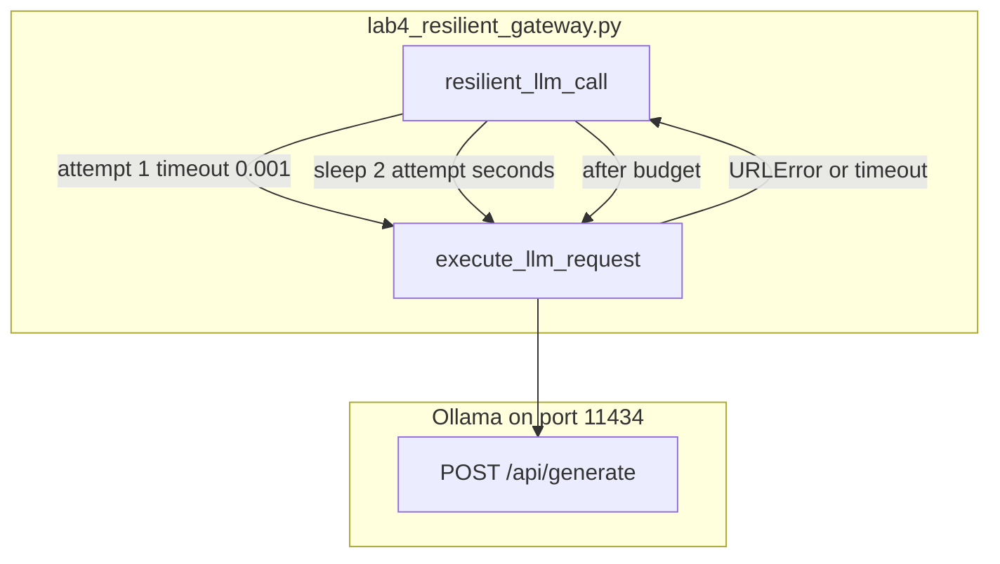

# 06: Resilient Gateways: Retries, Exponential Backoff, and Model Fallbacks

By the end of this chapter, you will build a resilient model gateway that automatically recovers from transient network drops, rate limits (HTTP 429), and server errors (HTTP 5xx) using exponential backoff retries and fallback models.

In Chapter 01, we implemented a single model call. In this chapter, we add network resilience so transient failures don't crash your agent applications.

## Data
A **resilient gateway** wraps raw model calls with retry and failover logic:
- **Exponential Backoff**: A sleep duration that increases with each failed attempt (e.g. `2 ** attempt` seconds) to avoid overwhelming a busy server.
- **Retry Budget (`max_retries`)**: The maximum number of attempts allowed before escalating (default is typically 2 or 3 retries).
- **Target Exceptions**: Transient issues such as `URLError`, `TimeoutError`, HTTP 429 (rate limits), and HTTP 500/503 errors.
- **Model Fallback**: Automatically switching to a backup model or alternative provider if the primary route fails repeatedly.

## Information
Local inference servers and cloud APIs occasionally experience hiccups, high load, or dropped connections. A single failed HTTP call should not crash a multi-step agent workflow.

By placing a resilient gateway between your application logic and the network layer, temporary glitches are absorbed and resolved automatically without user intervention.

## Knowledge
Here is the step-by-step implementation:
1. Wrap the low-level HTTP call inside a function `resilient_llm_call(prompt, max_retries=2)`.
2. Loop over attempts: `for attempt in range(1, max_retries + 1):`.
3. Try sending the request to the primary model.
4. If a transient error occurs, catch the exception, log the retry attempt, and sleep for `2 ** attempt` seconds.
5. If the primary model exhausts all retries, switch to the fallback model or secondary host.
6. Return the successful response string or raise a clean `RuntimeError` if all routes fail.

## Wisdom
Adding basic retries and exponential backoff provides 99% of production reliability benefits with minimal complexity.

## The When and Why
- **When**: Use a resilient gateway for all production agent applications, long-running batch jobs, and critical workflows.
- **Why**: Transient network blips and rate limits are inevitable in distributed systems. Automatic retries ensure high availability and robust execution.

## How it works



Walkthrough of one run of the reference script:

1. `main` calls `resilient_llm_call` with `Explain in 1 sentence why retry logic is critical for software APIs.`
2. Attempt 1 POSTs `PRIMARY_MODEL` with `timeout_seconds=0.001`. That almost always raises.
3. The wrapper prints the error, sleeps `2 ** 1` seconds, and tries attempt 2 with `timeout_seconds=15.0`.
4. If attempt 2 returns text, the function returns it. If not, it POSTs `FALLBACK_MODEL` with a 30s timeout on the same URL.
5. `main` prints the text and the total duration.

The new fact is the retry loop. The inner POST is chapter 01.

## Data contract

**Inner POST** `POST /api/generate`

```json
{
  "model": "qwen3.6:35b-a3b-65k",
  "prompt": "string",
  "stream": false,
  "options": { "temperature": 0.0 }
}
```

**Wrapper knobs**

```json
{
  "max_retries": 2,
  "backoff_seconds": 2,
  "primary_model": "qwen3.6:35b-a3b-65k",
  "fallback_model": "qwen3.6:35b-a3b"
}
```

Intended extras not in the script: jitter, a circuit-breaker flag, a second host URL. See Notes.

**Response field:** `response` (string).

## Lab
Done when a forced fail retried and then succeeded or raised.

- Module: [this file](./02_resilient_gateway.md)
- Lab 3: [lab4_resilient_gateway.py](./lab4_resilient_gateway.py) / [lab4_resilient_gateway.md](./lab4_resilient_gateway.md) - tiny timeout on attempt 1, backoff, fallback model. Done when you see `[Attempt 1/2]` then text or a final `RuntimeError`.
- Chapter 15 can call this wrapper from the harness.

## Related
- **Chapter 01 wrapper:** the inner call.
- **01_multi_model_router.md:** picks a model before the first try. This page retries after a fail.
- **LiteLLM:** a hosted version of retries. Not this lab.

## Notes
- Keep the existing ideas: 429, 5xx, connection errors, backoff, retry budget, optional second host, circuit breaker as a name.
- Contract drift vs `lab4_resilient_gateway.py`: no `OLLAMA_HOST` / `OLLAMA_MODEL` read (URL and models are literals). No 429/5xx branch (any exception retries). No jitter. No circuit breaker. No second host (same `OLLAMA_URL`, different `model`). Attempt 1 uses `timeout_seconds=0.001` on purpose. Fallback model is `qwen3.6:35b-a3b` (may 404 if that tag is not pulled). The intended contract is retry on 429/5xx/connection with backoff, then raise or switch host. Write that in your copy. Leave the reference file as-is.
- Moved from labs/00_foundations/lab3.
