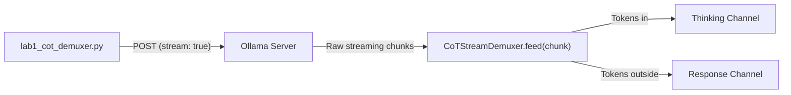

# Lab 1: Building a Chain-of-Thought Stream Demuxer

In this lab, you will implement a `CoTStreamDemuxer` that parses a live streaming response, separates internal thinking tokens (`<think>...</think>`) from user-facing answer text, and prints each channel independently.

---

## What you touch
- Script: `lab1_cot_demuxer.py`
- Main Class: `CoTStreamDemuxer` with `feed(chunk: str)` method
- URL / Endpoint: `{OLLAMA_HOST}/api/generate` (defaults to `http://127.0.0.1:11434/api/generate`)
- Request Keys: `model`, `prompt`, `stream` (`true`), `options.temperature` (`0.0`)
- Demux Output Channels: `thinking` (reasoning log) and `response` (clean answer payload)

---

## Steps


1. Read `OLLAMA_HOST` and `OLLAMA_MODEL` from environment variables, defaulting to `http://127.0.0.1:11434` and `llama3.2:1b` (or a reasoning model like `deepseek-r1:1.5b` or `qwen2.5:7b`).
2. Construct the request payload dictionary with `model`, `prompt` (`"Solve step-by-step: If a train travels at 60 mph for 2.5 hours, how far does it travel?"`), `stream: True`, and `options: {"temperature": 0.0}`.
3. Stream lines from `{OLLAMA_HOST}/api/generate`, parsing each line with `json.loads()`.
4. Feed each incoming chunk into `CoTStreamDemuxer.feed(chunk)`. The demuxer tracks parser state (`IDLE`, `THINKING`, `RESPONSE`), stripping `<think>` tags and routing text accordingly.
5. Print thinking text under `[THINKING LOG]` and response text under `[RESPONSE PAYLOAD]`.
6. When streaming concludes, print total character counts for both channels. Verify that the response channel contains zero `<think>` tags.

---

## Data contract

**Request Payload**

```json
{
  "model": "llama3.2:1b",
  "prompt": "Solve step-by-step: If a train travels at 60 mph for 2.5 hours, how far does it travel?",
  "stream": true,
  "options": { "temperature": 0.0 }
}
```

**Demux Result Structure**

```json
{
  "thinking": "The train travels at 60 mph for 2.5 hours. Distance = Speed * Time = 60 * 2.5 = 150.",
  "response": "The train travels a total distance of 150 miles."
}
```

---

## Run
From the repository root, run:

```bash
python education/06_the_reliability/lab1_cot_demuxer.py
```

```powershell
python education/06_the_reliability/lab1_cot_demuxer.py
```

---

## What you should see
- `[THINKING LOG]` showing step-by-step calculation tokens (if using a reasoning model).
- `[RESPONSE PAYLOAD]` showing the final answer (150 miles) cleanly formatted without internal tags.
- Character count summary for both channels.

---

## Stop here
You now have a clean stream demuxer! In Lab 2, we will implement cycle detection to protect against infinite tool loops.

Next up: [Lab 2: Cycle Detection](./lab2_cycle_detection.md).

---

## Notes
*(Record your demuxed stream output and character counts here)*

