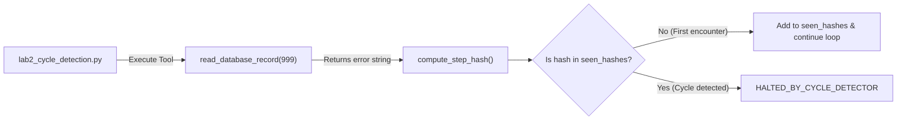

# Lab 2: Detecting and Halting Repeated Tool Execution Cycles

In this lab, you will implement step hashing (`compute_step_hash`) to track previously executed tool calls and immediately halt execution with `HALTED_BY_CYCLE_DETECTOR` when a repetitive loop is detected.

---

## What you touch
- Script: `lab2_cycle_detection.py`
- Main Function: `compute_step_hash(tool_name: str, tool_args: dict, tool_output: str) -> str`
- Tool: `read_database_record(record_id: int)` in `TOOL_REGISTRY`
- URL / Endpoint: `{OLLAMA_HOST}/api/chat` (defaults to `http://127.0.0.1:11434/api/chat`)
- Request Keys: `model`, `messages`, `tools`, `stream` (`false`), `options.temperature` (`0.0`)
- Return Status on Cycle: `"HALTED_BY_CYCLE_DETECTOR"`

---

## Steps


1. Read `OLLAMA_HOST` and `OLLAMA_MODEL` from environment variables, defaulting to `http://127.0.0.1:11434` and `llama3.2:1b`.
2. Define a mock database tool `read_database_record(record_id: int)` that always returns `"ERROR: Record 999 not found in table 'users'."` when `record_id == 999`.
3. Register the tool in `TOOL_REGISTRY` and define its JSON schema in `TOOLS_SCHEMA`.
4. Implement `compute_step_hash(tool_name, tool_args, tool_output)`:
   - Format: `f"{tool_name}:{json.dumps(tool_args, sort_keys=True)}:{tool_output}"`
   - Compute and return the SHA-256 hexadecimal hash string.
5. In your agent turn loop:
   - When a tool is executed, compute its step hash.
   - If the hash is already in `seen_hashes`, print an alert and return `"HALTED_BY_CYCLE_DETECTOR"`.
   - If new, add it to `seen_hashes` and continue the loop.
6. Test with a prompt that triggers repeated failures:
   `"Fetch user record 999. If it fails, try fetching record 999 again."`

---

## Data contract

**Request Payload**

```json
{
  "model": "llama3.2:1b",
  "messages": [
    { "role": "user", "content": "Fetch user record 999. If it fails, try fetching record 999 again." }
  ],
  "tools": [ /* schema for read_database_record */ ],
  "stream": false,
  "options": { "temperature": 0.0 }
}
```

**Step Signature String (Hashed with SHA-256)**

```text
read_database_record:{"record_id": 999}:ERROR: Record 999 not found in table 'users'.
```

**Cycle Detection Termination Return**

```json
"HALTED_BY_CYCLE_DETECTOR"
```

---

## Run
From the repository root, run:

```bash
python education/06_the_reliability/lab2_cycle_detection.py
```

```powershell
python education/06_the_reliability/lab2_cycle_detection.py
```

---

## What you should see
1. **Turn 1**: Tool action for `read_database_record(record_id=999)` returning the error string, recording the first trajectory hash.
2. **Turn 2**: Repeated tool call for record 999 generating an identical hash.
3. A critical alert: `[CRITICAL ALERT] INFINITE LOOP DETECTED!` followed by immediate termination with `HALTED_BY_CYCLE_DETECTOR`.

---

## Stop here
You have successfully implemented automated cycle prevention! In Lab 3, we will explore logit steering.

Next up: [Lab 3: Logit Steering](./lab3_logit_steering.md).

---

## Notes
*(Record your cycle detection log trace here)*

