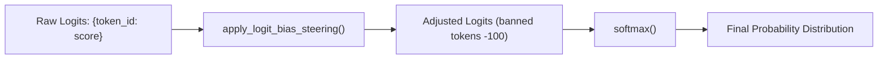

# Lab 3: Logit Steering and Output Vocabulary Control

In this lab, you will explore logit bias adjustment and the softmax function to mathematically suppress unwanted tokens (reducing their generation probability near zero) and boost favored tokens.

---

## What you touch
- Script: `lab3_logit_steering.py`
- Main Functions: `apply_logit_bias_steering(raw_logits, logit_bias)` and `softmax(logits)`
- Vocabulary Table: `VOCAB_TABLE` mapping token strings to token IDs (`"{"` is 101, `"I"` is 201, `"apologize"` is 202, `"cannot"` is 203)
- Input Logits & Bias Maps: Local dictionaries simulating model output layer logits

---

## Steps


1. Inspect `VOCAB_TABLE` and initialize `raw_logits` with baseline token scores:
   - `{`: 2.0
   - `I`: 4.5
   - `apologize`: 5.0
   - `cannot`: 4.8
2. Compute baseline probabilities using `softmax(raw_logits)`.
3. Define a steering map `logit_bias`:
   - Penalize banned words: `{"202": -100.0, "203": -100.0}` (`apologize`, `cannot`)
   - Boost JSON formatting token: `{"101": 5.0}` (`{`)
4. Call `apply_logit_bias_steering(raw_logits, logit_bias)` to add bias values to raw logits.
5. Compute steered probabilities with `softmax()` and print comparison tables before and after steering.
6. Verify that `apologize` and `cannot` drop to approximately `0.00%`, while `{` becomes the dominant token.

---

## Data contract

**Raw Logits & Bias Configuration**

```json
{
  "raw_logits": {
    "101": 2.0,
    "201": 4.5,
    "202": 5.0,
    "203": 4.8
  },
  "logit_bias": {
    "101": 5.0,
    "202": -100.0,
    "203": -100.0
  }
}
```

**Resulting Probability Distribution Comparison**

```text
Before Steering:
  - apologize: 44.5%
  - cannot:    36.4%
  - I:         16.3%
  - {:          2.7%

After Steering:
  - {:         99.1%
  - I:          0.9%
  - apologize:  0.0%
  - cannot:     0.0%
```

---

## Run
From the repository root, run:

```bash
python education/06_the_reliability/lab3_logit_steering.py
```

```powershell
python education/06_the_reliability/lab3_logit_steering.py
```

---

## What you should see
A side-by-side probability comparison showing that negative logit bias mathematically eliminates unwanted tokens from generation.

---

## Stop here
In Lab 4, we will build a resilient network gateway with automated retries and failover routes.

Next up: [Lab 4: Resilient Gateway](./lab4_resilient_gateway.md).

---

## Notes
*(Record your before-and-after probability distribution here)*

